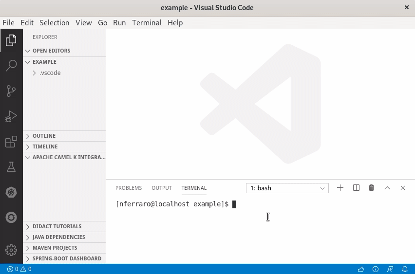

Apache Camel K has made a lot of progress since its inception and we're now proud to **announce the 1.0 release**.
We've been working hard in the past months to add more awesome features to Camel K, but also to improve stability
and performance. This post contains a list of cool stuff that you'll find in the 1.0 GA release.

First of all, if you're living under a rock and it's the first time you hear about Camel K, 
you can read some introductory blog posts here ([1 - introducing camel k](https://nicolaferraro.me/2018/10/15/introducing-camel-k/), [2 - camel k on knative](https://www.nicolaferraro.me/2018/12/10/camel-k-on-knative/))
or look at the Apache Camel website that contains a [Camel K section](/camel-k/next/)
with a lot of material that is automatically generated from the [Github repository](https://github.com/apache/camel-k).

## User experience

Camel K development style is minimalistic: you need just to write a single file with your integration routes and you can immediately 
run them on any Kubernetes cluster. This way of defining things is common to many FaaS platforms (although Camel K is not a proper FaaS platform, 
but a lightweight *integration* platform) and it's technically difficult to provide IDE support, such as code completion and other utilities, 
to developers.

But now we've done it. The integration tooling team has created some cool extensions for VS Code that make the development experience
with Camel K even more exciting.
You don't need to remember the Camel DSL syntax, the IDE will give you suggestions and error highlighting.



Code completion works with Java code, but it's not only limited to it: you also have suggestions and documentation out of the box when writing the Camel URIs and property files.
And you also have many options to run integrations and interact with them, all integrated in the IDE.

Just install the VS Code [Extension Pack for Apache Camel](https://marketplace.visualstudio.com/items?itemName=redhat.apache-camel-extension-pack) to have all these features available.


## Getting started tutorials

Good tools are fundamental to have a great development experience with Camel K, but then you need to learn what you can do with such a great power.
We've created a new repository in the Apache organization that hosts getting started examples: the [camel-k-examples](https://github.com/apache/camel-k-examples) repository.

So far we've added guides that drive you through:

- [01 Basic](https://github.com/apache/camel-k-examples/tree/master/01-basic): Learn the basics of Camel K and some interesting use cases
- [02 Serverless APIs](https://github.com/apache/camel-k-examples/tree/master/02-serverless-api): How to design a serverless (i.e. auto-scaling, scaling to zero) API and run it in a few minutes

The **basic quickstart is [also available online](https://learn.openshift.com/middleware/courses/middleware-camelk/camel-k-basic)**, so you can have a look at how camel k works **without installing anything on your laptop**.

More tutorials are expected to come in the following months. You are also welcome if you want to help us by **contributing your own**.
They are based on the [VSCode Didact](https://marketplace.visualstudio.com/items?itemName=redhat.vscode-didact) project, that provides an
awesome user experience.

If you are looking for Camel K code samples that you can just pick and run using the CLI, the [examples directory](https://github.com/apache/camel-k/tree/master/examples) of the Camel K main repository contains a lot of them. You can also run them directly from Github:

```
kamel run https://raw.githubusercontent.com/apache/camel-k/master/examples/Sample.java
```

You can find ready-to-use examples written in different languages (e.g. [XML](https://github.com/apache/camel-k/blob/5fb589090c2f45b28aef586118df48fad8838b3f/examples/hello.xml), [JavaScript](https://github.com/apache/camel-k/blob/5fb589090c2f45b28aef586118df48fad8838b3f/examples/simple.js) and others).

## Serverless

Serverless is the most important area where we're focusing the new developments in Apache Camel K, although, you should remember, 
you can have a wonderful Camel K experience even without serverless features.
To enable the serverless profile in Camel K, you just need to have **[Knative](https://knative.dev) installed**.

In recent releases, we have added support for the most recent advancements in Knative, for example, Camel K is very well integrated 
with the **Knative event broker** and you can easily produce or consume events from it.

With **2 lines of code** you can transfer events (e.g. generated by IoT devices) **from your MQTT broker to the mesh**:

*bridge.groovy*
```groovy
from('paho:mytopic?brokerUrl=tcp://broker-address:1883&clientId=knative-bridge')
  .to('knative:event/device-event')
```

No kidding, you just need to write those two lines of code in a file and run it with `kamel run bridge.groovy` to 
push data into the Knative broker.

And you can also scale the Integration out (*Integration* is a Kubernetes custom resource, `kubectl get integrations` to see all of them)
to have a higher throughput. Scaling here is manual because the source of events is a MQTT broker (but we've plans to put [auto-scaling also in this scenario](https://github.com/apache/camel-k/issues/1107)).

The Camel K embedded auto-scaling feature works really well when you want to react to some Knative events:

*listener.groovy*
```groovy
from('knative:event/device-event')
  .to('http://myhost/webhook/random-id')
``` 

This integration is configured to receive all events with `type=device-event` and **scales automatically with the load** because it is materialized into a [Knative Serving Service](https://knative.dev/docs/serving/spec/knative-api-specification-1.0/#service)
and automatically [subscribed to the Eventing Broker via a Trigger](https://knative.dev/docs/eventing/broker/).

It then receives a [CloudEvent](https://cloudevents.io/) when your IoT devices produce something and scales down to zero if there's no data coming.
You just need to create it (as before, just `kamel run listener.groovy`), all the remaining configuration is 
done **automatically by the Camel K operator**.

We've added much more features for having a better integration with the Knative ecosystem and we've also fixed some compatibility and performance issues that were present in previous versions. The user experience is now much smoother.

If you are a Knative YAML developer (!), instead of using Camel K directly, you also have the option to use **[Knative Camel Sources](https://knative.dev/docs/eventing/samples/apache-camel-source/)** which are part of the Knative release. They are wrappers for Camel K integrations that are compatible with all the tools used by Knative developers (such as the `kn` CLI or the OpenShift serverless console).
Sources in Knative can only push data into the various Knative endpoints, but not the other way around (i.e. they cannot be used to publish data from Knative to the outside).
In Camel K you don't have this limitation: the Route is the fundamental building block of a Camel integration and you can do whatever you want with it. 

## Fast startup and low memory

We cannot say we're serverless without mentioning the work that we've been doing in improving the performance of Camel K integrations.

Starting from **Camel 3.3.0** which is the default version used by Camel K 1.0.0, you can benefit from all improvements that have been made directly in the Camel core to make it much more lightweight. More in depth details of the Camel core improvements can be found the following blog series that highlights what has been changed in the 3.x Camel timeline to reduce memory footprint and speedup the startup time, which is foundamental when running integrations in a serverless environment: [part 1](http://www.davsclaus.com/2020/01/apache-camel-31-more-camel-core.html?m=1), [part 2](http://www.davsclaus.com/2020/01/apache-camel-31-more-camel-core_30.html?m=1), [part 3](http://www.davsclaus.com/2020/02/apache-camel-31-more-camel-core.html?m=1), [part 4](http://www.davsclaus.com/2020/03/apache-camel-32-reflection-free.html?m=1).

But improvements are not only limited to the Camel core: we're doing much more. Several months ago we've started a new subproject of Apache Camel named ["Camel Quarkus"](https://github.com/apache/camel-quarkus) with the goal of seamlessly running integrations on top of the Quarkus framework. As you probably know, Quarkus is able to reduce the memory footprint of Java applications and improve the startup time, because it moves much startup logic to the build phase. And Quarkus applications can also be compiled to a native binary, allowing a dramatic improvements in startup performance and very low memory footprint.

In Camel K 1.0.0 we support **Camel Quarkus in JVM mode**. A goal is to have also the in-cluster native compilation soon (for some DSL languages, such as YAML), in one of next releases!

To use Quarkus as underlying runtime, you just need to enable the **[Quarkus trait](/camel-k/next/traits/quarkus.html)** when running an integration:

```
kamel run myintegration.groovy -t quarkus.enabled=true
```

Quarkus is expected to be the default underlying runtime in the next release, and support for Standalone mode (via camel-main) will be deprecated and removed.
This means that you won't need to enable Quarkus manually in the next releases, but you still need to do it in 1.0.

## Fast build time

Every application running on Kubernetes needs to be packaged in a container image, but **in Camel K you only provide the integration DSL and the operator does what it takes to run it**, including building images directly in the cluster.

The operator manages a pool of reusable container images and if you redeploy your integration code, it does try to reuse existing images from the pool rather than building a new one at each change, because it takes some time to build a new one. **It was 1 minute at the beginning...**

But Kubernetes is moving so fast that you cannot solve a problem once and forget about it, you need to take care of it continuously. It happened that some of our third party dependencies that we used for doing builds in "vanilla Kube" has slowly degraded in performance up to a point where Camel K user experience was highly affected.

We decided to work harder on the build system in order to dramatically improve (again!) the build phase of Camel K integrations.

Build time can be be now measured in seconds in dev environments such as Minikube. **A bunch of seconds**, most of the times. This is more than a simple improvement!


## Better CLI

The 'kamel' CLI is the main tool we provide to developers to run integrations. It's not a mandatory requirement: at the end, an Integration is a Kubernetes custom resources and you can manage it with any Kubernetes standard tool (e.g. `kubectl`). But the `kamel` CLI adds a lot of value for integration developers.

For example, if you're a Camel Java developer it's not super easy to remember the boilerplate that you have to write in order to instantiate a Camel route builder. Now you don't have to remember that:

```
kamel init Handler.java
```

You get a Java file with **all the boilerplate written for you** and you just have to write your integration routes.

It works also with all other languages: Groovy, XML, YAML, Kotlin and JavaScript.
For example you can write:

```
kamel init foo.js
```

This way you get a simple route written in JavaScript.

It's not just that. Often Camel K developers need to add a lot of command line options to configure the final behavior of their integration. For example, you may want to add a custom library with the `-d` option or configure a trait with `-t`. E.g.:

```
kamel run -d mvn:org.my:lib:1.0.0 -d mvn:org.my:otherlib:2.0.0 -t quarkus.enabled=true Handler.java
```

Sometimes the number of command line parameters you've to add **can become too many**. For this reason we've added the possibility to specify them as **modeline options** in the integration file (done by adding a comment line with `camel-k:` as prefix).

*Handler.java*
```
// camel-k: dependency=mvn:org.my:lib:1.0.0 dependency=mvn:org.my:otherlib:2.0.0 trait=quarkus.enabled=true

// ...
// your routes here
```

Once the options are written in the file, you can run the routes with just:

```
// simply this, additional args are read from the file
kamel run Handler.java
```

The other options are taken automatically from the file modeline. The CLI also displays the full command to let you know what's running.

This kind of configuration is extremely useful in CI/CD scenarios because it allows you to have self-contained integration files and you don't need to change the pipeline to setup additional options. If you're curious about the CI/CD configurations, you can follow the tutorial about Tekton pipelines to have more information.

## Monitoring and Tracing

Ok, you've finished level 1 of Camel K development and you want to make serious things. You're in a very good position because Camel K provides a lot of 
useful tools to add visibility on **what your integration routes are doing**.

Let's suppose you've a **[Prometheus](https://prometheus.io/)** instance in your namespace and you want to **publish your integration metrics**:

```
kamel run Routes.java -t prometheus.enabled=true
```

That's it. No need to setup services and labels to enable scraping. A default prometheus configuration file is also provided for the integration, with sensible defaults. Of course you also have the option to provide [your own configuration](/camel-k/next/traits/prometheus.html) for advanced use cases.

Now, let's suppose you want to see what your routes are doing and trace the execution flow of an integration. What you need to do is to install an opentracing compatible application in the namespace, such as **[Jaeger](https://www.jaegertracing.io/)**, and run the integration as:

```
kamel run Routes.java -t prometheus.enabled=true -t tracing.enabled=true
```

That's it again. The Camel K operator will add the camel-opentracing library and **connect it to the Jaeger collector that is available in the namespace**.
Here again, [advanced use cases](/camel-k/next/traits/tracing.html) are supported.

## Master routes

Good old Camel users know why and when master routes are useful, but for those who are not familiar with the term, I'm going to provide a brief explanation.

Whenever you have an integration route that must be running, at any point in time, in at most one single Camel instance, you need to use a master route. Master routes can be declared by simply prefixing the consumer endpoint by the 'master' keyword and a name that will be used to create a named lock, e.g.

```
from('master:mylock:telegram:bots')
  .to('log:info')
```

It can be used to print all messages that are sent to your Telegram bot. Since the Telegram API support a single consumer only, you can guard the route with a master prefix to have the guarantee that there will be at most only one consumer at any given time.

If you're wondering how there can be two instances running of you deploy one, well, think just to when you change your code and need to do a rolling update: for some time there'll be two pods running in parallel. In some cases, you may decide to scale your service out but keep only one instance of a particular route among all the pods of your service. Or you may want to embed a master route in a Knative autoscaling service: in this case, the service can scale autonomously based on the load, but there'll be only one telegram consumer at any time.

Master routes **work out of the box** in Camel K, you just need to put a prefix in your endpoint uri. **A leader election protocol** based on Kubernetes APIs resource locks will be **automatically configured** for you!

## CronJobs

All complex enough systems contain several scheduled jobs. This is especially true for that part of the system that handles integration with the outside.

Ideally, if you need to execute a quick periodic task, say, every two seconds, you would startup an integration with a route based on timer to execute the periodic task. E.g.

```
from("timer:task?period=2000")
  .to(this, "businessLogic")
```

But if the period between two executions, instead of 2 seconds ("2000" in the Camel URI, which is measured in milliseconds) is 2 minutes ("120000") or 2 hours ("7200000")?

You can see that keeping a container with a JVM running for a task that should be executed once every two minutes may be overkill (it is overkill for sure when the period is 2 hours). We live in a time where resources such as **memory and CPU are really valuable**.

So the Camel K operator automatically handles this situation by deploying your integration not as a Kubernetes deployment, but as a **Kubernetes CronJob**. This saves a lot of resources, especially when the period between executions is high. When it's time to run your integration code, a container starts, triggers the execution and then gracefully terminates. Everything is handled automatically by Camel K and Kubernetes.

There are cases when you don't want this feature to be enabled, for example, when your code makes use of in memory caches that is better to keep between executions. In these cases, you can safely turn off the feature by passing the flag `-t cron.enabled=false` to the `kamel run` command.

The Cron feature does not only work with the `timer` component. We've also added a [cron component](/components/next/cron-component.html) since Camel 3.1 that works really well in combination with the [cron trait](/camel-k/next/traits/cron.html).

So you can also write the cron expression in the route directly:

```
from("cron:job?schedule=0/5+*+*+*+?")
  .to(this, "businessLogic")
```

In this case, a new pod with a JVM is started every 5 minutes to execute your scheduled task. For the remaining 4+ minutes you don't use any resource.

## Transparency

Camel K does a lot of work for you when you run your integration code in the cluster and it's possible that you put some errors in the code that can block the deployment process. We've added a lot of visibility on the deployment process that now communicates with the users via Kubernetes events that are printed to the console when you use the CLI.

This way you're always notified of problems in the code and you can better understand what to fix to make your integration run.

## How to try Camel K 1.0

The first step is to go to the [Camel K release page](https://github.com/apache/camel-k/releases) on Github (or the official [Apache release repository](https://dist.apache.org/repos/dist/release/camel/camel-k/1.0.0/)), **download the kamel CLI** for your OS and put it in your system path.

Installation is done usually using the `kamel install` command, but, depending on the kind of Kubernetes cluster you're using, 
you may need to execute additional configuration steps.
The Camel K documentation contains a section about **[installing it on various types of Kubernetes clusters](/camel-k/next/installation/installation.html)**.

If you have trouble or you need to install it on a particular cluster that is not listed, just reach out in the [Gitter chat](https://gitter.im/apache/camel-k) and
we'll do our best to help you.

## Future

We've reached version 1.0.0 and this is a great milestone for us. But we are not going to stop now: we've big plans for the future and we'll continue to develop awesome new features.

We need your help to improve Camel K and **we love contributions!**

Join us on:

- Gitter: https://gitter.im/apache/camel-k
- GitHub: https://github.com/apache/camel-k
