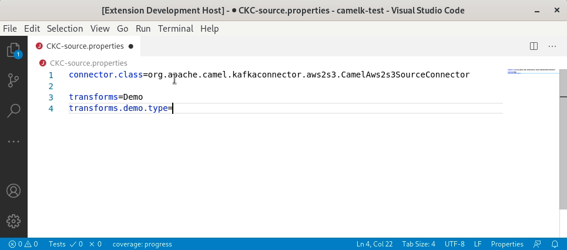

A new release of [VS Code Language Support for Apache Camel](https://marketplace.visualstudio.com/items?itemName=redhat.vscode-apache-camel) 0.0.28 is available. It includes an interesting set of new features.

# Camel 3.6.0 upgrade

Camel [3.6.0](/blog/2020/10/Camel36-Whatsnew/) catalog is now provided by default. The 3.6.0 version is also leveraged internally.

# Camel Kafka Connector Properties file improvements

Previously, the support for [Camel Kafka Connector](/camel-kafka-connector/next/index.html) was limited to Camel URI in `camel.(sink|source).url` property value.
This release adds support for the list of properties provided for each parameter instead of using a potentially long Camel URI. It relies on the new Camel Kafka Connector Catalog.

#### Completion for `connector.class` property value

There is completion for the `connector.class` property value. The display name of the completion item is the simple class name. The fully qualified name is inserted.

 

#### Completion and hover for component properties
 
There is completion and hover for `camel.sink.*` and `camel.source.*` property keys based on Camel Kafka Connector Catalog.
  
 
  
#### Completion for Converters

Camel Kafka Connector provides specific Kafka [key](https://kafka.apache.org/documentation/#key.converter) and [value](https://kafka.apache.org/documentation/#value.converter) Converters for some connectors. In this case, they are proposed for completion as property value of `key.converter` and `value.converter`.

 
  
#### Completion for Transformers

Camel Kafka Connector provides specific [Kafka Transformers](https://kafka.apache.org/documentation/#connect_transforms) for some connectors. In this case, they are proposed for completion as property value of `transforms.*.type`.

 

#### Refactor action to convert Camel URI to list of properties

When a lot of parameters are required to configure the Camel components, using the Camel URI through the `camel.(sink|source).url` can lead to a very long string which is not easy to read. Camel Kafka Connector allows to use a list of properties instead. A refactor action is available to convert a Camel URI to a list of properties.

 

# Camel K modeline improvements

The completion for resource-like options `open-api`, `property-file` and `resource` are now filtering files inside the IDE specific folder `.vscode`. For `open-api`, only json and yaml files are now proposed.

# Outlines and Document symbols

Previously, there was outlines and Document symbols for Camel contexts and routes for XML DSL only.

In this release, the Camel route steps are provided for XML and Java DSL.

It can be leveraged in the outline, or using the `Find symbol` command or even with the breadcrumb.
A little trick to have the flow of routes displayed in execution order in the Outline view is to select `Sort by position` option.

# What's next?

Provide your feedback and ideas!
You can start discussions on [Zulip camel-tooling channel](https://camel.zulipchat.com/#narrow/stream/258729-camel-tooling).
You can create and vote for issues on github [Camel Language Server](https://github.com/camel-tooling/camel-language-server/issues) and [VS Code Language support for Apache Camel](https://github.com/camel-tooling/camel-lsp-client-vscode/issues) repositories.
You can create and vote for issues on the [jira](https://issues.redhat.com/browse/FUSETOOLS2) used by the Red Hat Integration tooling team.