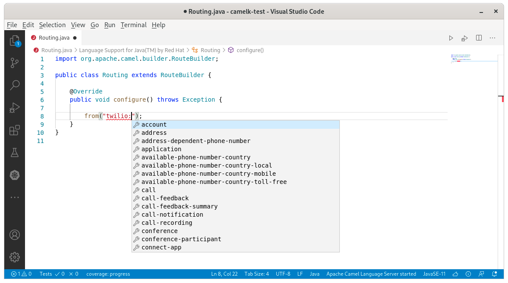
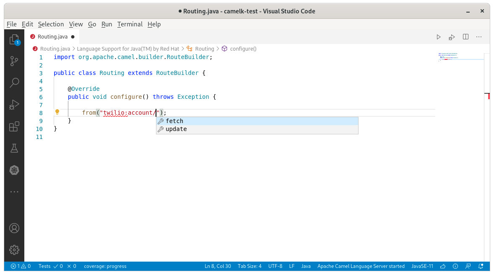
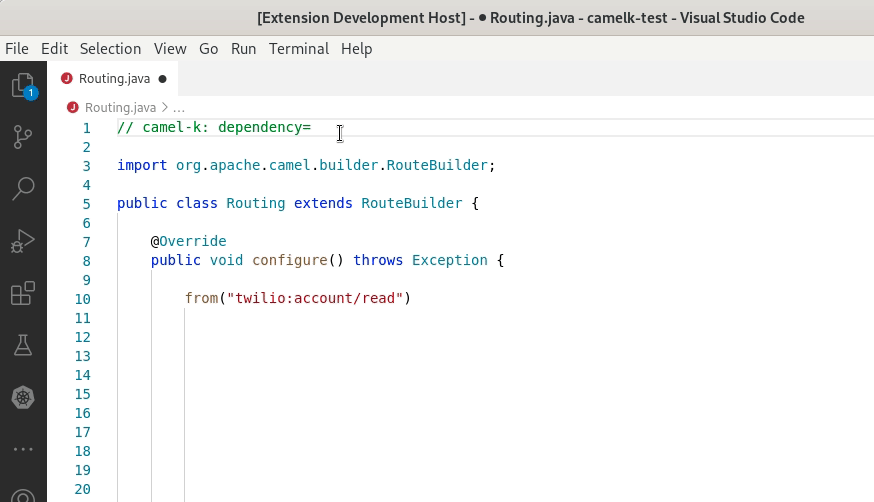
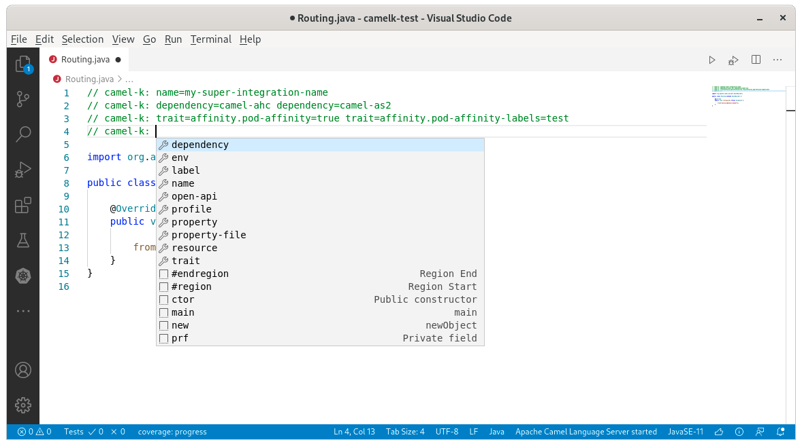

A new release of [VS Code Language Support for Apache Camel](https://marketplace.visualstudio.com/items?itemName=redhat.vscode-apache-camel) 0.0.29 is available. It includes an interesting set of new features and two important bugfixes.

# API based components support

Camel has several API based components which are source code generated from external API. In [3.6.0](./../../10/Camel36-Whatsnew/#api-components-overhaul), finer grained information is available through additional metadata (Camel catalog). This release is leveraging these metadata to propose improved completion, documentation and validation for these APU based components.

It is proposing completion for api name:

It is proposing completion for method name available depending on the method name:

It is proposing completion for properties depending on the api/method name combination of the component with a different icon:

# Camel K Modeline improvements

#### Jitpack completion

During development phase, it can be interesting to point to a repository directly. [Jitpack](https://jitpack.io/) is very convenient for that. Camel K modeline is leveraging it through the dependency parameter. This release introduce completion for the syntax that can be used.

#### Multi-lines

Initially, Camel K modelines were available on the first line only. it is now possible to use Camel K modelines in every parts of the file and still leverage the language support in the IDE.

It is especially useful when there are a lot of parameters provided. It allows to split and organize the different kind of parameters a bit.

# Bugfixes

The version 0.0.28 is broken on Windows. It is fixed in the 0.0.29 version. Test suite is now launched for the Camel Language Server on Windows too. Thanks to [hemangajmera](https://github.com/hemangajmera) for reporting the [issue](https://github.com/camel-tooling/camel-lsp-client-vscode/issues/472) and to Camel Kafka committers that released a maintenance version specifically for this issue.

Annoying error notifications were happening when a project was containing Java interfaces. Thanks to [Rafael T. C. Soares](https://github.com/rafaeltuelho) for reporting the [issue](https://github.com/camel-tooling/camel-lsp-client-vscode/issues/475).

# What's next?

Provide your feedback and ideas!
You can start discussions on [Zulip camel-tooling channel](https://camel.zulipchat.com/#narrow/stream/258729-camel-tooling).
You can create and vote for issues on github [Camel Language Server](https://github.com/camel-tooling/camel-language-server/issues) and [VS Code Language support for Apache Camel](https://github.com/camel-tooling/camel-lsp-client-vscode/issues) repositories.
You can create and vote for issues on the [jira](https://issues.redhat.com/browse/FUSETOOLS2) used by the Red Hat Integration tooling team.