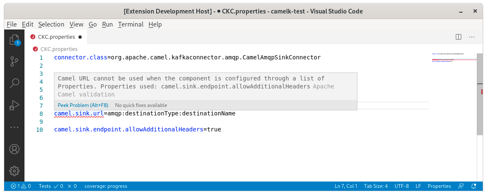

A new release of [VS Code Language Support for Apache Camel](https://marketplace.visualstudio.com/items?itemName=redhat.vscode-apache-camel) 0.0.30 is available. It includes upgrade of Camel catalogs and Camel Kafka Connector related improvements.

# Camel Catalogs upgrades

The default Camel catalog has been upgraded from 3.6.0 to 3.7.0.

The Camel Kafka Connector catalog has been upgraded from 0.6.0 to 0.7.0.

# Camel Kafka Connector related improvements

#### Completion for Basic Configuration

Some properties are not part of the Camel catalog material, neither of the [Kafka Connect](https://kafka.apache.org/documentation/#connectconfigs) framework and applies to all Camel Kafka connectors. They are the [Basic Configuration properties](/camel-kafka-connector/latest/user-guide/basic-configuration.html).

Completion is now available for these properties:

#### Diagnostics

Four rules provides diagnostic at design time for the Camel Kafka Connector files.

`camel.(source|sink).(endpoint|path).*` property keys are validated against the catalog. An error is provided if the property does not exist. it even propose a quickfix if a relatively similar value exists:

It is possible to use dash and camel case for properties. If a key is provided 2 times with a different case, an error is provided:

In case, there is a mix of source and sink properties compared to `connector.class`, an error is provided:

In case, both `camel.(source|sink).(endpoint|path).*` and `camel.(source|sink).url`, an error is provided:

#### Description for connector.class

The connector to use is specified by the `connector.class` value. The value is a fully qualified name which sometimes can be difficult to understand the exact purpose and scope. A description of the connector is now available on hover and on completion:

#### Automatic insertion of default value on completion

Completion for properties on `camel.(source|sink).(endpoint|path).*` now inserts also the default value:

# What's next?

Provide your feedback and ideas!
You can start discussions on [Zulip camel-tooling channel](https://camel.zulipchat.com/#narrow/stream/258729-camel-tooling).
You can create and vote for issues on github [Camel Language Server](https://github.com/camel-tooling/camel-language-server/issues) and [VS Code Language support for Apache Camel](https://github.com/camel-tooling/camel-lsp-client-vscode/issues) repositories.
You can create and vote for issues on the [jira](https://issues.redhat.com/browse/FUSETOOLS2) used by the Red Hat Integration tooling team.
