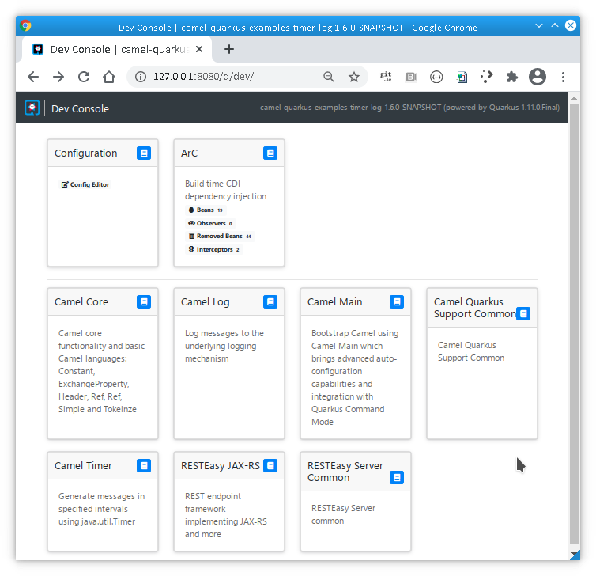

<sub><sup>Original image by <a href="https://commons.wikimedia.org/wiki/User:99of9">Toby Hudson</a> <a href="https://creativecommons.org/licenses/by-sa/3.0">CC BY-SA 3.0</a> via <a href="https://en.wikipedia.org/wiki/Camel_racing#/media/File:CamelRacingCamelCup2009Heat.JPG">Wikipedia</a></sup></sub>

We are pleased to announce the release 1.6.0 of Camel Quarkus! Here are the highlights.

## Java 11 required

Having deprecated Java 8 [long time ago](/blog/2020/04/Camel-Quarkus-release-1.0.0-M7/) and
following the same requirement by Quarkus, Camel Quarkus now requires Java 11+.

## Support for more Camel components

Camel Quarkus brings support for three new Camel components:

* [JSONATA](/camel-quarkus/latest/reference/extensions/jsonata.html)
* [Vert.x Kafka](/camel-quarkus/latest/reference/extensions/vertx-kafka.html)
* [Redis](/camel-quarkus/latest/reference/extensions/redis.html) (JVM only)

Components newly supported in native mode:

* [Azure Storage Blob Service](/camel-quarkus/latest/reference/extensions/azure-storage-blob.html)
* [Debezium MongoDB Connector](/camel-quarkus/latest/reference/extensions/debezium-mongodb.html)
* [Google BigQuery](/camel-quarkus/latest/reference/extensions/google-bigquery.html)
* [Hazelcast](/camel-quarkus/latest/reference/extensions/hazelcast.html)
* [Minio](/camel-quarkus/latest/reference/extensions/minio.html)

## Quarkus 1.11.0.Final

Camel Quarkus 1.6.0 is based on Quarkus 1.11.0.Final which brings a couple of interesting innovations:

### Dev Console

You certainly know the famous Quarkus [dev mode](https://quarkus.io/guides/getting-started#development-mode), in which
Quarkus tooling is watching your workspace and recompiling your application whenever you change something so that you
can interact with your up-to-date running app nearly instantly.

Quarkus 1.11.0.Final improves the development experience further through the Quarkus Dev Console. It is a UI available
at [http://localhost:8080/q/dev](http://localhost:8080/q/dev) when you run your application in dev mode via

```sh
$ mvn clean compile quarkus:dev
```

Note that the Dev Console currently [works only if](https://github.com/quarkusio/quarkus/issues/14471) you have
`io.quarkus:quarkus-vertx-http` dependency in your `pom.xml`.

The Dev Console allows to quickly visualise all the extensions currently loaded, see their status and go directly to
their documentation.

This is what it looks like for a simple Camel Quarkus application:



More details are available in [Quarkus Dev Console guide](https://quarkus.io/guides/dev-ui).

### More in Quarkus 1.11.0.Final

* [RESTEasy Reactive](https://quarkus.io/blog/quarkus-1-11-0-final-released/#resteasy-reactive)
* [Improved Micrometer support](https://quarkus.io/blog/quarkus-1-11-0-final-released/#improved-micrometer-support)
* [Spring Data REST](https://quarkus.io/blog/quarkus-1-11-0-final-released/#spring-data-rest)
* [Non application endpoints moved to `/q/`](https://quarkus.io/blog/quarkus-1-11-0-final-released/#non-application-endpoints-moved-to-q)
* [Jackson: `FAIL_ON_UNKNOWN_PROPERTIES` disabled by default for the default `ObjectMapper`](https://quarkus.io/blog/quarkus-1-11-0-final-released/#jackson)
* [GraalVM 20.3 recommended](https://quarkus.io/blog/quarkus-1-11-0-final-released/#graalvm-20-3)

Check the full [Quarkus 1.11.0.Final announcement](https://quarkus.io/blog/quarkus-1-11-0-final-released/).

## Full Changelog of Camel Quarkus 1.6.0

* Fixed issues: https://github.com/apache/camel-quarkus/milestone/10?closed=1
* All commits: https://github.com/apache/camel-quarkus/compare/1.5.0...1.6.0

## Known issue

Camel FOP [does not work in native mode with GraalVM 20.3.0](https://github.com/apache/camel-quarkus/issues/2113). The
users are advised to use GraalVM 20.3.1 or Mandrell GraalVM 20.3.0.

## What's next?

Camel Quarkus 1.7.0 should appear within a couple of weeks, shortly after Quarkus 1.12 or Camel 3.8, whichever comes first.

There is still a lot of [Camel components to port](https://github.com/apache/camel-quarkus/issues?q=is%3Aissue+is%3Aopen+label%3Aextension) to Quarkus.
Please upvote your favorites, or even better [contribute](/camel-quarkus/latest/contributor-guide/index.html)!
