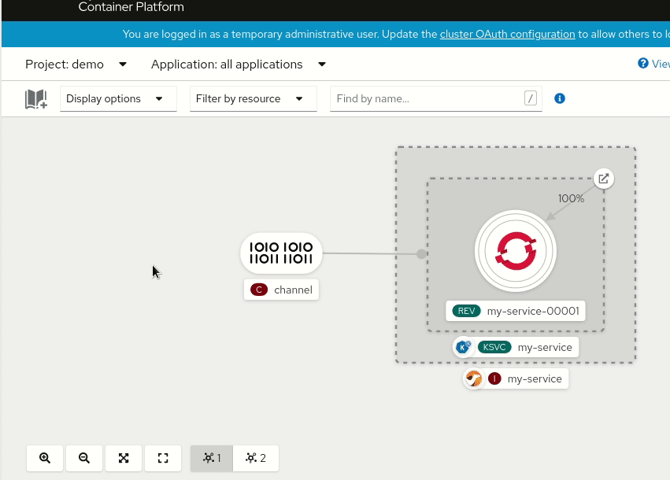

We're starting a new initiative at Apache Camel to create a community-driven catalog of reusable Kamelets (_Camel_ route snipp_ets_, i.e. connectors) that can be used to stream data from/to external systems into any platform powered by Apache Camel.

The ["Apache Camel Kamelet catalog" is available here](/camel-kamelets/latest) and it already contains a collection of useful Kamelets: we would like to extend it with help of the community.

Kamelets are currently supported out-of-the-box by the [Apache Camel K](/camel-k/latest) project and we're working to support them also in Camel core, so that they can run eventually in any Apache Camel subproject, like [Camel Kafka Connector](/camel-kafka-connector/latest/) (but also camel-quarkus, camel-spring-boot, ...).

## Why are they useful?

The most important reason why the new Kamelet catalog is so useful is that it provides a collection of connectors that are not tied to a particular platform, but they can be reused in multiple contexts. The new **OpenShift 4.7 developer console** is a clear evidence of this pattern. You can look at what it provides in the following animation:

The console shows a serverless environment where a Knative channel has been created and it's ready to receive and dispatch events to a registered subscribing service.
From the console, the user can add a new "Event Source" and the UI displays a collection of possibilities: well, starting from Camel K 1.4.0, that collection of sources will display **the official Apache Camel Kamelet catalog**. This means that contributing new Kamelets to the catalog will allow you to enhance the OpenShift catalog of Knative sources, for instance.

But there's nothing in the Kamelet catalog specifically related to OpenShift: **we show this to encourage people to take the same approach** for other platforms (in-house or open source, especially Kubernetes-based) and use cases. One of the advantages of this approach is that, since Kamelets provide a [well defined JSON-schema interface](https://camel.apache.org/camel-k/latest/kamelets/kamelets.html#kamelets-example) for their configuration, they can be made available for any kind of users, including those who don't even know anything about Apache Camel.

So, no matter if you need ingress/egress for a specific destination (like in the Knative example above) or you're working on an event orchestration/workflow tool, or you're just creating a IFTTT clone: **if you need connectors, look at Kamelets**.

Kamelets are not only useful in Web/UI projects, they can be also used from a CLI. For instance, there's a [plugin in the making in the Knative sandbox](https://github.com/knative-sandbox/kn-plugin-source-kamelet) that will allow users to easily create Knative sources from Kamelets using the Knative `kn` CLI.

Leaving the Kubernetes world, you can also imagine how the Kamelet Catalog can improve the user experience in Camel Kafka Connectors. As of today, A Camel Kafka connector can be created from a single Camel component: this is a quite powerful model, since components have a high degree of configurability, but it has severe limitations because complex use cases cannot be fullfilled by configuring a single Camel component. The Kamelet model will add to Camel Kafka Connector users to develop more complex use cases (because a Kamelet is a route template that can use multiple components and enterprise integration patterns) and share their connectors with other users via the Kamelet catalog.

## Kamelet vs. Component

There's a question that often arises and it relates to the difference between a Camel component and a Kamelet.

From a pure user perspective, the main difference between them is that the Camel component is a highly configurable resource that is intended to be used in 
a Camel development environment. Components contain lots of properties that allow to customize every aspect of their behavior and how they interact with the Camel context, the registry and so on. Additionally, a single Camel component can serve multiple purposes: e.g. the `camel-facebook` component allows receiving any kind of event or execute any action on Facebook; the `camel-http` component allows to contact any external `http` or `https` endpoint.

By contrast, Kamelets are tailored around actual use cases. A `todo-sink` Kamelet may be created in the catalog to transform an event into an entry of a "To-Do Application" (I refer here to that kind of applications where you add the things you need to, and later mark them as resolved). It may use the `camel-http` component under the hood, but that will be an implementation detail. The `todo-sink` Kamelet will also expose to the end user not the full list of parameters available in the `camel-http` component, but a reduced set of configuration properties that are relevant for the business purpose (i.e. adding an entry into a "To-Do Application").
Similarly, when the Kamelet model will evolve with the help of the community, there won't be a single `facebook-source` Kamelet, but there will be probably many facebook-related sources, one for each use case that the community finds relevant.

An important corollary of all this is that we're not going to auto-generate the Kamelet catalog from the components, instead, we'll follow a more opinionated approach taking into consideration the user needs rather than what the components already provide.

## Contributing

Contributions are welcome for the Kamelet catalog. All you need to do is to follow the guidelines in the [official repository for the Kamelet catalog on Github](https://github.com/apache/camel-kamelets).

Here's a list of relevant resources that you may want to learn before starting creating your own Kamelets:

- [Introduction to Kamelets in Camel K documentation](https://camel.apache.org/camel-k/latest/kamelets/kamelets.html)
- [Kamelets by Nicola Ferraro](https://www.nicolaferraro.me/2020/10/12/kamelets/)
