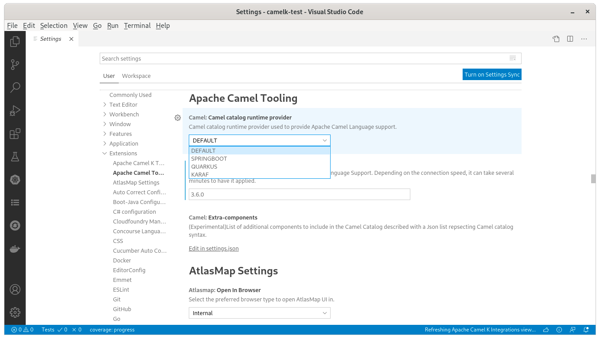

A new release of [VS Code Language Support for Apache Camel](https://marketplace.visualstudio.com/items?itemName=redhat.vscode-apache-camel) 0.0.31 is available. It includes upgrade of Camel catalogs and catalog runtime provider selection setting.

# Camel Catalogs upgrades

The default Camel catalog has been upgraded from 3.7.0 to 3.8.0.

The Camel Kafka Connector catalog has been upgraded from 0.7.0 to 0.8.0.

The Camel Quarkus catalog is provided with version 1.7.0.

# Runtime provider setting

Depending on the runtime used, the Camel components can have subtle differences, or even not be compatible. To have these differences reflected, you can use a specific Catalog runtime provider.

It can be set in *File* -> *Preferences* -> *Settings* , then *Extensions* -> *Apache Camel Tooling* -> *Camel catalog runtime provider*.

# What's next?

Provide your feedback and ideas!
You can start discussions on [Zulip camel-tooling channel](https://camel.zulipchat.com/#narrow/stream/258729-camel-tooling).
You can create and vote for issues on github [Camel Language Server](https://github.com/camel-tooling/camel-language-server/issues) and [VS Code Language support for Apache Camel](https://github.com/camel-tooling/camel-lsp-client-vscode/issues) repositories.
You can create and vote for issues on the [jira](https://issues.redhat.com/browse/FUSETOOLS2) used by the Red Hat Integration tooling team.
