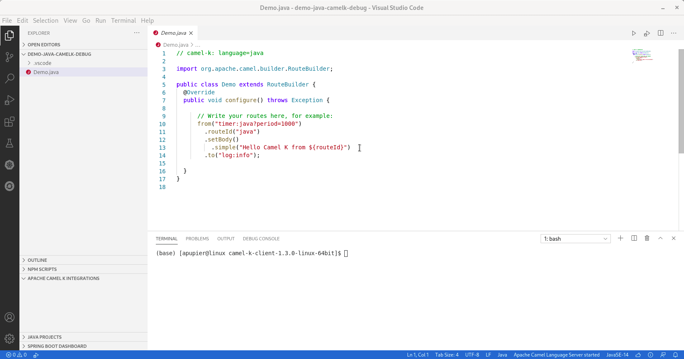

Camel K is providing a new feature to Java debug deployed integrations. Before VS Code Tooling for Apache Camel K 0.0.25, more complex steps were required to leverage the VS Code Java debugging capabilities as explained in [this previous blogpost](/blog/2021/01/DebugInVSCodeWithCamelK1.3.0/).

I recorded a [video](https://youtu.be/pFj21YvzZm0) which is following the steps in this blogpost.

# Requirements

- [VS Code Extension Pack for Apache Camel](https://marketplace.visualstudio.com/items?itemName=redhat.apache-camel-extension-pack) with VS Code Tooling for Apache Camel K 0.0.25+
- Camel K deployed to a cluster. In this demo, we will use a Camel K instance deployed on minikube.

# How to java debug

#### Create an Integration written in Java

- Open command palette _View -> Command Palette..._
- Select _Create a new Apache Camel K integration_
- Select _Java_
- Select the folder
- Provide a name, for instance: _Demo_

#### Set a breakpoint

To have a breakpoint during the execution of the Camel Route, as opposite at the creation of the Camel Route, you need to add a small piece of code. This is a classical trick for Java debugging of Camel Routes, not specific to Camel K.

The trick consists of adding a Processor between the steps you want to observe. It will be something like:

		  .process(new Processor(){
			  @Override
			  public void process(Exchange exchange) throws Exception {
				  System.out.println("can be breakpoint on this line");
			  }
		  })

Then, you can add a breakpoint to the line by clicking in the left ruler. A red dot will appear.

#### Start integration

You can then start the integration:

- Ensure the editor is still opened on the Java Integration file
- Open command palette _View -> Command Palette..._
- Select _Start Apache Camel K Integration_
- Select _Basic_
- Check in the _Apache Camel K Integrations_ view that the example is deployed successfully. it will have a green dot. It can take few minutes for the first deployment.

Note: If starting in --dev, it will allow to automatically reload the Integration. But take care, debugger will need to be restarted on each change. Meaning that the next two steps will need to be repeated.

#### Debug

In Integrations view, wait that the integration is running, then right-click on the integration and select _Start Java debugger on Camel K Integration_.

#### Enjoy

Now, it is time to enjoy. You can notice that you have access to the message content. It is providing a good insight into what is going on in the Camel Route.

# What's next?

There is room for improvements, provide your feedback and ideas!

You can start discussions on [Zulip camel-tooling channel](https://camel.zulipchat.com/#narrow/stream/258729-camel-tooling).

You can create and vote for issues on GitHub [VS Code Tooling support for Apache Camel K](https://github.com/camel-tooling/vscode-camelk/issues) repository.

You can create and vote for issues on the [related epic in Jira](https://issues.redhat.com/browse/FUSETOOLS2-941) which is used by the Red Hat Integration tooling team.
