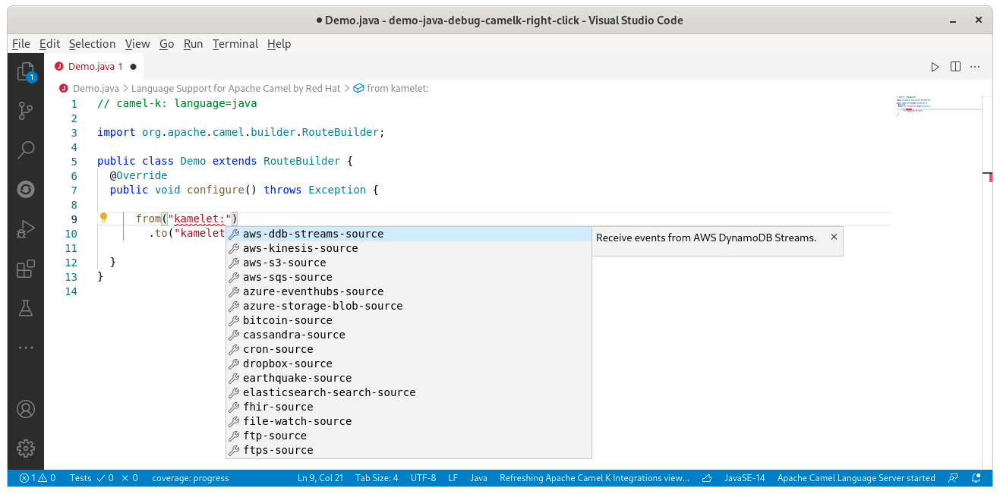
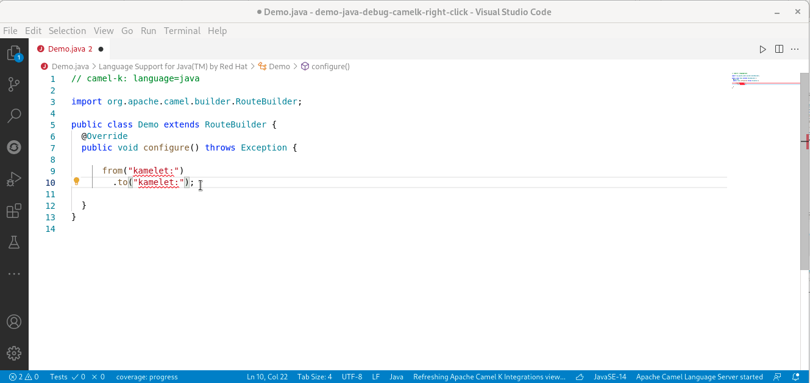
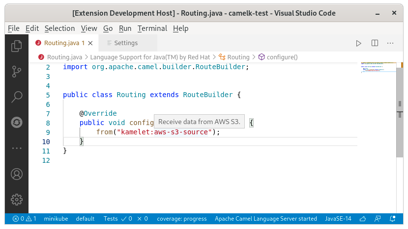
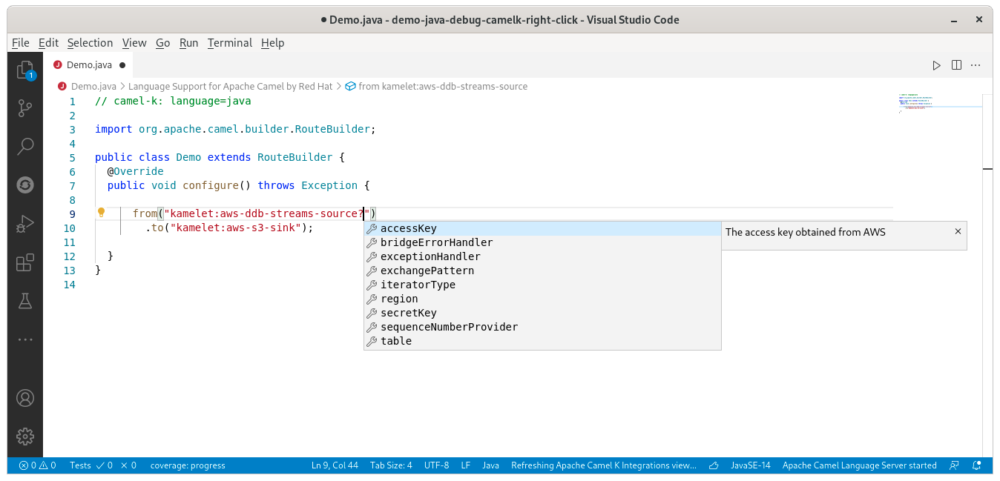
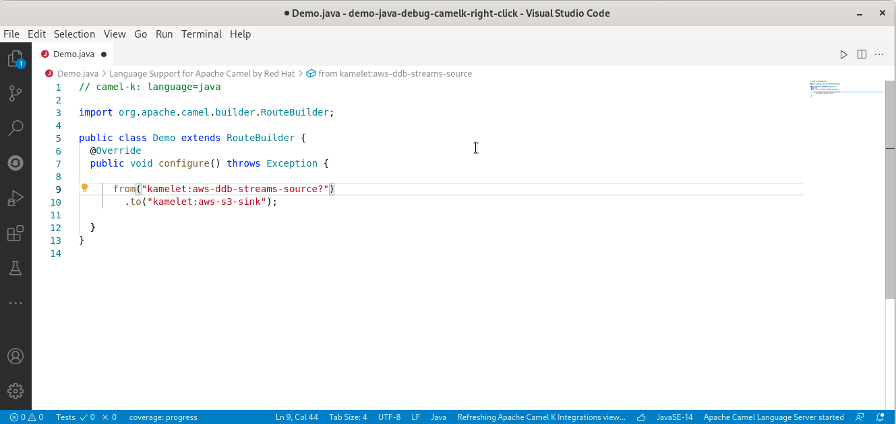

[Kamelets](/camel-k/next/kamelets/kamelets-user.html) (Kamel route snippets) are a new concept introduced in Camel K that allow users to connect to external systems via a simplified interface, hiding all the low level details about how those connections are implemented. There are several ways to consume them. One of them is as [standard Camel Components](/camel-k/next/kamelets/kamelets-user.html#kamelets-usage-integration). In this case, completion is provided to fill the template id and the parameter names. It is currently based on a fixed set of Kamelets provided by a snapshot of the [kamelet catalog](https://github.com/apache/camel-kamelets).

# Kamelet template id support

Inside a Camel URI, after `kamelet:`, completion for the template id is provided with its description.

They are filtered for source/sink consumer/producer endpoint type.

Description is available on hover.

# Kamelet parameters support

Inside a Camel URI, after `kamelet:<myTemplateId>?`, the parameter names are provided as completion with their description.

If a default value is available, it is inserted by default.

# What's next?

There is room for improvements, provide your feedback and ideas!

You can start discussions on [Zulip camel-tooling channel](https://camel.zulipchat.com/#narrow/stream/258729-camel-tooling).

You can create and vote for issues on GitHub repository of [Language Server for Apache Camel(https://github.com/camel-tooling/camel-language-server/issues) repository.

You can create and vote for issues on the [related epic in Jira](https://issues.redhat.com/browse/FUSETOOLS2-1074) which is used by the Red Hat Integration tooling team.
