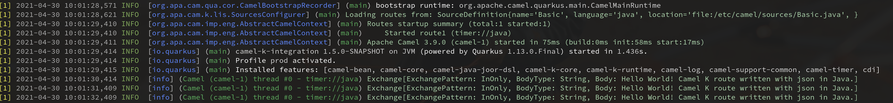

As part of our continuous work to improve Camel K and improve its stability, features and
usefulness to our community, we recently worked on logging improvements for different
parts of Camel K and the integrations it generated.

During the 1.5 development release we dedicated some time to review the logging capabilities
of Camel K. This version introduces a new [logging trait](https://camel.apache.org/camel-k/latest/traits/logging.html) that simplifies access to the logging configuration available on the runtime.

## Colorized logs

By default, Camel K will colorize the log output, making it easier to distinguish between
log levels, loggers, timestamps and the logging message. Naturally, we understand that not
everyone likes colorized logs. As such it's possible to disable it by using the `logging.color`
trait option.

This is what it looks like:




## Easier support for additional debug levels

Additional log levels can be turned on or off at ease, using the `logging.level` trait. Users
can inform the minimum log level (i.e.: `TRACE`, `DEBUG`, `INFO`, etc) and control how much
information is presented by the logger.


## Custom logging format

Leveraging the previous features, it's also possible to control the format of the
displayed message. The `logging.format` trait provides the ability to control what fields
will be logged, their formats and their orders.

For example, you can customize the log message so that it displays the hour, the log level,
the thread name, the message, the exception information, finished with a new line. To do so,
you can use the following to set the logging format:

`--trait logging.format='%d{HH:mm:ss} %-5p (%t) %s%e%n'`.

This would result in log messages similar to these:

```
[1] 11:21:59 INFO  (main) Apache Camel 3.9.0 (camel-1) started in 74ms (build:0ms init:58ms start:16ms)
[1] 11:21:59 INFO  (main) camel-k-integration 1.5.0-SNAPSHOT on JVM (powered by Quarkus 1.13.0.Final) started in 1.362s.
```

Since the runtime leverages Camel Quarkus and, by extension, Quarkus itself, all the
[logging format symbols](https://quarkus.io/guides/logging) suported by Quarkus can be used
to customize the integration logs.

## Logging in JSON format

Although log colorization is a nice improvement to the usability of Camel K in development
mode, most users will eventually run the integrations in production. In such scenarios, it's
not uncommon to use tools such as FluentD or Logstash to consume the logs and run all sorts
of processing on top of them. Structured logging, in JSON format, makes it possible to reuse
plugins available in those tools and may simplify the job of processing them.

```
{"timestamp":"2021-05-10T11:28:26.99Z","sequence":99,"loggerClassName":"org.jboss.logging.Logger","loggerName":"io.quarkus","level":"INFO","message":"Installed features: [camel-bean, camel-core, camel-java-joor-dsl, camel-k-core, camel-k-runtime, camel-log, camel-support-common, camel-timer, cdi]","threadName":"main","threadId":1,"mdc":{},"ndc":"","hostName":"basic-5b57bcf589-kbzvp","processName":"io.quarkus.bootstrap.runner.QuarkusEntryPoint","processId":1}
```


## Maven Build Logs

Lastly, we also modified the Camel K operator itself so that we normalize the log format of
the integration's build messages. Previously, our build would output unstructured log
messages for the build process, which would make it more complicated to parse and process
the messages for build errors.


```
{"level":"info","ts":1620393185.321101,"logger":"camel-k.maven.build","msg":"Downloading from repository-000: http://my.repository.com:8081/artifactory/fuse-brno/org/jboss/shrinkwrap/resolver/shrinkwrap-resolver-bom/2.2.4/shrinkwrap-resolver-bom-2.2.4.pom"}
```

All in all, these set of small logging improvements aim to make Camel K friendlier for the
developer and more flexible for different monitoring use cases, eventually simplifying
running integrations in an autonomous way.

Do you have any suggestions about how we could improve usability and make Camel K operate
even more autonomously? [Let us know](https://github.com/apache/camel-k/issues).


