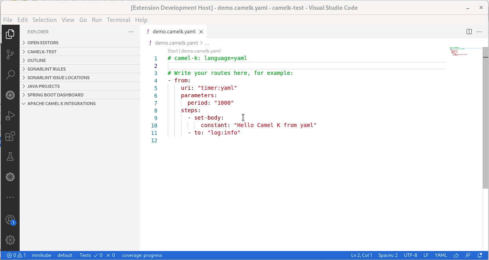
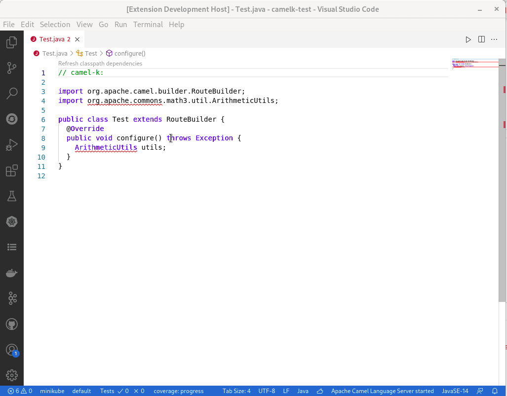

A new release of [VS Code Tooling support for Apache Camel K](https://marketplace.visualstudio.com/items?itemName=redhat.vscode-camelk) 0.0.26 is available. It notably includes compatibility with Camel K 1.5.0 and Code Lenses.

# Compatibility with Camel K 1.5.0

The Camel K binary provided by default is now 1.5.0. The commands are using the new API.

Note: It is working too with Camel K 1.4.0 productized by Red Hat. The needed features were backported.

# Code Lenses

A Code Lens is an information provided inside text editor. It is often used to provide also actions. This release introduces two Code Lenses in Camel K files.

## Code Lens to Start an Integration

When a Camel K file is opened in the text editor, a `Start` link appears at the top of the editor. When clicking on it, it triggers the classic command to `Start a Camel K integration` which is available from command palette.



Note: The Camel K file must use a *.camelk.* filename notation or have a Camel K modeline.

## Code Lens to Refresh Classpath dependencies

In previous release, a command was introduced to refresh the classpath dependencies of Camel K integration files written in Java. See [announcement](/blog/2021/05/vscode-camel-release/#command-to-update-dependencies-of-camel-k-integration). There is now a Code Lens at the top of the editor.



Note: The action can take several seconds. There is no feedback on the progress, please be patient.

# Migration

## Didact tutorial fix

For users that upgrade and that are using Didact, to have a working tutorial, these manipulations are required:

* Update VS Code Didact extension to 0.0.4
* Remove VS Code Tooling for Camel K
* Shutdown and start again VS Code
* Open command palette and call `Didact: Clear Tutorial Registry`
* Shutdown and start again VS Code
* Install VS Code Tooling for Camel K 0.0.26
* Reload window

## VS Code Camel K Task about resource

To allow providing several resources, the `resource` attribute has been replaced by `resources`.

For instance, this content:

```json
"tasks": [
		{
			"type": "camel-k",
			"resource": "path/to/file.xx",
			(...)
		},
```

must be migrated to:

```json
"tasks": [
		{
			"type": "camel-k",
			"resources": ["path/to/file.xx"],
			(...)
		},
```

# What's next?

Provide your feedback and ideas!

You can start discussions on [Zulip camel-tooling channel](https://camel.zulipchat.com/#narrow/stream/258729-camel-tooling).

You can create and vote for issues on GitHub [VS Code Tooling support for Apache Camel K](https://github.com/camel-tooling/vscode-camelk/issues) repositories.

You can create and vote for issues on the [Jira](https://issues.redhat.com/browse/FUSETOOLS2) used by the Red Hat Integration tooling team.
