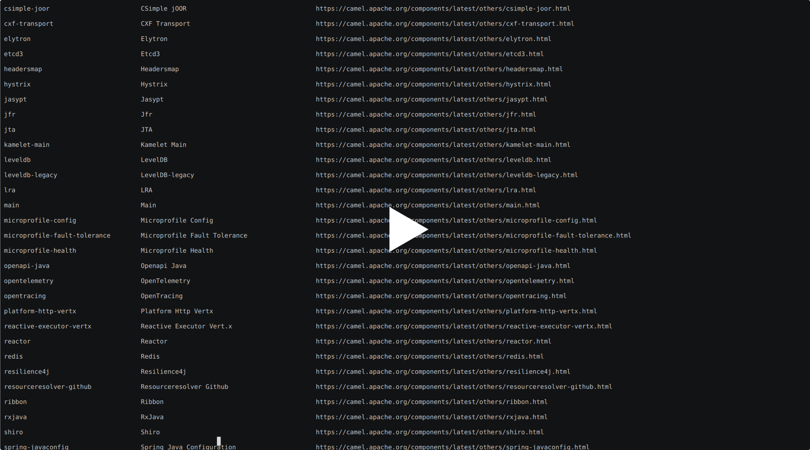

One of the new features we are introducing with Camel 3.12 is a command-line utility that leverages [JBang](https://www.jbang.dev/) in order to make it possible to benefit from the large set of Apache Camel features, without the need of writing a full blown application.

# What is JBang?

Before showing what it can do, it's important to give a brief overview of what JBang is. According to their website, JBang lets us " … create, edit and run self-contained source-only Java programs with unprecedented ease". In practice, this means that it lets us run Java applications without the need to write an application, going through the usual build/compile/deploy cycle. It turns Java into a scripting language, in a similar fashion to Python, Shell Script and others. With easy access to the dependency management, configuration, debugging and other features, it makes it very easy for Java developers to use all the power that Java and its ecosystem of components can offer.

# Camel + JBang

We are leveraging the set of features provided by JBang to expose and simplify access for some of the Apache Camel features with the intention to simplify trying Camel; make it easier to learn about and search for components, languages and features; and provide mechanisms for the users to try agile integration.

To showcase the features that have been already implemented, we prepared a set of screencasts showing the installation process, the
search functionality and running a few routes.

*Note*: At the moment we are writing this post, Camel 3.12 has not been released yet. As such, by installing the CLI utility, you are effectively getting access to a development version of Camel. Although we are excited to share news about new features, we also ask you to be please use caution and do not run this on production environments and also keep in mind that as a preview, features may change.

# Installation

As with any tool, it's nice if it's easy to install. JBang makes it easy for us by providing an installation feature that works well with git, Github. If you have JBang installed on your system, then to install CamelJBang is as easy as running:

```
jbang app install CamelJBang@apache/camel
```

The screencast below shows it in practice:

[](https://asciinema.org/a/426328)


# Search Feature

With Camel JBang installed, there are a few features currently available that we can make use of. For example, it's possible to search for kamelets, components, languages and others (miscellaneous components). This is shown on the following set of screencasts:

* Searching for Kamelets:

[](https://asciinema.org/a/426334)

* Searching for Components:

[](https://asciinema.org/a/426340)

* Searching for Languages:

[](https://asciinema.org/a/426341)

* Searching for miscellaneous components:

[](https://asciinema.org/a/426342)

# Kamelet Support and Running Routes

Searching is not the only cool feature of Camel JBang. We can also leverage one of the hottest new features in Camel and use Kamelets in our routes. For example, it's possible to write a YAML file that references to one of the Kamelets in the catalog and use it as a sink/source for an endpoint. We have a couple of [examples](https://github.com/apache/camel/tree/b0bada2f41029cd8496db4defc09b3a48b403ad4/dsl/camel-jbang/camel-jbang-main/examples) in the code base, so let's look at one that produces messages at a periodic interval and publishes them on a JMS broker using the AMQP 1.0 protocol:

```
- route:
    from:
      uri: "kamelet:timer-source"
      parameters:
        period: 1000
        message: "Hello Camel JBang"
    steps:
      - log: "${body}"
      - to:
          uri: "kamelet:jms-amqp-10-sink"
          parameters:
            remoteURI: amqp://localhost:61616
            destinationName: test-queue
```

The screencast below shows Camel JBang consuming and producing from a JMS broker, using the sink and source Kamelets:

[](https://asciinema.org/a/426344)

All in all, these features make it fairly easy to find and try new components; try and reuse Kamelets from the catalog; and experiment with Apache Camel in ways that were not possible in the past.

# Thanks

Our community is continuously exploring new ideas to improve our projects and make them accessible and easy to use. If you have any ideas about how we can extend and improve Camel JBang, as well as any of our sub-projects, we would be happy to hear about it on our [mailing list](/community/mailing-list/), our [official chat](https://camel.zulipchat.com/) or by filing an issue on [Camel Github repository](https://github.com/apache/camel).