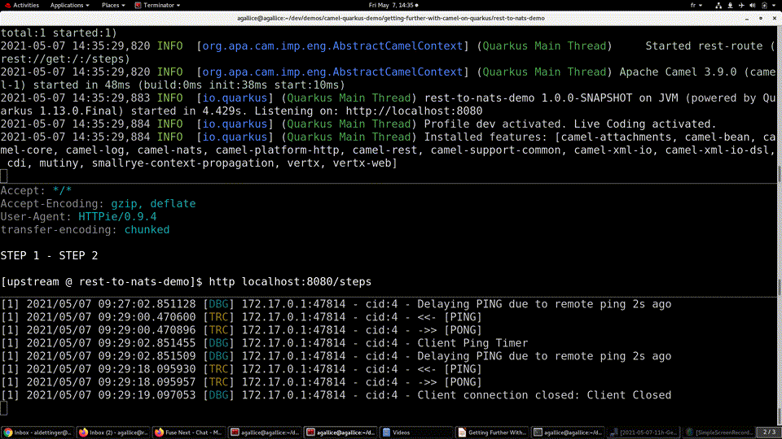

I will have the pleasure to cast a new demonstration explaining further development tips for Camel Quarkus at [Apache CON @HOME 2021](https://www.apachecon.com/acah2021/). Some details still remain to be polished, however I can already share with you the preview below:

This live coding presentation will be split in 2 parts.

# First part where we step into the shoes of a day to day Camel Quarkus developer

The idea is really to implement a typical Camel route on a local machine. Beyond that, this will be a good occasion to show the great integration of some Quarkus features into Camel. There will also be a few tips specific to Camel Quarkus to review, such as the
right way to tune a Camel component with Java code. Last but not least, we'll dig deeper and deeper into the native mode theory...
but also practice ! Indeed, we'll even experience some concrete problems and discover the corresponding answers.

It's already a lot of content and there will be even more.

# Second part where we play with on-demand provisioning and memory constraints on a remote cluster

Here, we'll work with few Hello/Bye worlds [Knative](https://knative.dev/docs/) services deployed on a remote [Kubernetes](https://kubernetes.io/) cluster. This is really a good spot to review the boot time and memory impact of using the native mode. Then, we'll raise the level up as this remote cluster has some memory constraints. This situation will be an opportunity to touch the trade-off between the time to serve the first request and the memory usage.

I wish you start to feel the taste of this presentation. And maybe we'll meet up at the [Apache CON @HOME integration track](https://www.apachecon.com/acah2021/tracks/integration.html) on Wednesday, 22 September 2021 at 18:50 UTC. I also encourage you to take a deeper look into the [integration track agenda](https://www.apachecon.com/acah2021/tracks/integration.html) as there are great talks covering a lot of topics.