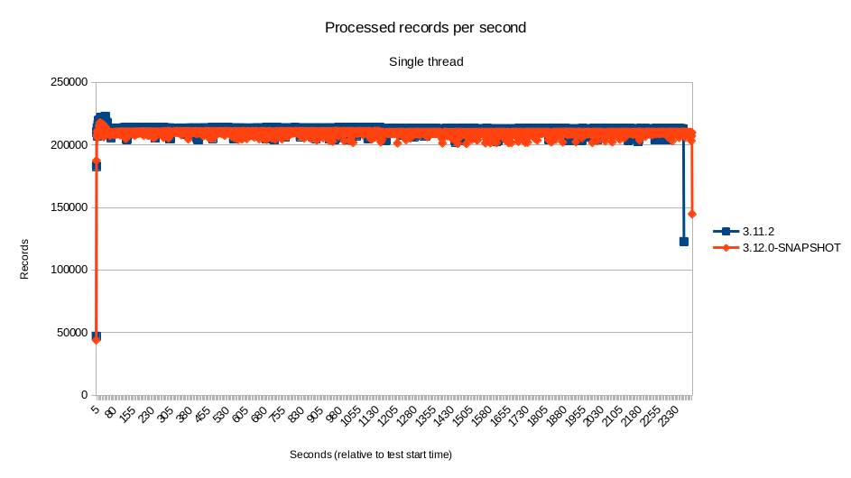
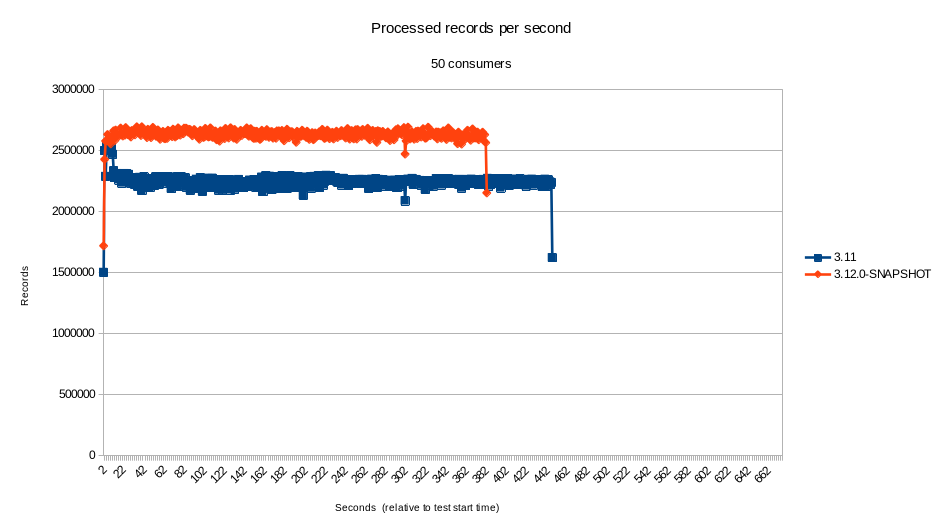
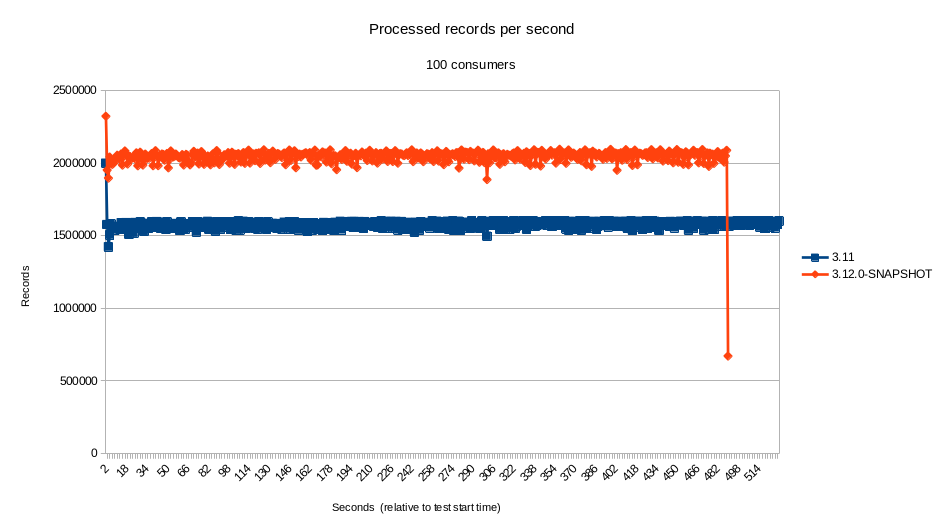

We recently started to review, investigate and fix reliability issues with the [Kafka](/components/next/kafka-component.html) component. As part of that, we refactored the code to avoid problematic concurrency patterns, remove calls to deprecated Kafka client code and simplify the overall maintainability of the code. This led to many changes in the internal implementation of the component, which we will talk about in this blog post.

## Motivation

The ground work related to these changes can be traced back to the following set of issues reported on our Jira. Some of these issues were relatively new, but some have been reported for some time. In no particular order, we have:

* [camel-kafka: possible corruption of idempotency messages when using KafkaIdempotentRepository](https://issues.apache.org/jira/browse/CAMEL-16914)
* [camel-kafka: usage of deprecated method may cause Camel to block indefinitely](https://issues.apache.org/jira/browse/CAMEL-16928)
* [camel-kafka: investigate alternatives to remove Thread.sleep from the record fetcher](https://issues.apache.org/jira/browse/CAMEL-16949)
* [camel-kafka: commits may be skipped on stop or shutdown](https://issues.apache.org/jira/browse/CAMEL-16973)
* [camel-kafka: improve the documentation about consumer streams vs consumers count](https://issues.apache.org/jira/browse/CAMEL-16981)
* [camel-kafka -consumerCount vs consumerStreams problem with pool size](https://issues.apache.org/jira/browse/CAMEL-13215)
* [camel-kafka: make the resume strategy configurable](https://issues.apache.org/jira/browse/CAMEL-16974)
* [camel-kafka: seek to specific offset and KafkaConsumer access](https://issues.apache.org/jira/browse/CAMEL-13768)

The main driver for these changes was our intention to move away from blocking consumer calls from the Kafka Consumer API, in order to leverage the modified APIs introduced on [KIP-266](https://cwiki.apache.org/confluence/display/KAFKA/KIP-266%3A+Fix+consumer+indefinite+blocking+behavior). Although the API changes by themselves are simple, the original behavior of the component consumer was not optimized for making the best use of them.

## Concurrency Changes

While reviewing and refactoring the code to implement the aforementioned set of changes, we used the opportunity to tweak the mechanism used for concurrently fetch records from Kafra. In previous versions, Camel had two configurations controlling the concurrency of the consumer threads: consumerStreams and consumersCount. The former was used to configure the size of the thread pool used by the consumers, whereas the latter configured the number of concurrent consumer threads used by the component. As part of these changes, the size of the thread pool is now defined by the number of concurrent consumers.

## Resume Strategy

This refactoring also allowed us to introduce one new feature that should provide greater flexibility for integrations willing to manage the resume process. It is now possible to define a custom resume strategy through the resumeStrategy configuration. A resume strategy can be recorded in the registry and referenced using the `resumeStrategy` configuration (i.e.: `resumeStrategy=#beanNameOnRegistry`).

## Performance

The Kafka component is a popular one and performance sensitive for many in the community. Therefore, we also run some tests comparing the new code with the latest LTS available at the moment (3.11.2).

There are many points of views when looking at performance metrics. Subtleties in interpreting the results can lead the readers to different and incorrect understanding of the results. As such, with the intent of being as open as possible and transparent about the tests, it's important to start by describing the test, as well as the environment and setup.

The intention of those tests was to measure the ability of the component to dispatch for processing as many records as possible. The scenarios of the tests were:

* Single thread.
* 2 concurrent consumers
* 5 concurrent consumers
* 10 concurrent consumers
* 25 concurrent consumers
* 50 concurrent consumers
* 100 concurrent consumers

The tests were run on an IBM 8335 GTH server with 2 Power 9 CPUs with 16 cores (4 SMT) each, with a total of 128 threads. The JVM used was OpenJDK version 11.0.12+7-LTS running on RHEL 8. No additional configuration was applied to Camel, the OS, the JVM or Kafka itself, because the intention of the test was to compare two different versions of the component on an out-of-the-box configuration (i.e.: instead of tuning it for maximum performance).

We used Kafka's own producer performance test client to generate the load on the Kafka instance. On the consumer end, we implemented a simple mock consumer to compute the metrics and save the results. This mock consumer, with details about how to reproduce the test are also [available](https://github.com/orpiske/kafka-tester).

The tests, which used the default configuration for the component, indicate that the performance of the component for highly concurrent scenarios was greater than 17% (sometimes far exceeding that) in our environment. For scenarios with low to none concurrency, the results were mostly within the 5% margin. Although the new component did perform better by a small percent on most of the time, at such a small difference it's certainly within the margin of error.

Even though we cannot blindly assume that the performance of the component would remain the same in every single scenario - it is, after all, important to test on your specific use case - this seems to indicate that the performance did not suffer from the changes.

## Closing Comments

A lot of care is taken when refactoring the code. Some new tests were introduced and a few tests that have been disabled in the past, have been fixed and re-enabled. Nonetheless, as usual with any large refactoring, it is possible that new issues have been introduced. As such, we kindly ask the community to report those issues on our [bug tracker](https://issues.apache.org/jira/) so that we can continue to harden the code. As usual, additional suggestions and improvements are [welcome](https://github.com/apache/camel).
