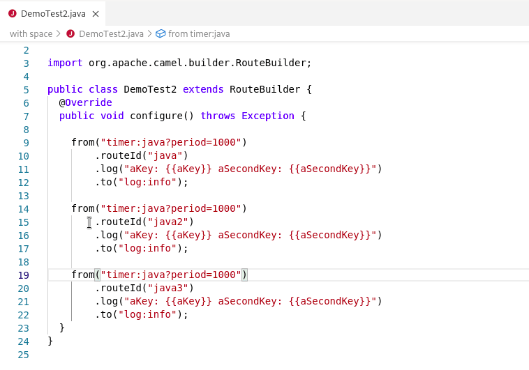

A new release of [VS Code Language Support for Apache Camel](https://marketplace.visualstudio.com/items?itemName=redhat.vscode-apache-camel) 0.0.35 is available. It includes upgrade of default Camel catalog, deprecation of Java 8 as runtime for embedded Language Server, folding of Camel routes in Java editor, status bar improvement.

# Camel version upgrade

The default Camel catalog has been upgraded from 3.11.0 to 3.11.1.

# Deprecation of Java 8 as runtime for embedded Language Server

The deprecation of Java 8 as runtime for embedded Language Server will allow to upgrade Camel Quarkus Catalog in upcoming release.

Java 8 will still be usable for the Camel projects themselves that support it. It will impact only the tooling provided through the Camel Language Server. The VS Code preferences `java.home` can be used to configure the java instance to use to launch the Camel Language Server. It allows keeping your system with Java 8.

# Folding of Camel routes in Java editor

It is now possible to fold each Camel routes in the java editor.

# Status bar improvement

Previously, a single message stating that the `Apache Camel Language server is started` was displayed in bottom status bar.

It was taking a lot of place and wasn't always correctly updated. it is now replaced with a smaller message and little animated icons.

# What's next?

Provide your feedback and ideas!
You can start discussions on [Zulip camel-tooling channel](https://camel.zulipchat.com/#narrow/stream/258729-camel-tooling).
You can create and vote for issues on github [Camel Language Server](https://github.com/camel-tooling/camel-language-server/issues), [VS Code Language support for Apache Camel](https://github.com/camel-tooling/camel-lsp-client-vscode/issues).
You can create and vote for issues on the [jira](https://issues.redhat.com/browse/FUSETOOLS2) used by the Red Hat Integration tooling team.
