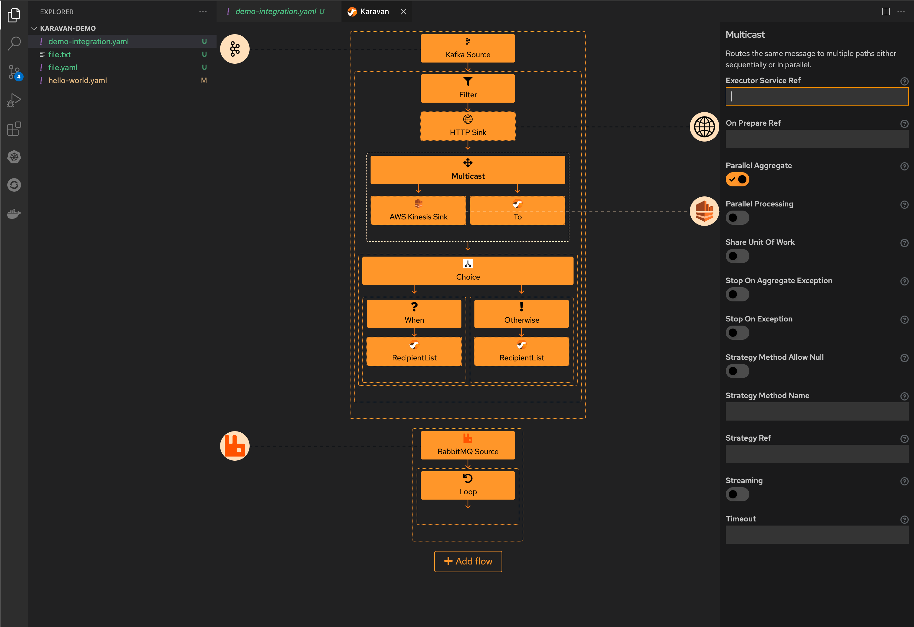
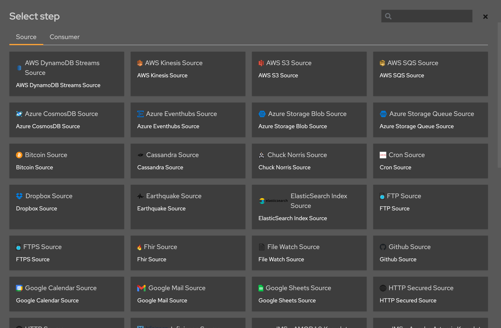
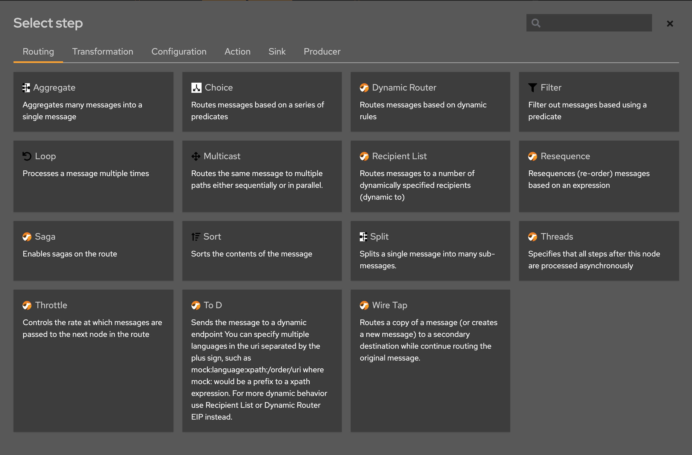
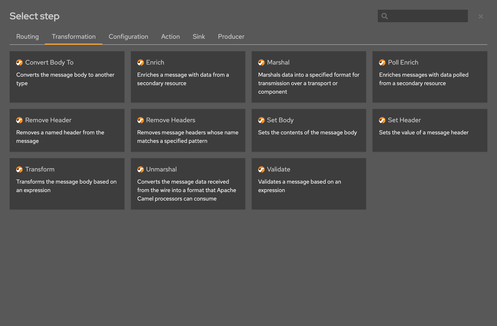

The first preview release of [Apache Camel Karavan Designer VS Code extension](https://marketplace.visualstudio.com/items?itemName=camel-karavan.karavan) is available.

# Karavan: Integration Designer for Apache Camel

The motivation behind the creation of the Karavan Designer  was to make the Apache Camel framework accessible for Non-Java Developers and Citizen-Integrators. 
Karavan simplifies integration with Camel-K: just create an integration pipeline using visual builder and deploy generated resources to Kubernetes or Openshift.

Integration demo on [Youtube](https://youtu.be/pJLNjphNlTo): from design with Karavan to running on Openshift in 5 minutes.

Karavan Designer and project is still in experimental phase. However, it already provides rich set of features:

* Read/Write Integration resources (*.yaml with kind:Integration)
* Kamelets source/sink/action
* Enterprise Integration Patterns DSL (partial)
* Components consumer/producer (experimental)




# Create and edit integration resources

Karavan reads and writes kubernetes resources for Camel-K (kind:Integration), ex:

```yaml
apiVersion: camel.apache.org/v1
kind: Integration
metadata:
  name: demo
spec:
  flows:
    - from:
        uri: 'kamelet:timer-source'
        steps:
          - to:
              uri: 'kamelet:log-sink'
              parameters:
                showStreams: true
        parameters:
          period: 3000
          message: hello
```

# Kamelets

Kamelets from Apache Camel Kamelets catalogue are available in Karavan for source, sink and action 



# Enterprise Integration Patterns

The most used Enterprise Integration Patterns (EIP) DSL elements are already implemented:





# Feedback is gold

If you have any idea or find a new issue, please [create a new issue report in GitHub](https://github.com/apache/camel-karavan/issues)!