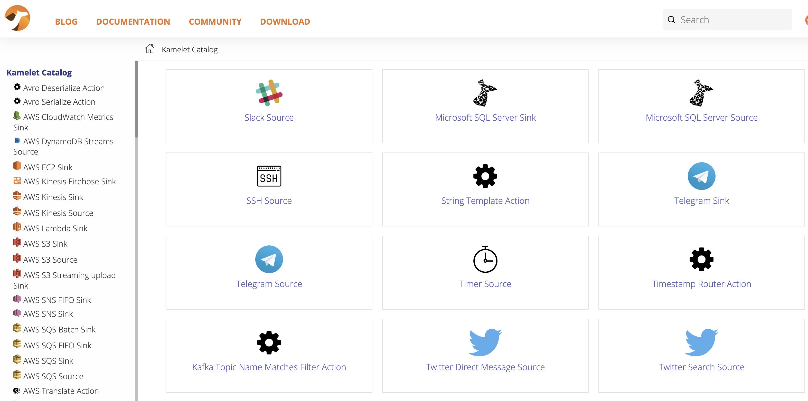

The latest community version of the [Knative client](https://github.com/knative/client) v0.26 includes a new kn plugin for managing Kamelets as Knative event sources (GitHub: [knative-sandbox/kamelet-plugin-source-kamelet](https://github.com/knative-sandbox/kn-plugin-source-kamelet)). With the new plugin users of the kn tooling can directly list the available Kamelet sources and bind these Kamelets to Knative resources such as brokers, channels or services.

The Kamelets facilitate a whole new world of event source possibilities allowing users to connect to external services (AWS, Twitter, Telegram, Postgres) as part of Knative eventing.

## Kamelets - what is this?

Kamelets (Kamel route snippets) introduce a new concept in Apache Camel that allows users to connect to external systems via a simplified ready-to-use connectors, hiding all the low level details about how those connections are implemented.

The user only provides a set of properties that the Kamelet needs for connecting to a foreign service (e.g. authorization token, target destination, connection credentials). The heavy lift of establishing the connection and exchanging data is done with the Camel components that run as part of the Kamelet runtime.

If you want to use Kamelets on your Kubernetes cluster simply install the Camel K operator ([installation guide](/camel-k/next/installation/installation.html)).

The user can then choose from a constantly growing [Kamelet catalog](/camel-kamelets/next/index.html) that provides a great ensemble of ready-to-use Kamelets.

**Kamelets catalog**



Kamelets are able to act as an event source or sink and complement with Knative eventing and the Cloud events standard.

## Install the kn Kamelet source plugin

Assuming you have the [kn CLI tooling](https://github.com/knative/client/blob/main/docs/README.md) installed and ready on your machine you can simply load the [Kamelet source plugin binaries](https://github.com/knative-sandbox/kn-plugin-source-kamelet/releases) in order to add the commands for managing Kamelets as event sources.

By default, the kn tooling knows a set of different event sources and its respective commands to manage those sources. You can display the command possibilities with the help option.

```shell
kn source -h

Manage event sources

Usage:
  kn source SOURCE|COMMAND [options]

Aliases:
  source, sources

Available Commands:
  apiserver   Manage Kubernetes api-server sources
  binding     Manage sink bindings
  container   Manage container sources
  list        List event sources
  list-types  List event source types
  ping        Manage ping sources

Use "kn <command> --help" for more information about a given command.
Use "kn options" for a list of global command-line options (applies to all commands).
```

Now it is the time to load the Kamelet source plugin binary for your operating system from the [plugin release pages](https://github.com/knative-sandbox/kn-plugin-source-kamelet/releases).

Once you have the binary available on your machine you can hook this into your local kn tooling quite easily. The kn-client project provides a clever plugin architecture for adding commands. The respective plugin configuration is located in your home directory under `~/.config/kn/plugins`.

Save the `kn-source-kamelet` binary into this configuration folder or add a symbolic link pointing to the plugin binary there. You can add the symbolic link as follows:

```shell
cd ~/.config/kn/plugins
ln -s /the/path/to/my/kn-source-kamelet kn-source-kamelet
```

You can then verify the plugin setup by displaying the kn help page once more:

```shell
kn source -h

Manage event sources

Usage:
  kn source SOURCE|COMMAND [options]

Aliases:
  source, sources

Available Commands:
  apiserver   Manage Kubernetes api-server sources
  binding     Manage sink bindings
  container   Manage container sources
  list        List event sources
  list-types  List event source types
  ping        Manage ping sources

Plugins:
  kamelet      ~/.config/kn/plugins/kn-source-kamelet

Use "kn <command> --help" for more information about a given command.
Use "kn options" for a list of global command-line options (applies to all commands).
```

You should see a new plugins section with the Kamelet source plugin listed. This means that you are now ready to use the plugin commands directly with the kn CLI.

## List Kamelets

First thing you can do with the plugin is to list all available Kamelets. This will print a list of Kamelets coming from the [Kamelet catalog](/camel-kamelets/next/index.html) that is installed on your cluster via the Camel K operator.

```shell
kn source kamelet list

NAME                           PHASE   AGE    CONDITIONS   READY   REASON
aws-ddb-streams-source         Ready   2d7h   1 OK / 1     True
aws-kinesis-source             Ready   2d7h   1 OK / 1     True
aws-s3-source                  Ready   2d7h   1 OK / 1     True
aws-sqs-source                 Ready   2d7h   1 OK / 1     True
azure-cosmosdb-source          Ready   2d7h   1 OK / 1     True
azure-eventhubs-source         Ready   2d7h   1 OK / 1     True
azure-storage-blob-source      Ready   2d7h   1 OK / 1     True
azure-storage-queue-source     Ready   2d7h   1 OK / 1     True
bitcoin-source                 Ready   2d7h   1 OK / 1     True
cassandra-source               Ready   2d7h   1 OK / 1     True
chuck-norris-source            Ready   2d7h   1 OK / 1     True
cron-source                    Ready   2d7h   1 OK / 1     True
dropbox-source                 Ready   2d7h   1 OK / 1     True
earthquake-source              Ready   2d7h   1 OK / 1     True
elasticsearch-search-source    Ready   2d7h   1 OK / 1     True
fhir-source                    Ready   2d7h   1 OK / 1     True
file-watch-source              Ready   2d7h   1 OK / 1     True
ftp-source                     Ready   2d7h   1 OK / 1     True
ftps-source                    Ready   2d7h   1 OK / 1     True
github-source                  Ready   2d7h   1 OK / 1     True
google-calendar-source         Ready   2d7h   1 OK / 1     True
google-mail-source             Ready   2d7h   1 OK / 1     True
google-sheets-source           Ready   2d7h   1 OK / 1     True
http-secured-source            Ready   2d7h   1 OK / 1     True
http-source                    Ready   2d7h   1 OK / 1     True
...
```

This command lists all Kamelets provided by the awesome Camel community. As you can see the list is huge and it is growing constantly. All these Kamelets are potential sources for your Knative eventing data streams.

## Describe a Kamelet

You are able to display details for a Kamelet with the `kamelet describe` command:

```shell
kn source kamelet describe github-source

Name:           github-source
Namespace:      openshift-operators
Labels:         camel.apache.org/kamelet.bundled=true,
                camel.apache.org/kamelet.readonly=true, camel.apa ...
Annotations:    camel.apache.org/catalog.version=0.4.0,
                camel.apache.org/kamelet.group=GitHub, came ...
Age:            2d
Description:    Github Source - Receive events From Github.
Provider:       Apache Software Foundation
Support Level:  Preview
Phase:          Ready

Properties:
  Name       Req  Type     Description
  oauthToken ✓    string   Oauth token
  repoName   ✓    string   The Github Repository name
  repoOwner  ✓    string   The repository owner
  type       ✓    string   The type of event to consume.

Conditions:
  OK TYPE     AGE REASON
  ++ Ready     2d
```

The command prints detailed information about the Kamelet source. In particular the properties that a user needs to set when using the Kamelet in a binding.

## Create Kamelet bindings

A Kamelet is able to bind to a Knative resource such as a broker, a channel or a service. The binding will use the Kamelet as an event source and stream external data into Knative eventing.

You can use the kn client to create such a binding as the kn Kamelet source plugin provides a binding command with subcommands such as create and describe. See the following example that links the github-source Kamelet to a Knative channel.

```shell
kn source kamelet binding create github-pull-requests \
      --kamelet github-source \
      --channel github-prs \
      --property oauthToken=xxx \
      --property repoName=camel \
      --property repoOwner=apache \
      --property type=pullRequest
```

In the following each pull request on the given GitHub repository creates a new event on the channel `github-prs`.

You should now see the created binding when running the `binding list` command

```shell
kn source kamelet binding list

NAME                   PHASE   AGE   CONDITIONS   READY   REASON
github-pull-requests   Ready   36s   1 OK / 1     True
```

## Wrap up

This completes the capabilities with the new kn source plugin for managing Kamelets as event sources. Please stay tuned as this is only the beginning and there are many more plugin features yet to come! Please give it a try and tell us what you think!
