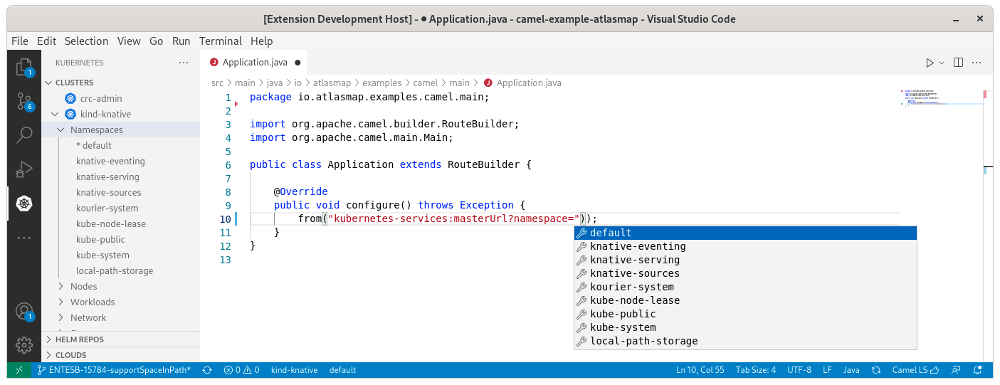
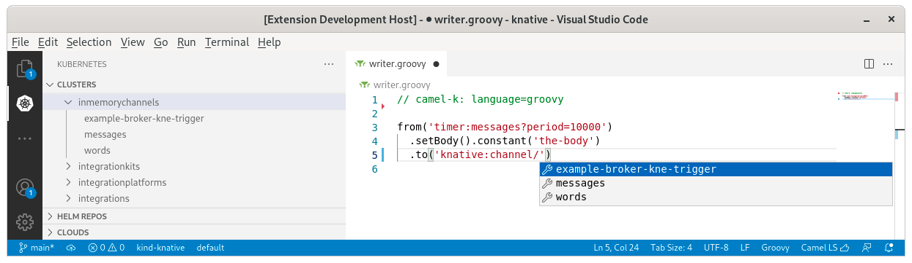
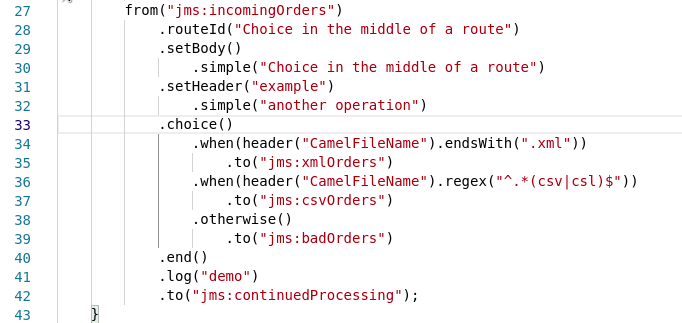

A new release of [VS Code Language Support for Apache Camel](https://marketplace.visualstudio.com/items?itemName=redhat.vscode-apache-camel) 0.1.0 is available. It includes upgrade of Camel catalogs, removal of Java 8 as runtime for embedded Language Server, connected mode completion for Kubernetes and Knative and folding of choice in Java.

# Removal of Java 8 as runtime for embedded Language Server

The removal of Java 8 as runtime for embedded Language Server allowed the upgrade of Camel Quarkus Catalog and some test dependencies. Java 8 is planned to be dropped in several of current dependencies, [including Camel](/blog/2021/09/eol-java8/). It is time to move forward.

Java 8 is still usable for the Camel projects themselves that support it. It will impact only the tooling provided through the Camel Language Server.

# Connected-mode for completion of Knative and Kubernetes components

When a kubernetes connection is configured, either via command-line interface or by VS Code Kubernetes extension, the completion is looking up in the Kubernetes instance for the following cases:
* namespace attribute value on _kubernetes-*_ components

* endpoint, channel and event component path values on _knative_ component

# Camel catalogs version upgrades

The default Camel catalog has been upgraded from 3.11.1 to 3.12.0.

The Kamelet catalog has been upgraded from 0.3.0 to 0.4.0.

The Camel Quarkus catalog has been upgraded from 2.0.0 to 2.3.0.

The Camel kafka connector catalog has been upgraded from 0.10.1 to 0.11.0.

# Folding of Camel routes in Java editor

In previous release, it was possible to [fold a Camel route](/blog/2021/09/vscode-camel-language-support-release-0.0.35#folding-of-camel-routes-in-java-editor). It is now possible to fold each choice of Camel routes in the java editor.

# What's next?

Provide your feedback and ideas!
You can start discussions on [Zulip camel-tooling channel](https://camel.zulipchat.com/#narrow/stream/258729-camel-tooling).
You can create and vote for issues on github [Camel Language Server](https://github.com/camel-tooling/camel-language-server/issues), [VS Code Language support for Apache Camel](https://github.com/camel-tooling/camel-lsp-client-vscode/issues).
You can create and vote for issues on the [jira](https://issues.redhat.com/browse/FUSETOOLS2) used by the Red Hat Integration tooling team.
