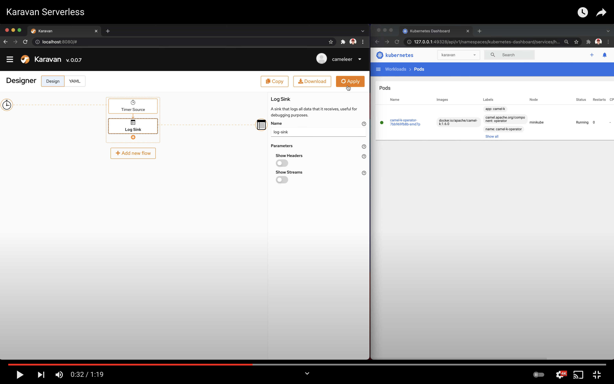

# Karavan Serverless

What's new in Karavan preview release 0.0.8? In addition to VSCode extension and Standalone application, Karavan could be deployed in Serverless mode alongside Camel-K on Kubernetes.
Karavan Serverless gets and applies Integration Custom Resources directly from/to Kubernetes.



# Try Karavan Serverless mode on Minikube

1. [Install Minikube](https://github.com/kubernetes/minikube#installation) 
2. [Install Camel-K](https://camel.apache.org/camel-k/next/installation/installation.html)
3. Install Karavan serverless
    ```shell
    git clone --depth 1  https://github.com/apache/camel-karavan
    cd camel-karavan/karavan-demo/serverless
    kubectl apply -k karavan -n default
    ```
4. Get Karavan URL
    ```shell
    minikube service camel-karavan --url
    ```
    The output should be like the following:
    ```shell
    🏃  Starting tunnel for service camel-karavan.
    |-----------|---------------|-------------|------------------------|
    | NAMESPACE |     NAME      | TARGET PORT |          URL           |
    |-----------|---------------|-------------|------------------------|
    | default   | camel-karavan |             | http://127.0.0.1:60708 |
    |-----------|---------------|-------------|------------------------|
    ```

5. Open Karavan URL in your browser, ex. `http://127.0.0.1:60708`
6. Follow the video demonstration on [YouTube](https://youtu.be/m8BCqwHWHCo)
