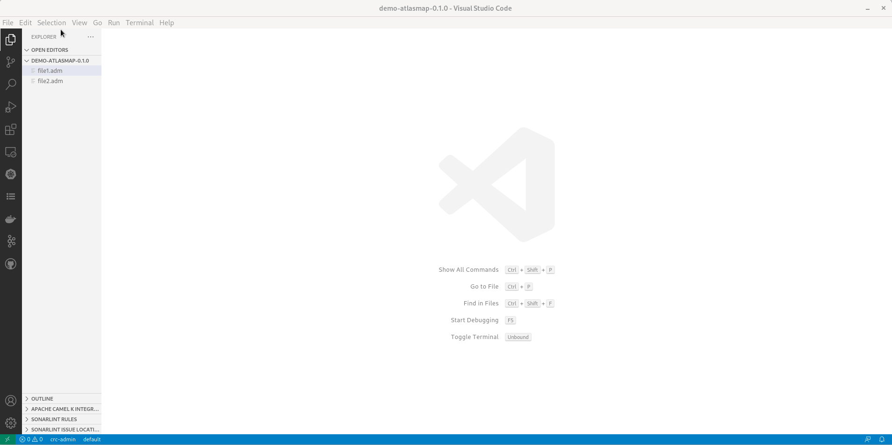

A new release of [VS Code AtlasMap](https://marketplace.visualstudio.com/items?itemName=redhat.atlasmap-viewer) 0.1.0 is available. It includes a new development flow closer to a classical VS Code development flow.

# New features

## Create a new AtlasMap Data Transformation

A new command is available in the command palette to create a new AtlasMap Data Transformation.

## Open AtlasMap UI for AtlasMap Data Transformation from workspace

It is now possible to click on an *.adm file from the VS Code explorer. It will load the file in the AtlasMap UI.

 

Previously a right-click was necessary.

## Open AtlasMap UI from Camel URI in Text editor

In textual editor, above Camel URI using an AtlasMap component, a codelens is provided to open the AtlasMap Data transformation file when it is found.

## Save AtlasMap Data Transformation with VS Code Save command

The AtlasMap UI is now embedded inside a VS Code editor. When a modification is done, the editor is marked as dirty. When calling save (Ctrl+S), the modifications are directly written to the corresponding *.adm file.

## Open several AtlasMap Data Transformation at the same time

It is now possible to open several AtlasMap Data Transformation editor at the same time.

Be careful to not open too many of them as available memory can become a problem.

## Compatibility version table

VS Code AtlasMap is using a single AtlasMap UI version in each release. Defined Data Transformation are ensured to be compatible only with the same version of AtlasMap runtime. To help users to know which combination of version has the best chance to work, please see the new tables in the [readme](https://github.com/jboss-fuse/vscode-atlasmap#relation-between-vs-code-atlasmap-and-atlasmap-runtime-version).

# Video demonstrating combination of the new features

If you want to see all features combined, here is a [video](https://youtu.be/7bdih_yG7BE).

# Under the hood

Previously, a VS Code webview as used. it implied that there was no tracking of dirtyness and ability to save from VS Code normal flow. Users required to use specific AtlasMap UI to export the Data transformation
Also, on click from the VS Code file explorer an empty editor was displayed. It was required to pen through a contextual menu.

With new release, the VS Code webview is used inside a VS Code Custom editor. It allows to open file on direct click from VS Code file explorer and having the dirty/save lifecycle completely integrated with normal VS code development flow.

Please note that it is using AtlasMap UI 2.4.0-M1 which is ensured to be compatible only with AtlasMap runtime 2.4.0-M1. For deployment to other versions, please double-check that features used are available.

# What's next?

Provide your feedback and ideas!
You can start discussions on [Zulip camel-tooling channel](https://camel.zulipchat.com/#narrow/stream/258729-camel-tooling).
You can create and vote for issues on github [issue](https://github.com/jboss-fuse/vscode-atlasmap).
You can create and vote for issues on the [jira](https://issues.redhat.com/browse/FUSETOOLS2) used by the Red Hat Integration tooling team.
