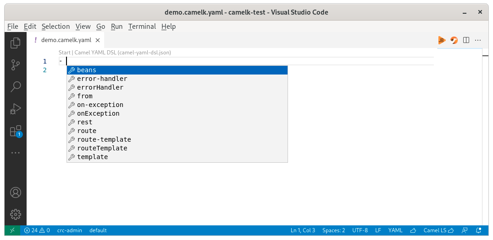
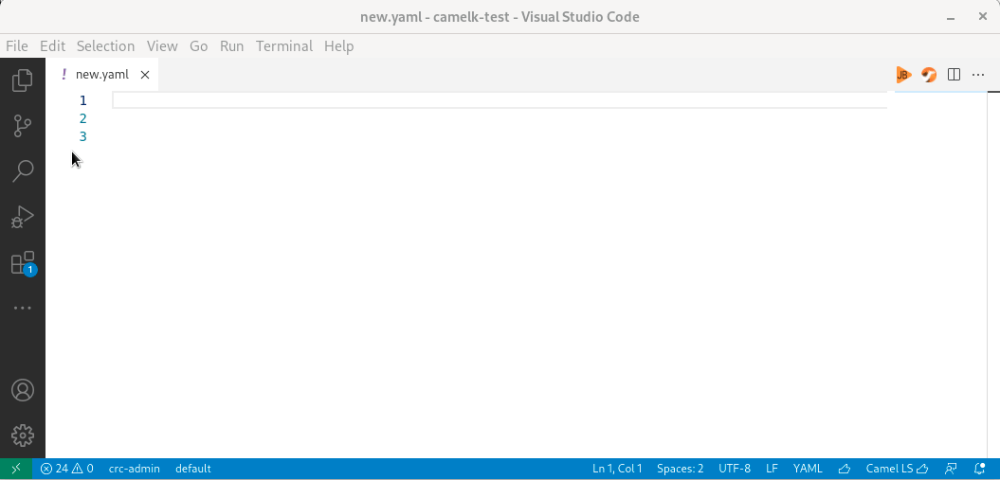
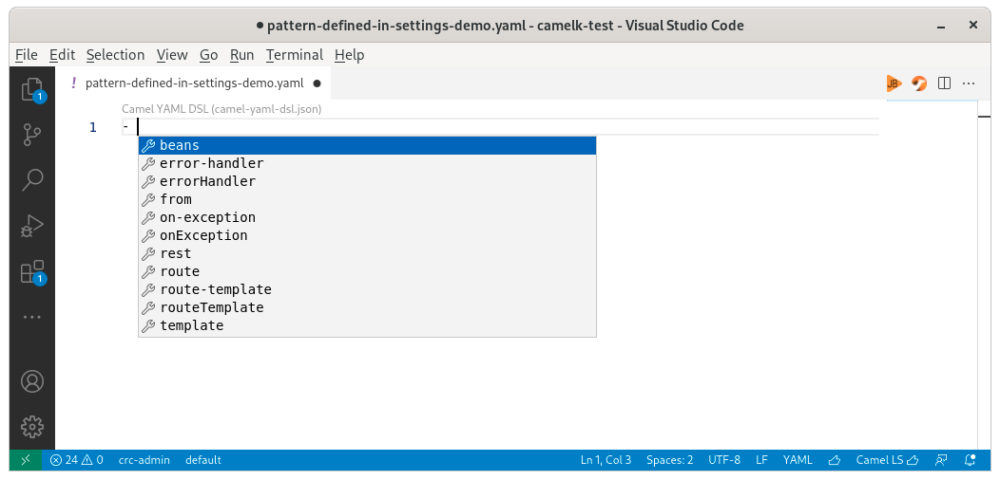
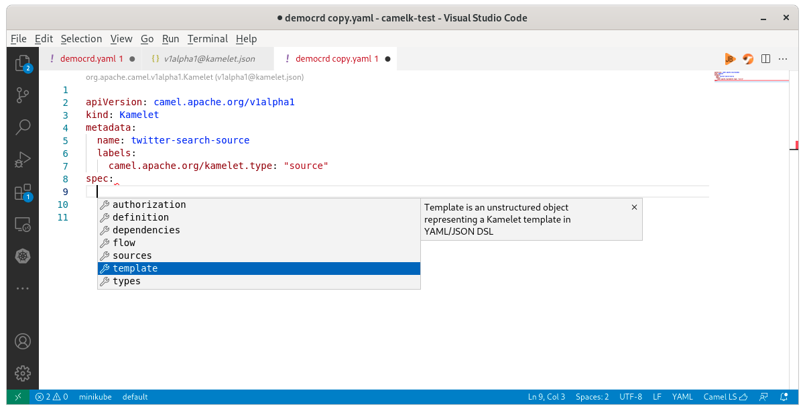

Camel provides possibilities to define Integrations using Yaml language. It is the language often used for people dealing with Kubernetes/OpenShift. This language doesn't have the same maturity than xml or java but there are tooling that can help a lot. Given that yaml specification doesn't allow self-described yaml metadata, several conventions are introduced to provide edition support of Yaml files. This article will focus on Camel Yaml files, both plain Yaml and Custom Resource Definitions (CRD) inside VS Code. Most of it can be transposed to other IDEs and other Yaml file types, see [this other article](https://developers.redhat.com/blog/2020/11/25/how-to-configure-yaml-schema-to-make-editing-files-easier#yaml_schema).

# Editing support

Textual editing support of yaml files is provided by [VS Code Yaml](https://marketplace.visualstudio.com/items?itemName=redhat.vscode-yaml). It provides syntaxic check for conformance with Yaml specification. More specific to our Camel use case, it can leverage Yaml schemas to provide completion and validation support. The binding of Yaml schema to the Yaml file can be done in various different ways. These various ways are explained in this article, describing their advantages and drawbacks.

# Plain Camel Yaml files

Plain Camel Yaml files are available for Camel K and Camel standalone, for instance it is looking this way:

```yaml
- from:
    uri: "timer:yaml"
    parameters:
      period: "1000"
    steps:
      - set-body:
          constant: "Hello Camel K from yaml"
      - to: "log:info"
```

## Yaml schema

The Camel Yaml schema is available in Camel GitHub repository at the following URL https://raw.githubusercontent.com/apache/camel/main/dsl/camel-yaml-dsl/camel-yaml-dsl/src/generated/resources/camel-yaml-dsl.json

This Yaml schema is the basis for all following solutions.

It is registered in [Json Schema Store](https://github.com/SchemaStore/schemastore/blob/e6e7694a50cae45213b32b6acb591fbca3c972c9/src/api/json/catalog.json#L496).


## File name pattern

[VS Code Yaml](https://marketplace.visualstudio.com/items?itemName=redhat.vscode-yaml) is automatically resolving the schema when the file is named following one of these 2 patterns, :
- `*.camel.yaml`
- `*.camelk.yaml`



In the screenshot, please notice the file name visible in the editor title, the Codelens mentioning the Camel YAML DSL as resolved schema and the completion which is based on the schema.

The advantages are that the content of the file is left untouched. It is also working in all editors/IDEs relying on the [Json schema store](https://www.schemastore.org/json/). For instance [IntelliJ](https://www.jetbrains.com/help/idea/json.html#ws_json_using_schemas) or editors/IDEs based on the Yaml Language server (Eclipse Desktop, Eclipse Che, Atom and [more](https://github.com/redhat-developer/yaml-language-server#clients)).

The drawbacks are that it doesn't allow to have a versioning. It means that you will always have to follow the latest released version.

## Inlined schema

It is possible to use inline metadata to specify the schema corresponding to the file with the [VS Code Yaml](https://marketplace.visualstudio.com/items?itemName=redhat.vscode-yaml). The following modeline-like format must be used:

`# yaml-language-server: $schema=https://raw.githubusercontent.com/apache/camel/main/dsl/camel-yaml-dsl/camel-yaml-dsl/src/generated/resources/camel-yaml-dsl.json`

No need to remember this line, on an empty file, you can call 2 completions to access it: `Inlined schema` and then `Camel YAML DSL`.



Note that after, you need to provide the first `-` yourself until [this enhancement](https://github.com/redhat-developer/yaml-language-server/issues/604) in Yaml Language Server has been implemented.

Defining inlined schema has the advantage to provide a self-described yaml file. It means that it allows to define the Camel/Camel K version used and consequently manage versioning. It is also working in all editors/IDEs based on the Yaml Language server (Eclipse Desktop, Eclipse Che, Atom and [more](https://github.com/redhat-developer/yaml-language-server#clients)).

## Camel K modeline

In case, the yaml file is a Camel K one using the plain Yaml DSL and defining `camel-k` modeline, a schema is automatically applied by [VS Code Tooling for Apache Camel K](https://marketplace.visualstudio.com/items?itemName=redhat.vscode-camelk). This schema, especially the version of it, can be changed in `File -> Preferences -> Settings -> Extensions -> Apache Camel K Tooling -> Camelk -> Yaml: Schema`


In the screenshot, please notice that there is no specific filename but the modeline `# camel-k:` is starting the file and that completion is available.

The modeline is provided by default when creating the Integration file from Command palette `Create a new Apache Camel K Integration file` or via command-line `kamel init my.yaml`.

## Association in VS Code Yaml settings

[VS Code Yaml](https://marketplace.visualstudio.com/items?itemName=redhat.vscode-yaml) provides settings to map specific files from the workspace to specific schemas. 

`File -> Preferences -> Settings -> Extensions -> Yaml -> Yaml: Schemas -> Edit in settings.json` and then insert something like:

```json
{
	"yaml.schemas": {
		"https://raw.githubusercontent.com/apache/camel/main/dsl/camel-yaml-dsl/camel-yaml-dsl/src/generated/resources/camel-yaml-dsl.json" : "/pattern-defined-in-settings*.yaml"
	}
}

```



Notice that the file is named following the specific pattern provided in code snippet example provided above. It doesn't have any modelines and do not match JSon schema store file name pattern.

# Camel CRD files

Edition support for Camel CRD files is available for a part of the Yaml attributes.

An automatic schema association is available with the following conditions:

* [VS Code Kubernetes](https://marketplace.visualstudio.com/items?itemName=ms-kubernetes-tools.vscode-kubernetes-tools) installed
* [VS Code Yaml](https://marketplace.visualstudio.com/items?itemName=redhat.vscode-yaml) installed
* Camel K deployed to a Kubernetes instance and VS Code connected to it



Please note that it is missing several subcomponents; notably missing Flow/steps schema definitions, please [vote for the support of it](https://github.com/apache/camel-k/issues/2229).

# What's next

Submit your enhancement requests! Given that several extensions are involved, feel free to report in the one that you want and you will be redirected. In case of doubt, I suggest to submit in the [VS Code Language support for Apache Camel issue tracker](https://github.com/camel-tooling/camel-lsp-client-vscode/issues).

Vote or provide Pull Requests for enhancement requests and issues to imrpove user experience for Camel Yaml development in VS Code, for instance:

* Offline CRD automatic association/Content-aware schema detection [redhat-developer/yaml-language-server#605](https://github.com/redhat-developer/yaml-language-server/issues/605#issuecomment-987781705)
* Support flows in CRDs schemas [apache/camel-k#2229](https://github.com/apache/camel-k/issues/2229)
* Completion for top-level array [redhat-developer/yaml-language-server#604](https://github.com/redhat-developer/yaml-language-server/issues/604)
* Wrong completion inside kubernetes kamelet spec -> types [redhat-developer/yaml-language-server#610](https://github.com/redhat-developer/yaml-language-server/issues/610)
* Use deprecated field of yaml schema specification instead of only modifying description [apache/camel-k#2817](https://github.com/apache/camel-k/issues/2817)
* Support composite folding strategy [microsoft/vscode#135279](https://github.com/microsoft/vscode/issues/135279)

More tooling to play with Camel Yaml in VS Code:

* A graphical editor and local deployment: [Apache Karavan](https://marketplace.visualstudio.com/items?itemName=camel-karavan.karavan)
* Camel URI support: the Yaml schema doesn't define specifications for the Camel URI itself. For Camel URI support in Yaml files, I let you check the [VS Code Language Support for Apache Camel](https://marketplace.visualstudio.com/items?itemName=redhat.vscode-apache-camel).
* Deployment utilities to a Kubernetes instance: [VS Code Tooling for Apache Camel K](https://marketplace.visualstudio.com/items?itemName=redhat.vscode-camelk)


