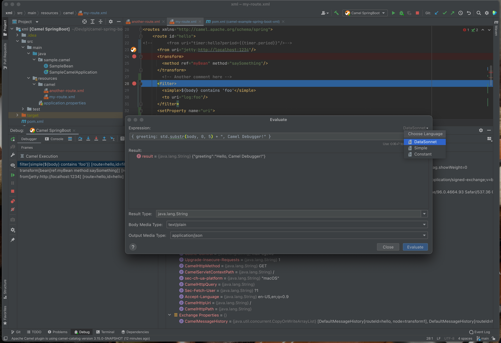

The recent release of the [Apache Camel plugin for IntelliJ version v0.8.0](https://plugins.jetbrains.com/plugin/9371-apache-camel) includes the first tech preview of the Camel Route Debugger. The debugger is currently available on Maven-based Camel projects and routes defined in the XML DSL. The minimum recommended Camel version is 3.15.0-SNAPSHOT (older versions also may work, but the functionality is limited).

# Features

The first tech preview includes the following features:

- breakpoints inside Camel routes in XML DSL;
- conditional breakpoints with Simple language predicates;
- Camel expressions evaluator;
- Support for Simple and DataSonnet expression languages;
- Message History and execution stack;
- Step Over, Step Into, Step Out and Run To Position functionalities implemented;
- Camel and Camel SpringBoot run configurations.



To try the debugger:

- Check out a [Camel Spring Boot example which uses XML routes](https://github.com/apache/camel-spring-boot-examples/tree/main/xml);
- Import the project into the IntelliJ as a Maven project;
- Create a new **Camel SpringBoot Application** run configuration;
- If you want to evaluate expressions in the [DataSonnet language](https://camel.apache.org/components/3.13.x/languages/datasonnet-language.html), add the following dependencies to your `pom.xml`:
 ```
    <dependency>
        <groupId>org.apache.camel.springboot</groupId>
        <artifactId>camel-datasonnet-starter</artifactId>
    </dependency>
    <dependency>
        <groupId>org.scala-lang</groupId>
        <artifactId>scala-library</artifactId>
        <version>2.13.3</version>
    </dependency>
```

# What's next
We'd like to hear from you! Please be sure to submit your bug reports and enhancement requests to the [Camel IDEA Plugin issue tracker](https://github.com/camel-tooling/camel-idea-plugin/issues)! 

The future enhancements will include support for non-XML DSLs such as Java and YAML, support for other project types (e.g. Gradle) and more!
