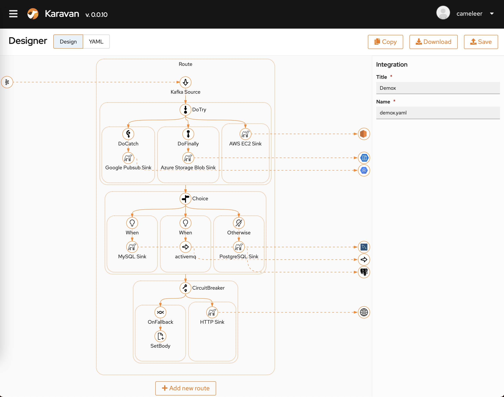
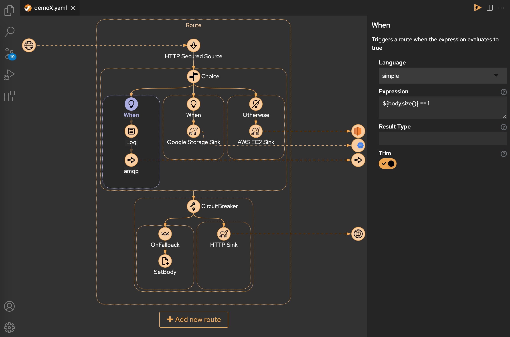
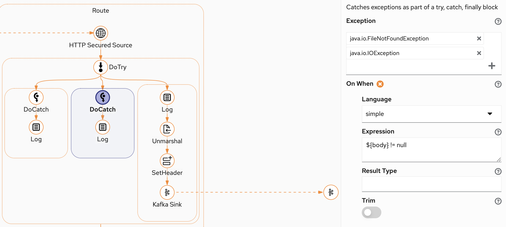
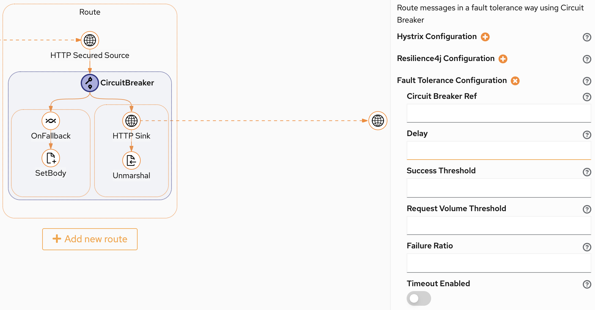
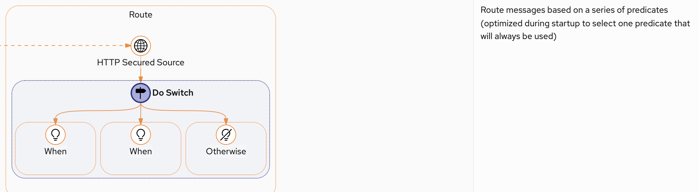
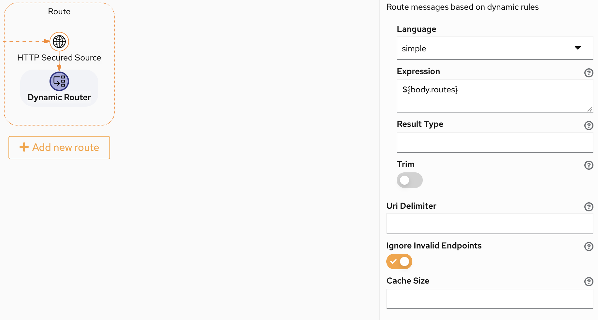
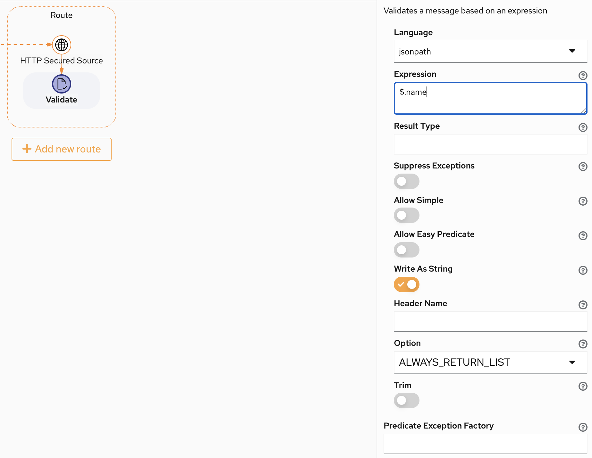

An important milestone in Apache [Apache Camel Karavan Designer](https://github.com/apache/camel-karavan) development.

# New Look and Feel

Current release comes with new redesigned interface for [Standalone application](https://github.com/apache/camel-karavan/pkgs/container/camel-karavan) and [VS Code extension](https://marketplace.visualstudio.com/items?itemName=camel-karavan.karavan)  (light and dark mode).

# Connectivity

1. Camel Kamelets 0.7.0
2. Camel Components 3.15

# New supported DSLs

We continue to add more DSL elements. New in this release:

1. Do Try - Do Catch - Do Finally
2. Circuit Breaker
3. Do Switch (new in Camel 3.15)
4. Dynamic Router (new in Camel 3.15)
5. Full Expression languages support for expression type properties

### Do Try - Do Catch - Do Finally

### Circuit Breaker

### Do Switch (new in Camel 3.15)

### Dynamic Router (new in Camel 3.15)

### Full Expression languages support for expression type properties

# Feedback is gold

If you have any idea or find a new issue, please [create a new issue report in GitHub](https://github.com/apache/camel-karavan/issues)!