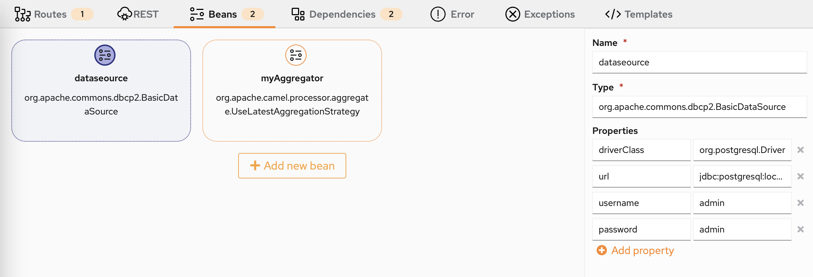
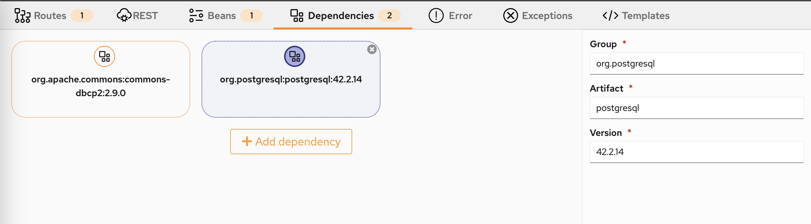
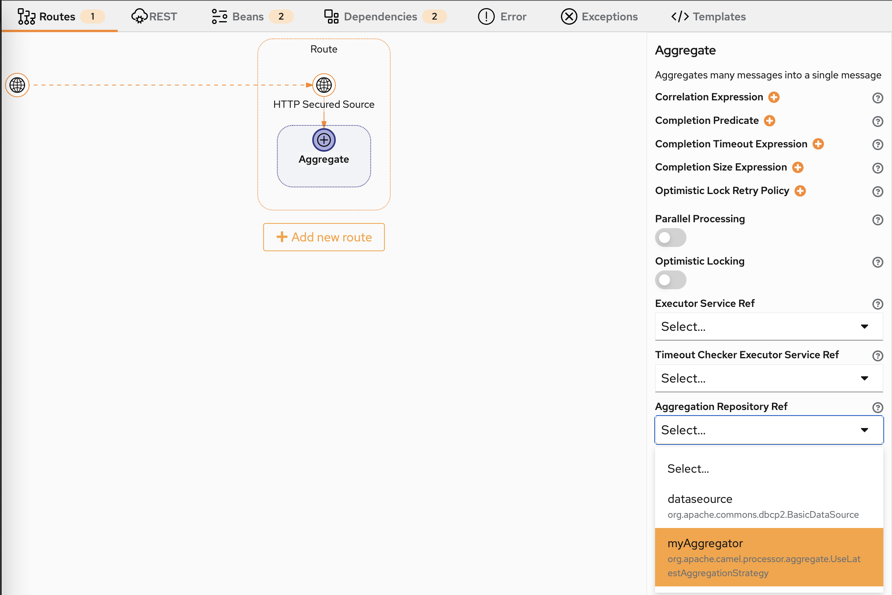
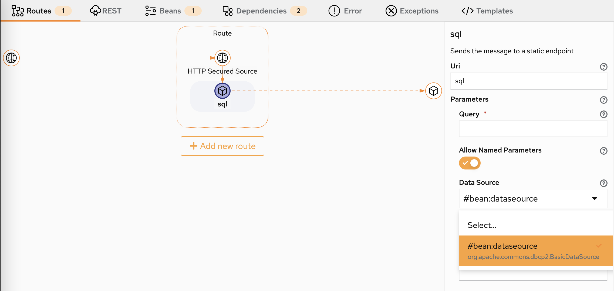

# Beans and dependencies

New Karavan preview release comes with Beans and dependencies configuration. Get it as a [Standalone application](https://github.com/apache/camel-karavan/pkgs/container/camel-karavan) or install [VS Code extension](https://marketplace.visualstudio.com/items?itemName=camel-karavan.karavan) from the Marketplace.

# Bean Configuration

New Beans tab to configure Beans:

# Dependencies Configuration

Configure Dependencies to access Beans outside Camel:

# DSL Bean mapping

How to map Bean to DSL: just select from the list.

# Component Bean mapping

How to map Bean to Component: just select from the list.

# Beans in action

How to configure SQL Component:

# Feedback is gold

If you have any idea or find a new issue, please [create a new issue report in GitHub](https://github.com/apache/camel-karavan/issues)!