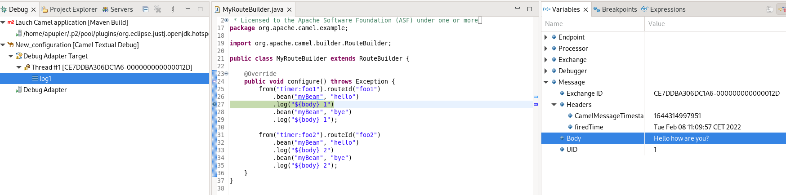
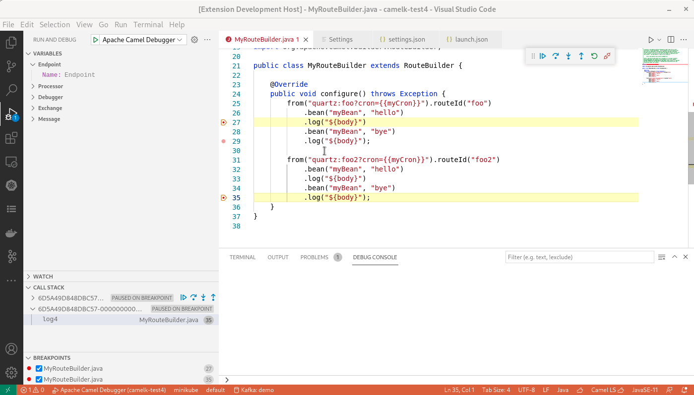
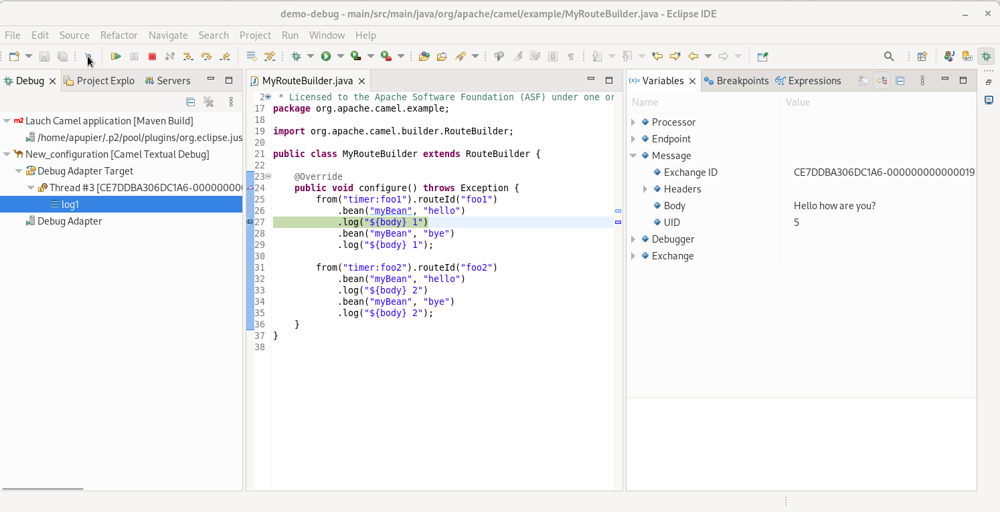
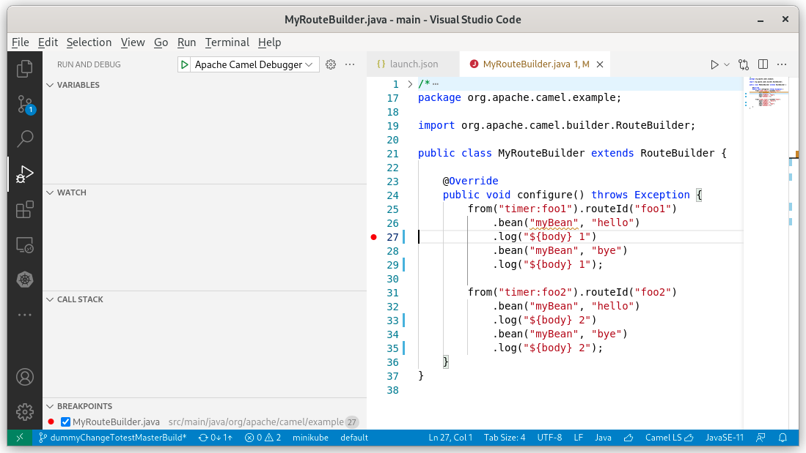
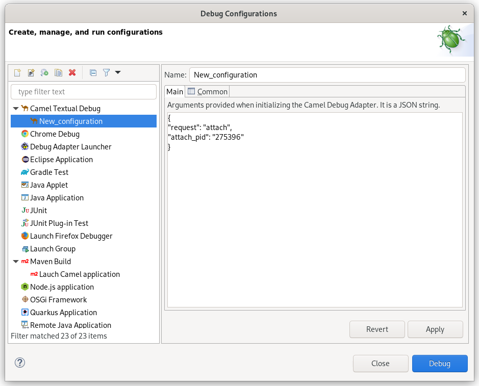

Textual debug for Camel routes was [announced in IntelliJ few weeks ago](/blog/2021/12/camelDebuggerForIntelliJ/). It is now available in [VS Code](https://marketplace.visualstudio.com/items?itemName=redhat.vscode-debug-adapter-apache-camel) and [Eclipse desktop](https://marketplace.eclipse.org/content/textual-debugging-apache-camel) with dedicated extensions. 

# Scope

The Camel Textual Route debugger is working locally. The debugger must be running on the same machine than the Camel application to debug. It is attaching to a running Camel route written in Java using the PID (Other Camel DSLs should work but have not been tested yet). Currently, a single Camel context can be debugged.

## Features

The Camel Textual Route Debugger provides the following features:

- Add and remove breakpoint.
- Inspect variable values on suspended breakpoints. Notably `body` and `headers` but also several more advanced ones.
  
- Resume a single route instance.
  
- Resume all route instances.
- Stepping to next endpoint when the route definition is in the same file.
  

Videos demonstration of these features are available for [VS Code](https://www.youtube.com/watch?v=c63ydfvqeNA) and [Eclipse Desktop](https://www.youtube.com/watch?v=jrp8prqD4mw).

## Requirements

Java Runtime Environment 11+ must be available on system path. This JRE must contain `com.sun.tools.attach.VirtualMachine` class. This is available in most JVMs, for instance in HotSpot and OpenJDK.

The Camel instance to debug must follow these requirements:

- Camel 3.15+
- Have `camel-debug` on the classpath
- Have [JMX enabled](/manual/jmx.html#_disabling_or_enabling_camel_jmx)

# IDEs

## VS Code

A [specific extension](https://marketplace.visualstudio.com/items?itemName=redhat.vscode-debug-adapter-apache-camel) is required for VS Code. After installing it, you can provide a `Launch configuration` of type `apache.camel` in your `.vscode/launch.json`. You will need to provide the value for the `attach_pid` field.

```json
{
	"version": "0.2.0",
	"configurations": [
		{
			"type": "apache.camel",
			"request": "attach",
			"attach_pid": "400335",
			"name": "Apache Camel Debugger"
		}
	],
	"compounds": []
}
```

Then `In Run and Debug panel`, launch the launch configuration that you just configured.



Next step is to set breakpoints and enjoy!

This [video](https://www.youtube.com/watch?v=c63ydfvqeNA) is providing a quick tour of current capabilities.

## Eclipse Desktop

A [specific extension](https://marketplace.eclipse.org/content/textual-debugging-apache-camel) is available for Eclipse Desktop. After installing it, a specific Launch configuration `Camel Textual Debug` is available. You will need to provide the value for the `attach_pid` field. Then click on `Debug`.



Next step is to set breakpoints and enjoy!

This [video](https://www.youtube.com/watch?v=jrp8prqD4mw) is providing a quick tour of current capabilities.

## Other IDEs

All IDEs mentioned in [this page](https://microsoft.github.io/debug-adapter-protocol/implementors/tools/) can be used. It remains up to you to configure the connection to the Debug Adapter yourself.

# Under the hood

It relies on the [Debug Adapter Protocol](https://microsoft.github.io/debug-adapter-protocol/overview). The idea is to standardize an abstract protocol for how a development tool communicates with concrete debuggers. It follows a very similar approach than the [Language Server Protocol](https://microsoft.github.io/language-server-protocol/), for which there is an [implementation for Apache Camel](https://github.com/camel-tooling/camel-language-server) already. It allows to concentrate most of the work and the logic in one place. On the clients side, there is only a relatively thin layer.

The Debug Adapter server for Apache Camel is written in Java. It is using the [Eclipse LSP4J.Debug](https://github.com/eclipse/lsp4j) project. It contains code inspired from [Camel debugger for IntelliJ](https://github.com/camel-tooling/camel-idea-plugin) and [Eclipse Fuse Tooling](https://github.com/jbosstools/jbosstools-fuse). Unfortunately not factorized with them as they use IDE-specific non-reusable API in current state.

In Eclipse desktop, despite the possibility to [use generic built-in Launch Configuration](https://github.com/camel-tooling/camel-dap-client-eclipse#built-in-lsp4edebug-launcher) of [LSP4E.Debug](https://projects.eclipse.org/projects/technology.lsp4e), a specific extension is provided to allow a much simpler interface for end-user and avoids the need to download the debug adapter server for Apache Camel. This extension is using APIs of LSP4E.debug project.

Currently, it requires to provide the PID of the Camel process manually and then creating a local JMX connection. In the future, it is planned to support arbitrary JMX connection, even JMX over http. It will allow to remote debug Camel routes, especially interesting when deployed in a Container.

# What's next

Submit your enhancement requests! Given that several extensions are involved, feel free to report in the one that you want and you will be redirected. In case of doubt, I suggest to submit in the [Red Hat Jira](https://issues.redhat.com/browse/FUSETOOLS2-1422) or the [debug adapter server for Apache Camel GitHub issues](https://github.com/camel-tooling/camel-debug-adapter/issues).
