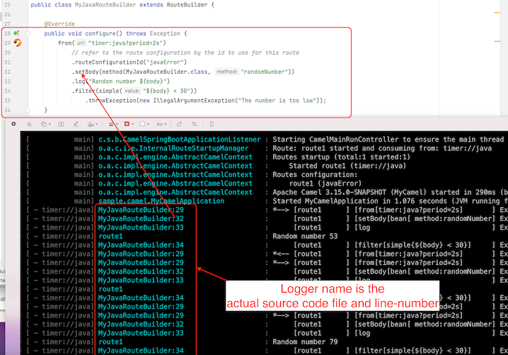

Apache Camel 3.15 has just been [released](/blog/2022/02/RELEASE-3.15.0/).

This release has **dropped** support for Java 8, and therefore Java 11 is required.

Because this is first release where we upgrade from Java 8 to 11, then some effort has been made
to migrate various Maven plugins and settings to make this upgrade possible.

This release introduces a set of new features and noticeable improvements that we will cover in this blog post.

### Camel Route source file:line 

When Camel startup then the DSL parser will now include the source file and line number
for every EIPs in the routes. (Java DSL requires to turn this on).

The illustration below shows message tracing outputting in the log which file:line the
message is being routed at:

Using this also allows Camel to give the exact route location,
such as where an exception was thrown during routing.

That is not all, as this also makes it possible to build route debugger for all the DSLs.

### Route Debugger

Camel now comes with support for route debugger for tooling.

The Camel IDEA plugin already supports this, which makes it possible
to do step by step debugging in Java, XML, YAML, Groovy, Kotlin routes.

You can read more about the debugger in this [blog post](/blog/2021/12/camelDebuggerForIntelliJ/).

The Camel Tooling team is currently working on debugging support for other IDEs such as VSCode and Eclipse.

### Alternative Dynamic Router

An alternative Dynamic Router EIP has been implemented as a new component.
You can find details about this from this [blog post](/blog/2022/01/dynamic-router-eip-component/).

### Running Camel K locally

The `camel-yaml-dsl` is now capable of loading Camel K source files (Integration and Binding), meaning you
can run and test locally integrations that are intended for Camel K.

This works well with Camel JBang, meaning that you can get a _Camel K like_ development
experience, running locally without the needed for a Kubernetes cluster.

For example, to run the Camel K examples, you can a Camel route written in Kotlin directly from GitHub with:

    camel run https://github.com/apache/camel-k/blob/main/examples/languages/routes.kts

### Camel JBang

We continue to innovate and make running Camel quickly and easily with JBang better and better.

In this release we added support for easily enabling the following features from the command line:

- `--jfr` - To enable Java Flight Recorder that will record and save to disk on exit.
- `--trace` - Enables the Camel tracing logging to the console
- `--health` - Enables health checks that are available on `http://localhost:8080/health` endpoint.
- `--console` - Includes the new Camel developer console (Very early prototype, plain text mode only)

We also made it easy to run using wildcards, for example to run with all files included from current dir:

     camel run *

You can also run directly from GitHub via:

     camel run https://github.com/apache/camel-examples/tree/main/examples/jbang

The `--reload` option has been improved, and in the next release Camel can also do updates to Java classes.
However, in this release the reloading is only Camel route source files.

See more details at the [Camel JBang documentation](/manual/camel-jbang.html)

### Developer Console

This release comes with an early prototype of the new Camel Developer Console.
The developer console is intended for development purposes, by giving relevant
information to the developer about the running Camel application.

The console is based on a pluggable architecture (similar to health-checks), which
makes it possible for individual components to provide their own consoles, and also
to make 3rd-party consoles as well.

Camel will come with a set of out-of-the-box consoles, such as general information
about the Camel version, which components are in use, real-time metrics of the routed
messages, and details of the last N throw exceptions etc.

We will continue to work on this functionality in the upcoming releases.

We also plan to integrate with [Quarkus Dev UI](https://quarkus.io/guides/dev-ui),
so you will have a lot of Camel consoles when using Camel on Quarkus.

### Camel UI Designer

The [Camel Karavan](https://github.com/apache/camel-karavan) project is progressing nicely, and during the development we have identified
a number of _mistakes_ in the route model in Camel that has been improved and corrected.

This overall makes it easier to build custom Camel tooling as there are less _model hacks_ you may need to
implement in the tool.

The changes to the model may affect users when upgrading, so make sure to read the [upgrade guide](/manual/camel-3x-upgrade-guide-3_15.html).

### Camel Kafka

We refactored the commit management code to simplify the maintenance, reduce the incidence of bugs and support the new features planned for future releases. 

The Kafka client was upgraded to version 3.1.0. The Kafka component remains backwards compatible with older Kafka versions. 

### Quarkus

The upcoming Camel Quarkus 2.8 release will be upgraded to Camel 3.15. 

### Spring Boot

We have upgraded to the latest Spring Boot 2.6 release.

### Better Java 17 support

Although Java 17 is not officially supported, we did improve a few Camel components to make them work with Java 17.
The official support is for Java 11.

### New components

This release has a number of new components:

- `camel-dynamic-router` - The Dynamic Router component routes exchanges to recipients, and the recipients (and their rules) may change at runtime.
- `camel-huaweicloud-frs` - Face Recognition Service (FRS) is an intelligent service that uses computers to process, analyze, and understand facial images based on human facial features.
- `camel-knative` - Send and receive events from Knative.
- `camel-milo` - Connect to OPC UA servers using the binary protocol for browsing the node tree.
- `camel-cloudevents` - Camel support for the CloudEvents specification
- `camel-jsh-dsl` - Camel DSL with JavaShell

## Upgrading

Make sure to read the [upgrade guide](/manual/camel-3x-upgrade-guide-3_15.html) if you are upgrading from a previous Camel version.

## Release Notes

You can find more information about this release in the with a list of JIRA tickets resolved in the release: 

- [release notes 3.15](/releases/release-3.15.0/)

