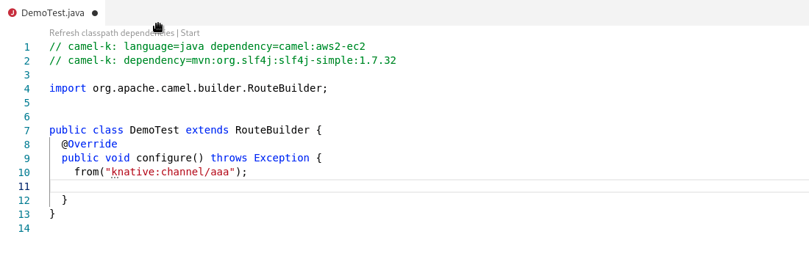

A new release of [VS Code Language support for Camel](https://marketplace.visualstudio.com/items?itemName=redhat.vscode-apache-camel) is available! This is the version 0.1.5. It comes with improvement in `connected mode` and several Camel versions upgrades.

# Connected mode hint

For components which proposes `connected mode`, there is now a little hint on hover to help user to know that more completion is available with a configured connection to an instance.

For reminder, the components leveraging this kind of feature are `kafka`, `knative` and `kubernetes-*`. See [release 0.1.0 announcement](/blog/2021/10/vscode-camel-language-support-release-0.1.0/#connected-mode-for-completion-of-knative-and-kubernetes-components) and [release 0.0.32 announcement](/blog/2021/05/vscode-camel-release/#connected-mode-for-kafka-topic-completion).

# Version upgrades

Default Camel Catalog version is updated from 3.14.0 to 3.15.0.

Camel Quarkus Catalog is updated from 2.5.0 to 2.7.0

Kamelet Catalog is updated from 0.5.0 to 0.7.0.

# What's next

Submit your enhancement requests!

In lights of recent `connected mode` improvements, we are especially interest in suggestion for specific components and attributes for which being connected to a running instance of the target environment would really help to provide completion or validation.

They can be submitted in [Language Server for Camel GitHub tracker](https://github.com/camel-tooling/camel-language-server/issues) or [Red Hat Jira](https://issues.redhat.com/projects/FUSETOOLS2/issues).
