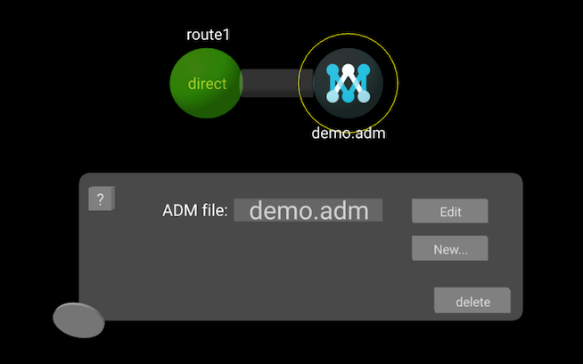
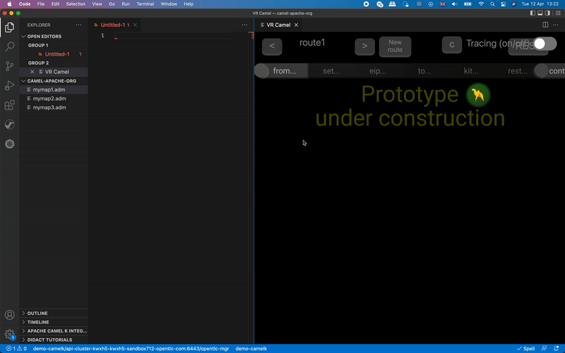

\

The latest release of the [VS Code Camel Designer](https://marketplace.visualstudio.com/items?itemName=brunoNetId.camel-designer) extension integrates [VS Code AtlasMap](https://marketplace.visualstudio.com/items?itemName=redhat.atlasmap-viewer). Explore how both can help you to accelerate productivity in Camel.


## Two visual tools for Camel integrated in VS Code

\

[*AtlasMap*](https://www.atlasmap.io/) is a great visual data mapping tool that enables users to define data transformations that *Camel* can process at runtime.

The [0.1.0 release of the *VSCode* extension for *AtlasMap*](/blog/2021/11/vscode-atlasmap-release-0.1.0/) introduced a series of improvements that allowed a better user experience when creating and editing *AtlasMap* definitions.

Provided that *AtlasMap* is a visual design-time tool that Camel can execute, it makes sense to integrate *AtlasMap* with other visual tooling for *Camel*. And that’s what the latest release of *Camel Designer* does, enable the user to model *Camel* routes, and include *AtlasMap* as a processing step in the route flow.

[*Camel Designer*](https://brunonetid.github.io/2020/06/28/camel-designer.html) is a visual tool to intuitively compose integration processes using the Camel language. It explores how to augment user productivity, provide a pleasant and confortable experience and lower the effort to define Camel routes.

Let’s look at how *AtlasMap* is integrated within *Camel Designer*.

## Using the AtlasMap activity in Camel Designer

\

Camel routes are composed of multiple processing steps. You first define the data source with a `from` DSL starting element, and then you include the actions that follow. In *Camel Designer* you include *AtlasMap* as a processing action in the Camel route by selecting from the menu the following option:

* `eip… > transform > AtlasMap` 


<div style="
  padding: 12px 12px;
  background-color: #e7f3fe;
  border-left: 6px solid #2196F3;">
  <p><strong>Tip!</strong> Read Camel Designer’s <a href="https://github.com/designer-for-camel/camel-designer/blob/master/docs/how-to.md">how-to</a> documentation to get familiar with common UI tasks.</p>
</div>
\

From the visual editor, a representative flow would be rendered as follows:



In the illustration above, an *AtlasMap* activity follows the starting element (`direct`). The yellow ring indicates the activity under configuration (AtlasMap).

The default ADM file (*AtlasMap* data mapping definition) is dummy, configured as `demo.adm` (does not exist). If you try to edit the file, you would get the following error displayed:


<br>

To create a new ADM file, click the `New…` button. This action will launch VSCode’s AtlasMap extension and prompt you to select the working folder where the ADM file will be located and its file name.

From *AtlasMap* ’s UI you create your data mapping definition and its configuration data will be stored in the ADM file when saved. *Camel Designer* defines your new *AtlasMap* activity pointing to the newly created ADM file.

If your current workspace already contains ADM files, *Camel Designer* will find them and include them in its configuration dropdown list. To open and edit any of the existing ADM files, hover your mouse cursor over the dropdown list and select the ADM file you’d like to configure, then click the ```Edit``` button. The following animated GIF illustrates the actions to follow:



You will observe how Camel Designer generates all your source code in real time on the left of your screen using Camel's DSL language.

And that's it! Give it a try!


## Learn more about *Camel Designer* and *AtlasMap*

\

- Read this [*Camel Designer* blog](https://brunonetid.github.io/2020/06/28/camel-designer.html) to understand how visualisation increases productivity
- A good place to get started with *Camel Designer* is its [how-to guide in GitHub](https://github.com/designer-for-camel/camel-designer/blob/master/docs/how-to.md).
- Explore [*AtlasMap*'s website](https://www.atlasmap.io/) to discover all its features.
- Read [this blog](/blog/2021/11/vscode-atlasmap-release-0.1.0/) presenting the latest *VS Code AtlasMap* release
- Find [*Camel Designer*](https://marketplace.visualstudio.com/items?itemName=brunoNetId.camel-designer) in *VS Code*'s marketplace
- Find [*AtlasMap*](https://marketplace.visualstudio.com/items?itemName=redhat.atlasmap-viewer) in *VS Code*'s marketplace


