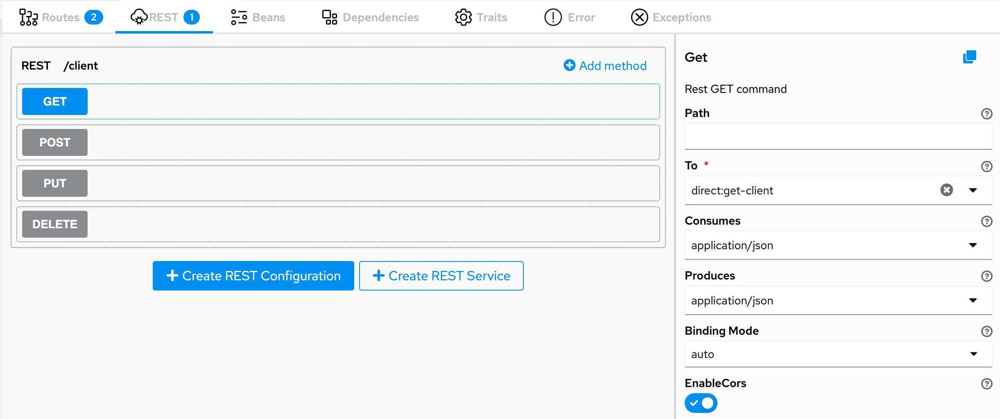
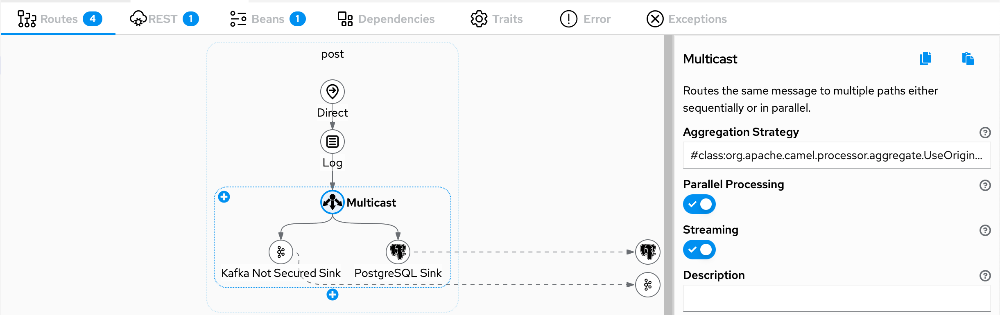
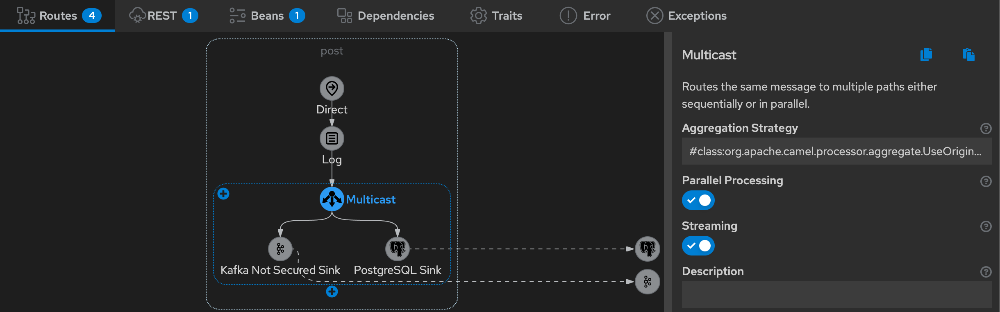
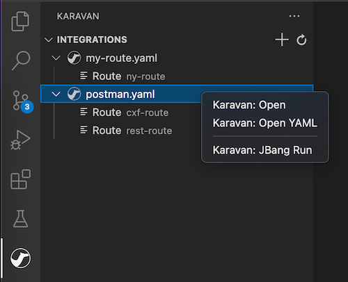
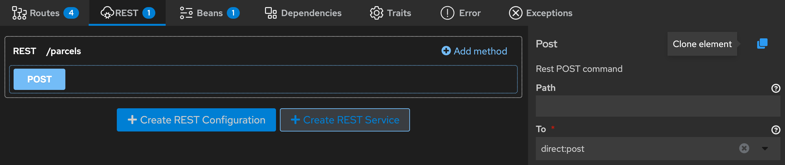
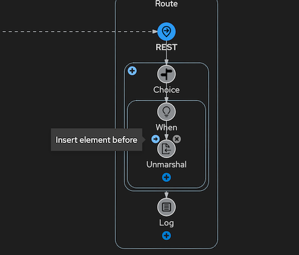

What's going on with Apache Camel Karavan? 

Karavan is progressing! The following cool stuff was done since the last [post](/blog/2022/02/camel-karavan-0.0.12):

# REST API

With the aid of the new clean REST DSL in Camel 3.16  Karavan can help to design REST API.
Starting from version 0.0.13 Karavan requires Camel 3.16+ runtime

# User Interface improvements

## New theme

Karavan comes with the new theme aligned to VSCode build-in theme.

## New VS Code view

Karavan comes with the new VS Code view to manage integrations.

## Copy-Paste and Clone

Clone REST services and methods, beans and dependencies.

## Insert steps

In additional to drag-and-drop steps, now step could be added before any other steps.

## Karavan Tour

Karavan has a built-in tour to help self-learn integration design with Apache Camel.

# Feedback is gold

Get Karavan as a [Standalone application](https://github.com/apache/camel-karavan/pkgs/container/camel-karavan) or install [VS Code extension](https://marketplace.visualstudio.com/items?itemName=camel-karavan.karavan) from the Marketplace.

If you have any idea or find a new issue, please [create a new issue report in GitHub](https://github.com/apache/camel-karavan/issues)!
