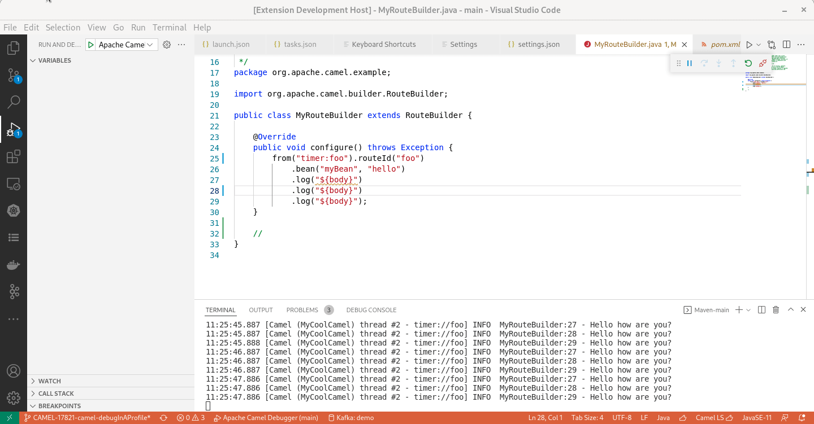
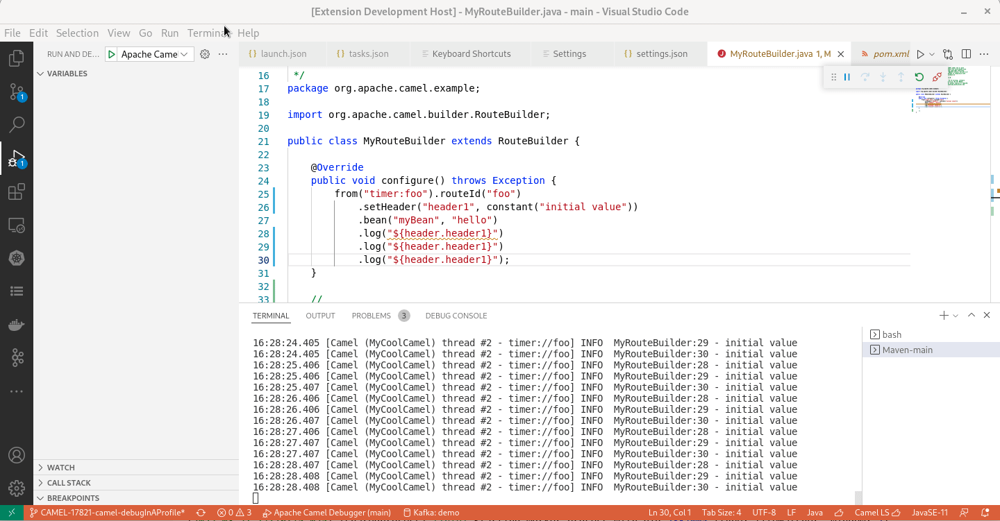
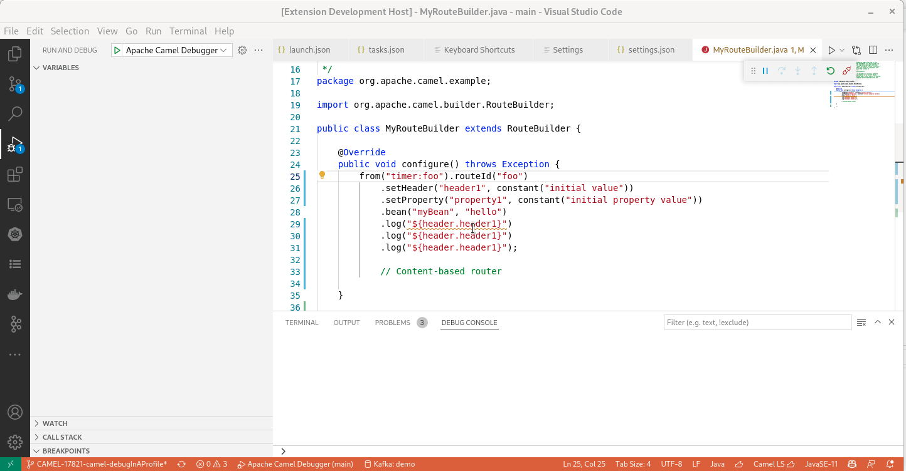
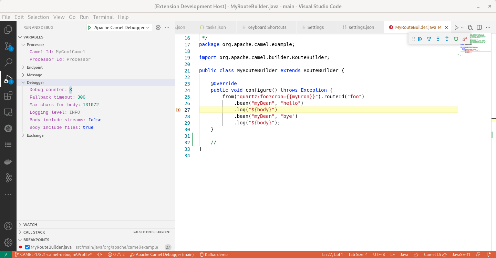
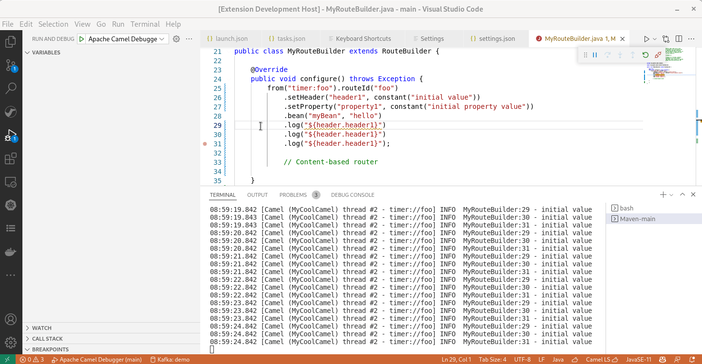

Textual debug for Camel routes allows to set breakpoints at Route definition. A first release based on Debug Adapter Server for Apache Camel has [been announced](/blog/2022/02/camel-textual-debug-eclipse-vscode/) last month. The new release 0.1.1 is coming with two new features: the support of JMX connection and the update of variable values.

# New Features

## JMX Connection support

It might sound very technical but it has a tremendous functional impact. It simplifies a lot the launch of the debugger as there is no more the requirement to grab the pid. There is a stable default JMX url in Camel which allows to connect with the same configuration between different launch of the same Camel application.

A [specific extension](https://marketplace.visualstudio.com/items?itemName=redhat.vscode-debug-adapter-apache-camel) is required for VS Code. After installing it, you can provide a `Launch configuration` of type `apache.camel` in your `.vscode/launch.json`.

Then  in `Run and Debug panel`, launch the launch configuration that you just configured.

Next step is to set breakpoints and enjoy!

This [video](https://youtu.be/CV8Q42uMCeM) is providing a demo of the new and easier way to connect the debugger.

## Update variable values for simple types

During a debug session, it can be convenient to update a variable value on the fly. it allows to test different values without modifying and (auto-)redeploying the application. Maybe, the most interesting ones are the body and the header values.

Check it in action:

* For Body:
  
* For Message header:
  
* For Exchange property:
  
* For generic debugger variables:
  

Please note that if an invalid value or an unsupported modification is tried, an `internal error` message is available in UI and the specific error message is available in the Debug console.

# New Requirements

Previously, Camel 3.15+ was required for the Camel application under debug. With this version, Camel 3.16+ is required.

# What's next

Important next steps are to improve robustness of the JMX connection, to allow JMX over http so that Camel applications deployed in containers can be debugged too and to provide ability to combine start of application and debugger attachment.

Submit your enhancement requests! Given that several extensions are involved, feel free to report in the one that you want and you will be redirected. In case of doubt, I suggest to submit in the [Red Hat Jira](https://issues.redhat.com/browse/FUSETOOLS2) or the [debug adapter server for Apache Camel GitHub issues](https://github.com/camel-tooling/camel-debug-adapter/issues).
