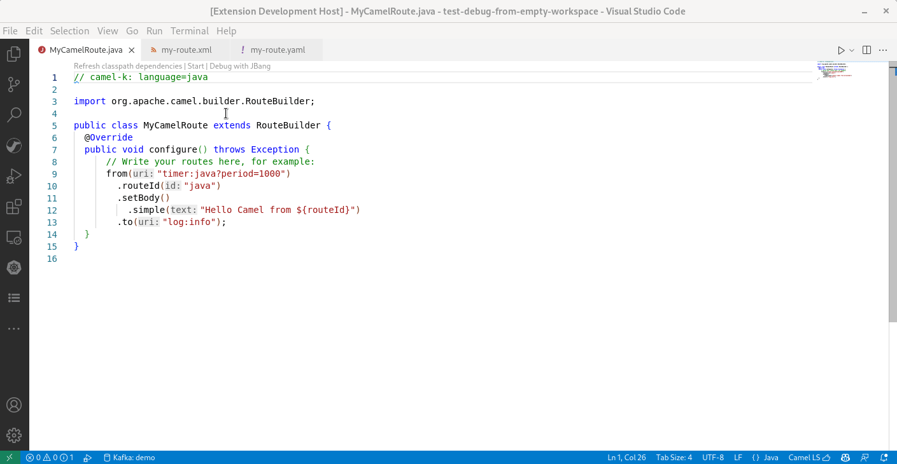
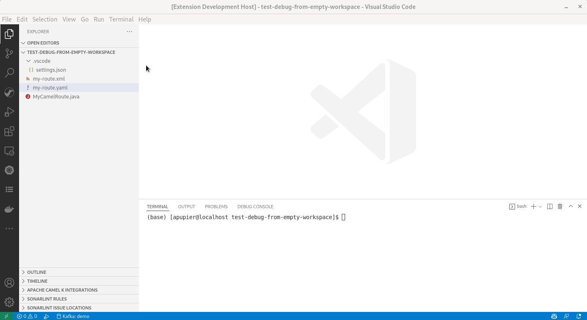
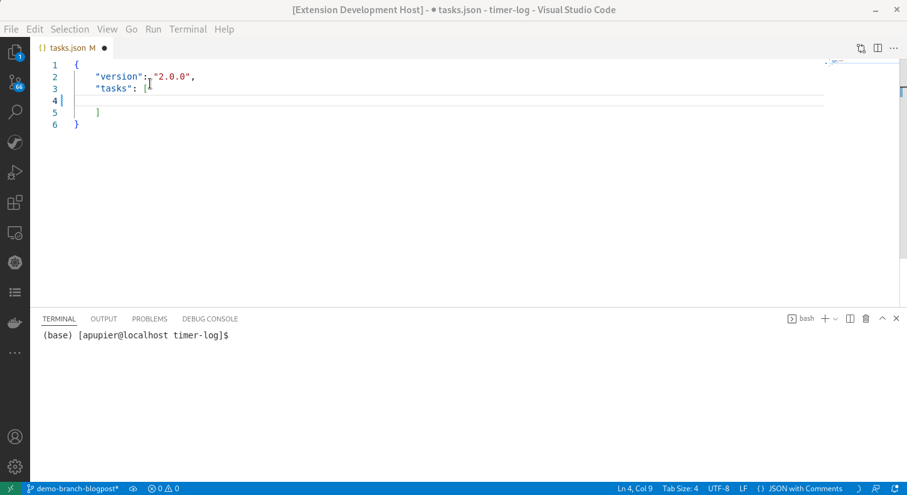
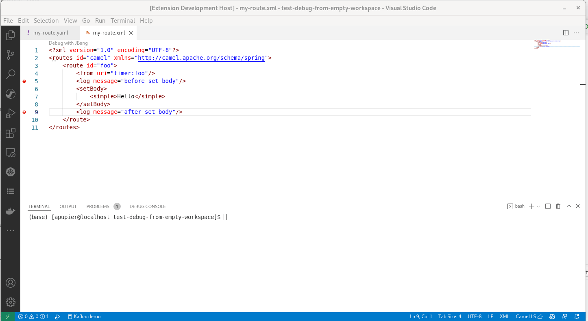
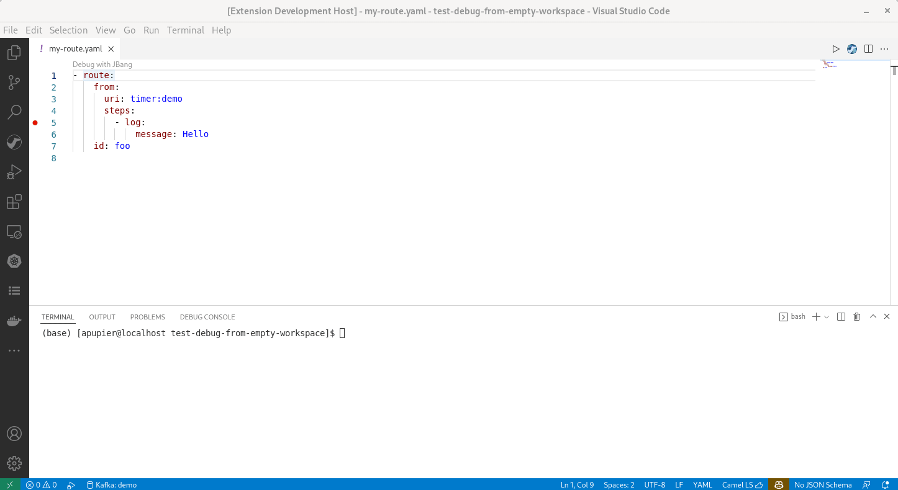

Textual debug for Camel routes allows to set breakpoints at Route definition.

The new release of [VS Code Debug Adapter for Apache Camel](https://marketplace.visualstudio.com/items?itemName=redhat.vscode-debug-adapter-apache-camel) 0.3.0 improves guidance to start the debug session and provide support for conditional breakpoint.

# Guidance to start the debug session improvements

## Codelens and contextual menu

In previous release, the command `Start camel Application with JBang and debug` was provided in the command palette. This command is now also available closer in the User UI. Both as a codelens and as a contextual menu on right-click in the file explorer. They are available on `java`, `xml` and `yaml` files.

## Completion for Quarkus

In `.vscode/tasks.json`, a new completion is available to guide user.

For more details how to Camel debug a Quarkus application, see this [previous blogpost](/blog/2022/05/start-camel-quarkus-application-with-camel-textual-debug-in-vscode/).

# Conditional breakpoint

Conditional breakpoints are now supported. It allows to suspend the route execution only on certain conditions. For instance, when the `body` has a certain value.

You can add a condition and/or hit count when creating a source breakpoint (with the `Add Conditional Breakpoint` action) or when modifying an existing one (with the `Edit Condition` action). In both cases, an inline text box with a dropdown menu opens where you can enter Camel `simple` language expression.

For details how to write the condition, see the [Camel Simple language documentation page](/components/3.16.x/languages/simple-language.html).

A [video](https://youtu.be/38Q1CDZm5SI) is available to see it in action with comments.

# Breakpoints available on start

In previous versions, the Camel breakpoints needed to be set after the Camel debugger was connected to the Camel application. It is now possible to set breakpoints before starting the Camel debugger.

# What's next

You can submit your enhancement requests on the [VS Code client for Debug Adapter for Camel](https://github.com/camel-tooling/camel-dap-client-vscode/issues) or in the [Red Hat Jira](https://issues.redhat.com/browse/FUSETOOLS2).
