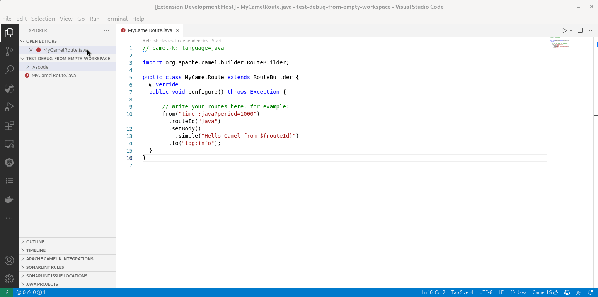
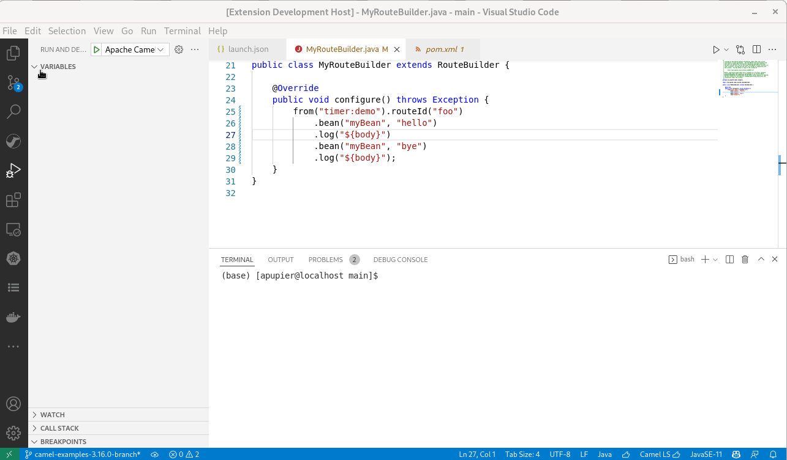
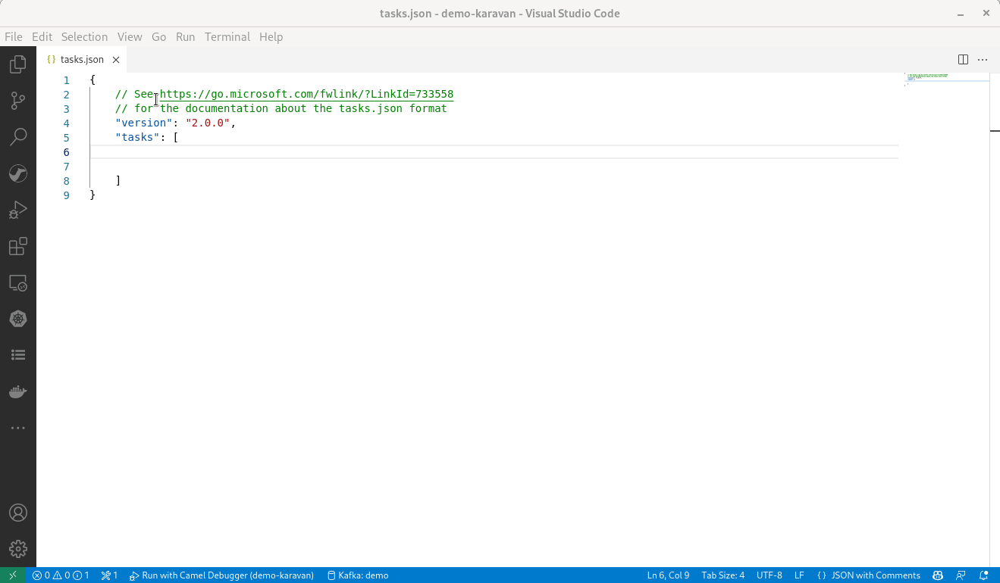
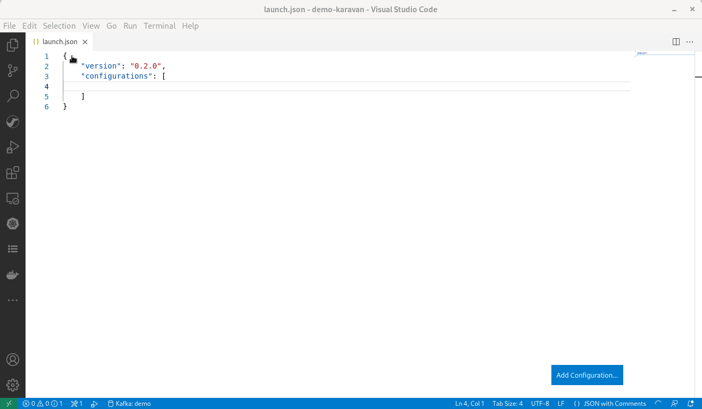

Textual debug for Camel routes allows to set breakpoints at Route definition.

The new release of [VS Code Debug Adapter for Apache Camel](https://marketplace.visualstudio.com/items?itemName=redhat.vscode-debug-adapter-apache-camel) 0.2.0 improves guidance to start the debug session and provide a JBang-based command to start Camel application and attach Camel Textual debugger in a single action.

# Command to start with Jbang and Camel debug

The command `Start camel Application with JBang and debug` allows a straightforward "start and debug" with a single action for simple cases. It assumes that [Jbang is available on command-line](https://www.jbang.dev/documentation/guide/latest/installation.html).

You can also see it in action in [this video](https://youtu.be/IGoq3JmAN8g).

# Requirements message reminder on error

There are several requirements to leverage the Debugger functionalities. In case, the debug adapter for Camel is not able to connect to the launched Camel application, an error message is now displayed in Debug console. It provides the exception message and it reminds the various requirements.

# Completion for task and launch configurations

Previously, I published a [blogpost](/blog/2022/04/start-camel-application-with-camel-textual-debug-in-vscode/) on how to configure tasks and launch configurations. New snippets are available on completion. They are provided to guide on the configuration of these tasks and launch configurations. It covers launch with `JBang` and `Maven`.

Compared to previous blogpost, they are using an improved problem matcher. It allows a more robust experience as it is attaching the debugger only when the Camel application is ready for the debugging session.

Using tasks and launch configurations is useful for use cases too complex for a simple `jbang` launch.

# What's next

You can submit your enhancement requests on the [VS Code client for Debug Adapter for Camel](https://github.com/camel-tooling/camel-dap-client-vscode/issues) or in the [Red Hat Jira](https://issues.redhat.com/browse/FUSETOOLS2).
