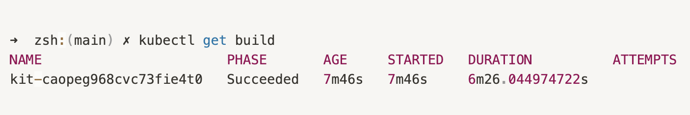
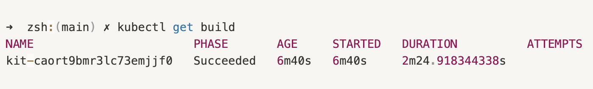

The Integration is the resource which represents the actual Camel application and building a container image that packages the integration within an elevated cloud platform (be it locally in a Minikube or K8s hosted cluster to Openshift clusters) takes ample amount of time.

### Enhancing the Camel-K Integration build time

Our goal was to reduce overhead and improve user experience. We were able to narrow down the major contributors that had a significant influence on the integration build time.

We identified that the CPU resources available to the operator can have a significant impact on integration build time. Following that, we modified the Camel-K operator to be aware of the CPU quota set on the operator container, and then we made the Maven process and container image layers push scaling vertically based on the CPU quota. Users may use Maven to download dependencies in parallel by configuring a group of concurrent threads. We modified the technique for configuring the build by default to account for the maximum number of CPU cores available simultaneously. In addition we modified the container Image push method to use the parallelization.

The effect of faster build times may be seen in the benchmark comparisons below.

### System Configuration

| Device         | Chip              | Total Number of Cores | Memory |
| -------        | -----             | --------              |--------|
|MacBook Air (M1)| Apple Sillicon M1 |   8 core CPU (4 performance and 4 efficiency), 7 Core GPU                |                  8GB

### Environment Configuration

The tests are graded using the following configurations:

1. **Minikube Version:**  v1.25.2
2. **Minimum no. of cores:** 2
3. **Maximum no. of cores:** 4
4. **Maximum memory used:** 3933 MB
5. **Registry Addon:** Enabled

*PS: These metrics are exclusive to my system; they may differ for others.*

### Evaluating Performing

1. Start a new minikube cluster with minimum permissible cores and maximum memory (as per docker desktop)

    ```shell
    minikube start --addons registry --cpus 2 --memory=3GB
    ```

2. Setup the Camel-K environment by installing the operator (Kamel)

    ```shell
    kamel install
    ```

3. Run a sample Integration in the dev mode

    ```shell
    kamel run --env MY_ENV_VAR="hello world" Env.java --dev
    ```

4. Get the build duration
    The build duration is ~6mins using default usage of cores available.

    

5. Delete the minikube cluster to reinstate the environment and avoid any usage of previously build Integration images.

    ```shell
    minikube delete
    ```

6. Start a new minikube cluster with maximum permissible cores and maximum memory (as per docker desktop)

    ```shell
    minikube start --addons registry --cpus 4 --memory=3GB
    ```

7. Repeat steps 2 and 3.
8. Get the build duration
    The build duration is ~2mins utilizing the maximum CPU cores available for my system.

    

#### Benchmark Comparison

| Integration | Integration Kit Name | Build Time |CPUs |
| -------- | -------- | -------- |----- |
| Env.java     |  kit-caopeg968cvc73fie4t0   |   6m26.044974722s   | 2 |
|Env.java | kit-caort9bmr3lc73emiifo | 2m24.9183443385s | 4

It is clear that the build time has decreased significantly; with more powerful systems (e.g., 16, 32 cores), the build time will be reduced to a few tens of seconds.

### Leveraging the benefit

To utilise this newly available functionality and apply CPU constraints on operator deployment, select from the following example measures or consult the [Resource Management](/camel-k/1.9.x/installation/advanced/resources.html#scheduling-infra-pod-resources) guide to modify it about their own needs.

```shell
kamel install --operator-resources requests.cpu=256m --operator-resources limits.cpu=500m --operator-resources limits.memory=512Mi ...
```

The operator Pod's Maven builds are most likely the largest contributor to compute resource consumption (assuming you use the default build strategy). As a result, the resource needs must be determined properly. The conditions listed below are reasonable defaults that should work in most cases, probably giving you the freedom to customize it as per your system to leverage the full potential of it.

```yaml
resources:
  limits:
    cpu: "4"
    memory: 3Gi
  requests:
    cpu: 500m
    memory: 512Mi
```

---
Feedback or questions can be sent to the [camel-k](https://github.com/apache/camel-k) community by raising issues/discussing your concerns in the [mailing list](/community/mailing-list/) or [IRC](https://camel.zulipchat.com/#) channels.
