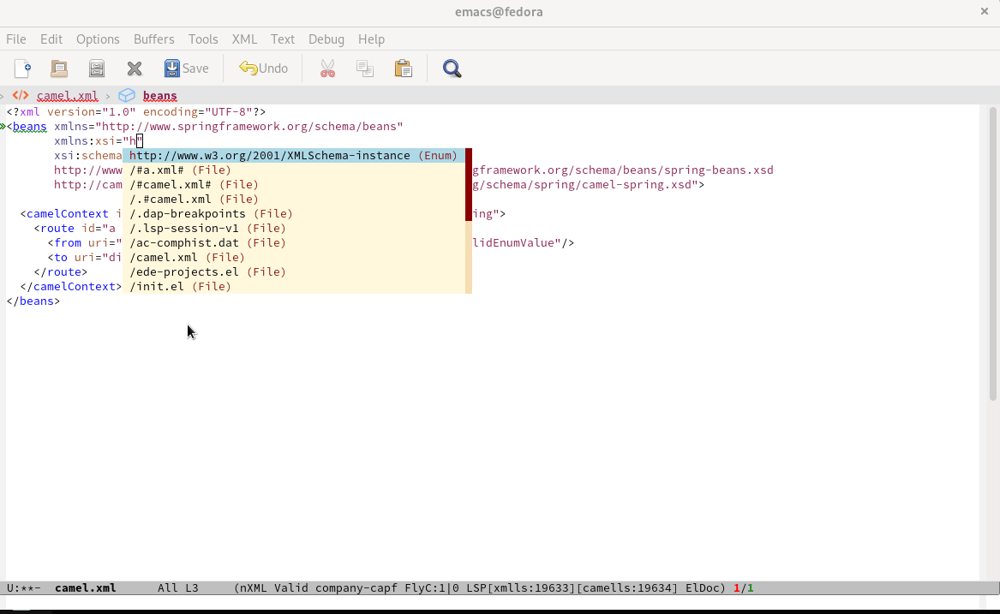
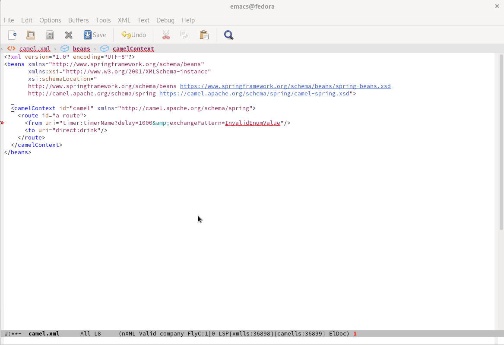
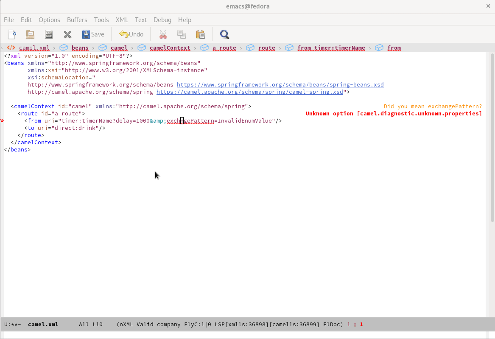

# Text Editing capabilities of Camel URI with Camel XML DSL

The capabilities are based on the [Camel Language Server](https://github.com/camel-tooling/camel-language-server).

For instance, code completion of Camel URI with Camel XML Dsl:



Diagnostic of Camel URI attribute value with Camel XML Dsl:



Diagnostic of Camel URI attribute name with Camel XML Dsl:




# How to configure Emacs?

* For the convenience to have all the Emacs configuration in one directory, should use `~/.emacs.d/init.el`

In a `~/.emacs.d/init.el` file:

```lisp
(require 'package)
(add-to-list 'package-archives '("melpa" . "https://melpa.org/packages/") t)
;; Comment/uncomment this line to enable MELPA Stable if desired.  See `package-archive-priorities`
;; and `package-pinned-packages`. Most users will not need or want to do this.
;;(add-to-list 'package-archives '("melpa-stable" . "https://stable.melpa.org/packages/") t)
(package-initialize)
(custom-set-variables
 ;; custom-set-variables was added by Custom.
 ;; If you edit it by hand, you could mess it up, so be careful.
 ;; Your init file should contain only one such instance.
 ;; If there is more than one, they won't work right.
 '(package-selected-packages '(lsp-mode)))
(custom-set-faces
 ;; custom-set-faces was added by Custom.
 ;; If you edit it by hand, you could mess it up, so be careful.
 ;; Your init file should contain only one such instance.
 ;; If there is more than one, they won't work right.
 )

(require 'lsp-mode)
(add-hook 'nxml-mode-hook #'lsp)
```

* Create `~/.emacs.d/lsp-camel.el`file with the following content:


In a `~/.emacs.d/lsp-camel.el` file:

```lisp
;;; lsp-camel.el --- LSP Camel server integration        -*- lexical-binding: t; -*-


;;; Code:

(require 'lsp-mode)

(defgroup lsp-camel nil
 "LSP support for Camel, using camel-language-server"
 :group 'lsp-mode
 :tag "Language Server"
 :package-version '(lsp-mode . "8.0.0"))

;; Define a variable to store camel language server jar version
(defconst lsp-camel-jar-version "1.5.0")

;; Define a variable to store camel language server jar name
(defconst lsp-camel-jar-name (format "camel-lsp-server-%s.jar" lsp-camel-jar-version))

;; Directory in which the servers will be installed. Lsp Server Install Dir: ~/.emacs.d/.cache/camells
(defcustom lsp-camel-jar-file (f-join lsp-server-install-dir "camells" lsp-camel-jar-name)
 "Camel Language server jar command."
 :type 'string
 :group 'lsp-camel
 :type 'file
 :package-version '(lsp-mode . "8.0.0"))

(defcustom lsp-camel-jar-download-url
 (format "https://repo1.maven.org/maven2/com/github/camel-tooling/camel-lsp-server/%s/%s" lsp-camel-jar-version lsp-camel-jar-name)
 "Automatic download url for lsp-camel."
 :type 'string
 :group 'lsp-camel
 :package-version '(lsp-mode . "8.0.0"))

(lsp-dependency
'camells
'(:system lsp-camel-jar-file)
`(:download :url lsp-camel-jar-download-url
			:store-path lsp-camel-jar-file))

(defcustom lsp-camel-server-command `("java" "-jar" , lsp-camel-jar-file)
 "Camel server command."
 :type '(repeat string)
 :group 'lsp-camel
 :package-version '(lsp-mode . "8.0.0"))

(defun lsp-camel--create-connection ()
 (lsp-stdio-connection
  (lambda () lsp-camel-server-command)
  (lambda () (f-exists? lsp-camel-jar-file))))

(lsp-register-client
(make-lsp-client :new-connection (lsp-camel--create-connection)
				 :activation-fn (lsp-activate-on "xml")
				 :priority 0
				 :server-id 'camells
				 :add-on? t
				 :multi-root t
				 :initialized-fn (lambda (workspace)
								   (with-lsp-workspace workspace
									 (lsp--set-configuration (lsp-configuration-section "camel"))))
				 :download-server-fn (lambda (_client callback error-callback _update?)
									   (lsp-package-ensure 'camells callback error-callback))))

(lsp-consistency-check lsp-camel)

(provide 'lsp-camel)
;;; lsp-camel.el ends here
```

* Evaluating it by calling `M-x eval-buffer`

* Loading Camel LS by calling: `M-x lsp-install-server` and choosing `camells`

Follow [this link](https://github.com/camel-tooling/camel-lsp-client-emacs) to know more about configuring Emacs and have up-to-date information.

Then you can enjoy editing capabilities of Camel URI.

NOTE - The configuration will be simplified with next release of [lsp-mode](https://github.com/emacs-lsp/lsp-mode) thanks to [built-in support of Camel Language Server](https://github.com/emacs-lsp/lsp-mode/issues/3528).
