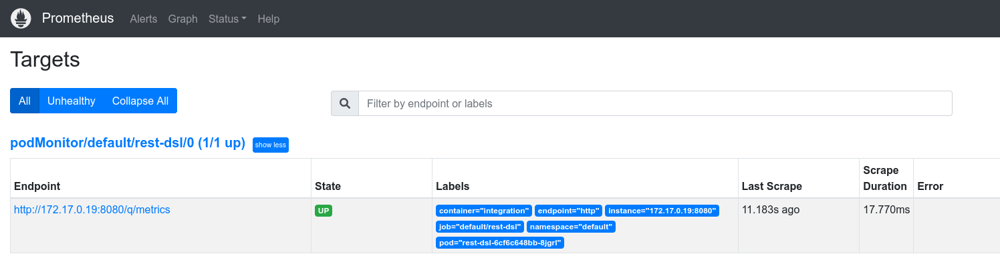
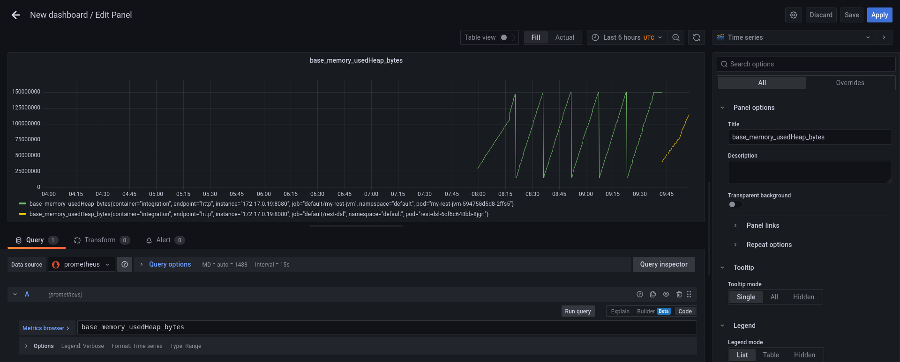
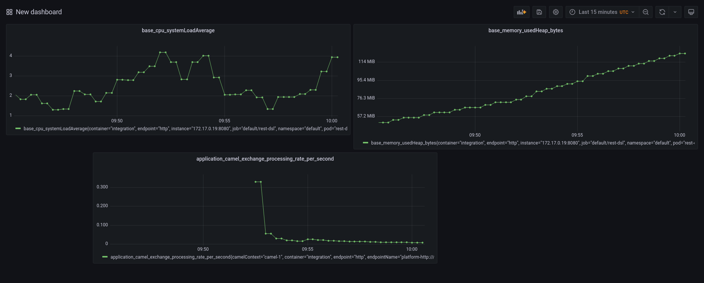
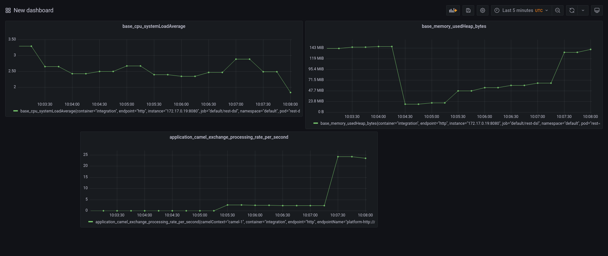
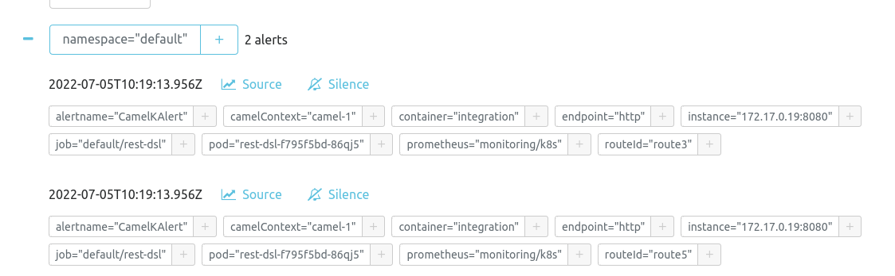

Camel K offers a wide list of operations you can execute once your Integration has been deployed (likely in a production environment). When we talk about operations, the most typical question we got is "How to monitor a Camel K Integration?". Fortunately, we have all the ingredients needed to let you manage this operation as smooth as possible. I'll walk you through the different tools and configuration needed in this blog post.

## MicroProfile metrics component

First of all let's start presenting the Apache Camel component that will make the most of the heavy lift work for you: [Camel Microprofile Metrics](/components/next/microprofile-metrics-component.html). This components is in charge to automatically expose a series of default basic metrics for every Camel route. Moreover, with this component you can include your own metrics (please, refer to the documentation to see how to do that). The standard set of metrics is quite extensive already and can be used to provide a wide variety of information that will give you good insights about the health status of your application.

When the component is available, the Integration will expose a _/q/metrics_ endpoint and you can use it for monitoring purposes.

## Prometheus stack

If you look at the endpoint you will quickly notice that the information are not thought to be read by humans. They are infact designed to work with some scraping tool whose goal is to read the information and aggregate the results.

Prometheus is our tool. It is an application that will collect and aggregate the metrics coming from any source in the cluster. This tool is very well suited to work with other side applications: Grafana, which is in charge to use the collected metrics and draw a graph; AlertManager which is in charge to trigger any alert when certain thresholds are met (for instance, application failures).

This technology stack will be your ally and you can install everything you need following the [Prometheus Quickstart](https://prometheus-operator.dev/docs/prologue/quick-start/).

## Check Grafana and Prometheus datasource

Before testing the configuration with a real Integration, let's have a look to confirm that Prometheus, Grafana and AlertManager dashboards are working correctly and the Prometheus datasource is correctly set into Grafana.

If you've followed the installation instructions above and you're on a local Kubernetes cluster environment, you may need to run (each on a separate prompt):

```
kubectl --namespace monitoring port-forward svc/prometheus-k8s 9090
kubectl --namespace monitoring port-forward svc/grafana 3000
kubectl --namespace monitoring port-forward svc/alertmanager-main 9093
```

Now, you can open your browser to http://localhost:9090, http://localhost:3000, http://localhost:9093. Grafana dashboard may require you to login (admin, admin) and to change the default admin password. Some further validation you want to perform is to check that Grafana is correctly setup with Prometheus datasource. Please go to _Configuration >> Data Sources_. By default a Prometheus datasource is set. Click on it and go to the bottom where a "Test" button is shown. Click on it and if all is good you should have a green flag confirming.

## Run a Camel K Integration with Prometheus trait

We have prepared the field to play. Now we need to run some Camel K application in order to see it in action. We're using a simple REST API application to show how to monitor an Integration in Camel K. Let's use this [Camel K REST API example](https://github.com/apache/camel-k/blob/main/examples/rest/RestDSL.java). In order to perform all the configuration required to expose the metrics we can rely on [Prometheus trait](/camel-k/next/traits/prometheus.html). As we already have a Prometheus operator installed, it will be as easy as enabling the trait:

```
kamel run https://raw.githubusercontent.com/apache/camel-k/main/examples/rest/RestDSL.java --dev -t prometheus.enabled=true
```

## Check Microprofile metrics and Prometheus target

Once the application is running, we can verify that it exposes the Microprofile metrics accessing to _/q/metrics_ endpoint:

```
$ curl -i http://192.168.49.2:31501/q/metrics
HTTP/1.1 200 OK
Content-Type: text/plain
content-length: 13131

# HELP application_camel_context_exchanges_completed_total The total number of completed exchanges for a route or Camel Context
# TYPE application_camel_context_exchanges_completed_total counter
application_camel_context_exchanges_completed_total{camelContext="camel-1"} 0.0
# HELP application_camel_context_exchanges_failed_total The total number of failed exchanges for a route or Camel Context
# TYPE application_camel_context_exchanges_failed_total counter
application_camel_context_exchanges_failed_total{camelContext="camel-1"} 0.0
...
```

Let's also verify that the metrics are scraped by Prometheus. Access to _Prometheus >> Status >> Targets_ and you should see something like the following image:



## Add Grafana panel (ie errors, tps, heap consumption, ...)

We are now ready to add a bit of colour to our monitoring. Let's login to Grafana dashboard and we can create a new dashboard. In the blank dashboard (you can add a name and other customization) we can add any graph from the metrics exposed. For instance, let's create a panel for each of the following metrics:

* `base_memory_usedHeap_bytes`: JVM heap memory consumption
* `base_cpu_systemLoadAverage`: system load average
* `application_camel_exchange_processing_rate_per_second`: transactions per second

You can see an example in the following screenshot:



Once finished, the result should be something like the following screenshot:



## Simulate some traffic

You can start calling your endpoint in order to simulate some traffic. A nice way to put your system under stress is to use `ab` tool from [Apache Benchmark](https://httpd.apache.org/docs/2.4/programs/ab.html). Let's create ten thousands of requests to our service:

```
ab -n 10000 http://192.168.49.2:31501/hello
```
You can observe how the graph will change accordingly, for instance:



## Configure alerts

Now we know how to monitor our Integration. We've learned how to watch the metrics going up and down in graphs. However, we expect that most of the important metrics are handled automatically, firing alerts when certain threshold are met. Fortunately, our monitoring stack is composed by an AlertManager. The creation of an alert in Kubernetes cluster is quite simple. Let's look at it with an example:

```
$ cat <<EOF | kubectl apply -f -
apiVersion: monitoring.coreos.com/v1
kind: PrometheusRule
metadata:
  labels:
    prometheus: k8s
    role: alert-rules
  name: camel-k-alert
spec:
  groups:
  - name: camel-k.rules
    rules:
    - alert: CamelKAlert
      expr: application_camel_route_exchanges_failed_total > 0
EOF
```

In the configuration above (which creates a `PrometheusRule` custom resource) we're instructing the system to trigger an alert when any failure happens on our endpoint (via `application_camel_route_exchanges_failed_total > 0` metric expression). As soon as a failure is detected, the AlertManager will fire the trigger.

You can see it in the dashboard available at http://localhost:9093/#/alerts. As soon as the failure happens, the alert will be shown as:



The AlertManager and more in general, the Prometheus stack, can be customized to send alert to various channel (email, slack, ...).