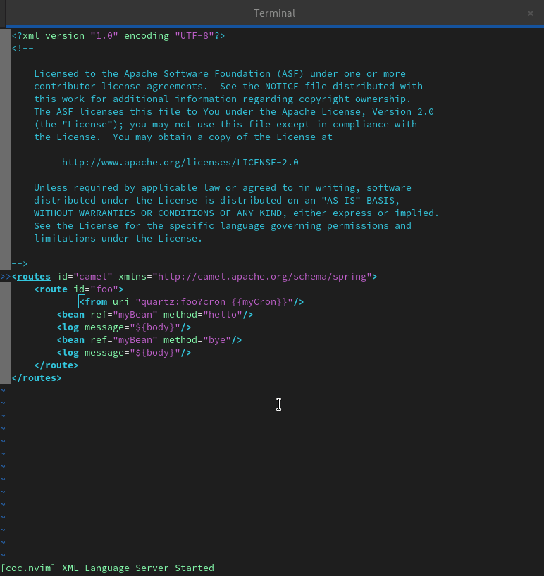
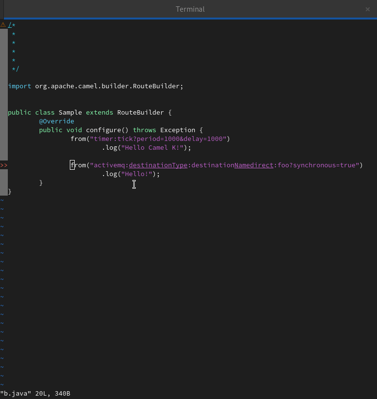

Two weeks before it became easier to provide language support inside emacs -[See this blog post](/blog/2022/06/emacs/). It is now the case for vim.  

# coc-camel
An [extension for coc.nvim](https://github.com/neoclide/coc.nvim/wiki/Using-coc-extensions) to enable
   [Apache Camel language server](https://github.com/camel-tooling/camel-language-server) support.

# Camel LS Demo

For instance, code completion for XML with Camel DSL. The capabilities are based on the [Camel Language Server](https://github.com/camel-tooling/camel-language-server/).




For instance, code completion for JAVA with Camel DSL. The capabilities are based on the [Camel Language Server](https://github.com/camel-tooling/camel-language-server/).



## Quick Start

1. Download and install a recent Java Development Kit
2. Install this extension by adding this following lines to your `~/.vimrc` or `~/.config/nvim/init.vim`, Assuming you are a [vim-plug](https://github.com/junegunn/vim-plug) user

```
" Initialize plugin system
"
call plug#begin()

" Shorthand notation; fetches https://github.com/neoclide/coc.nvim
Plug 'neoclide/coc.nvim', {'branch': 'release'}
" Shorthand notation; fetches Camel Ls
Plug 'camel-tooling/coc-camel', {'do': 'yarn install --frozen-lockfile && yarn build'}

call plug#end()
```

Then you can enjoy editing capabilities of Camel URI.
