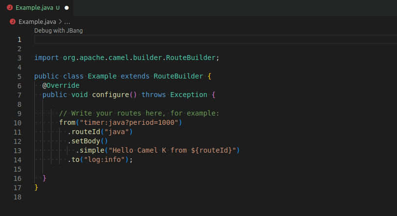
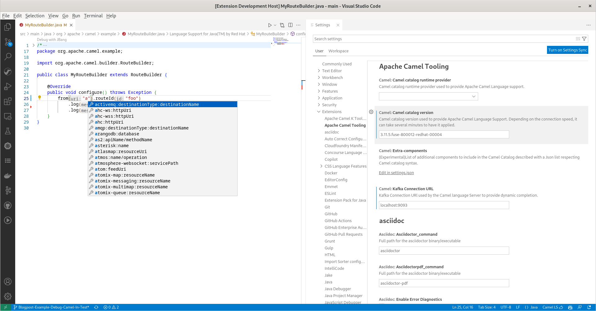

# Release 0.4.0

This new release adds a new completion to add Camel K modeline to new files.
It also brings updates on the default Camel catalogs and brings support for the productized classic Camel catalog.

# Insert Camel K Modeline completion

This completion allows you to add Camel K Modeline at the beginning of your Camel files.

# Improved support for the productized version

The support for the productized version has been improved. Now the maven repositories will be automatically added when using any productized version's catalog.

# Catalog upgrades

This new release contains the following upgrades:

* Camel Catalog version from 3.16.0 to 3.18.0
* Camel Quarkus Catalog from 2.8.0 to 2.10.0
* Kamelet Catalog from 0.8.0 to 0.8.1

# What's next

You can submit your enhancement requests on the [VS Code Language support for Apache Camel](https://github.com/camel-tooling/camel-lsp-client-vscode/issues) or in the [Red Hat Jira](https://issues.redhat.com/browse/FUSETOOLS2).
