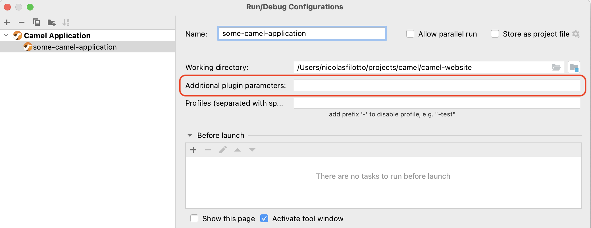
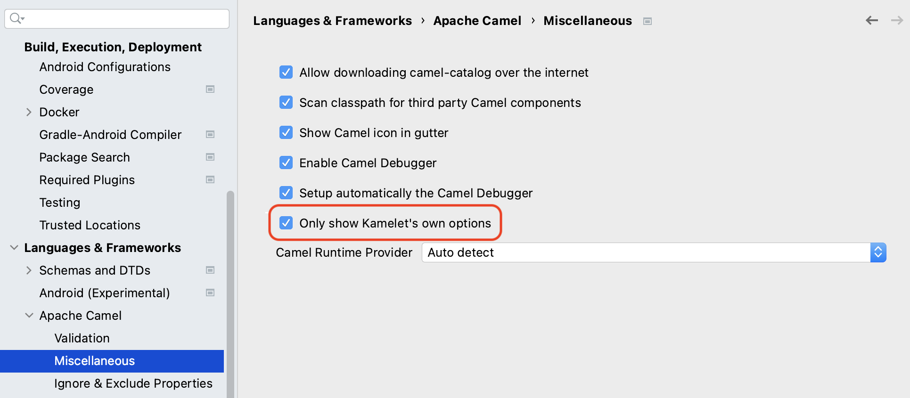

Apache Camel IDEA Plugin 0.8.13 has just been [released](https://plugins.jetbrains.com/plugin/9371-apache-camel/versions/stable/208227).

In this release, we mainly focused on improving the Camel Debugger user experience thanks to a set of improvements that we will cover in this blog post.

## Camel Debugger UX

### Enable the Camel Debugger seamlessly

In this version, in the case of the Standalone/Main and Spring Boot runtimes, it is now possible to enable the Camel Debugger seamlessly when launching a Camel application or a test by using respectively the _Java Launcher_ or the _JUnit Launcher_ as shown below:

The plugin detects that you are trying to launch a Camel application, and then automatically adds the required dependencies and configuration properties for you to enable the Camel Debugger.

### A Run/Debug configuration for Quarkus

In previous versions, a dedicated Run/Debug configuration was proposed only for the Standalone/Main and Spring Boot runtimes. In this version, a new Run/Debug configuration called _Camel Quarkus Application_ has been added to be able to launch a Quarkus application with the Camel Debugger enabled.

### Add custom plugin parameters

When using the Camel configuration dedicated to a Camel runtime, behind the scenes, a pre-defined maven command is launched which could not be good enough according to your use case. In previous versions, the only way to customize it was to provide a list of maven profiles to enable or disable. 

In this version, we added a new field allowing us to provide custom parameters to add to the maven command to launch as shown in the following screenshot:

### No more than one message at a time

Previously, if several Camel breakpoints had been set, and many messages were processed in parallel, we could end up with IntelliJ spending its time switching from one message to another which makes the debugging very difficult. For the sake of simplicity, from now on, if some messages reach different Camel breakpoints, only one message is proposed for debugging, this way, it is easier to follow a message inside a route as we cannot be disturbed by any other messages.

### How to use the Camel Debugger?

If you want to know more about how to use the Camel Debugger in the plugin, a [new article](https://github.com/camel-tooling/camel-idea-plugin/wiki/How-to-use-the-Camel-Debugger) has been added for this purpose.

## Other noticeable improvements

### Propose only Kamelet's options

Historically, the options of the Kamelet component were proposed with the options of the Kamelet itself when using the code assistance which could be considered noise. In this new version, by default, only the options of the Kamelet are proposed, but it is still possible to get the previous behavior by disabling this feature in the plugin preferences as shown in the next screenshot:

