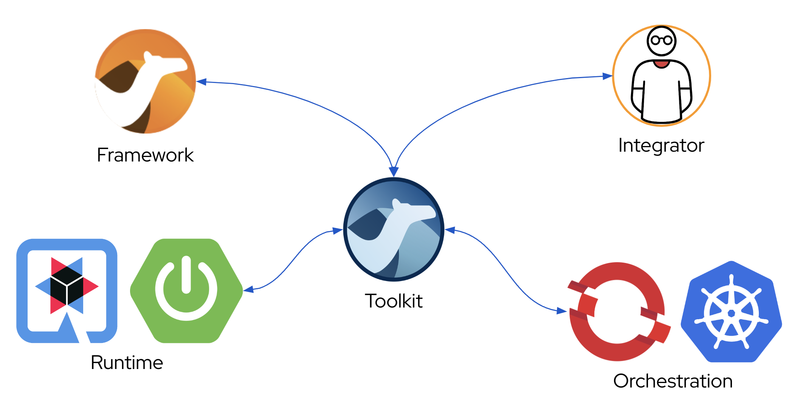
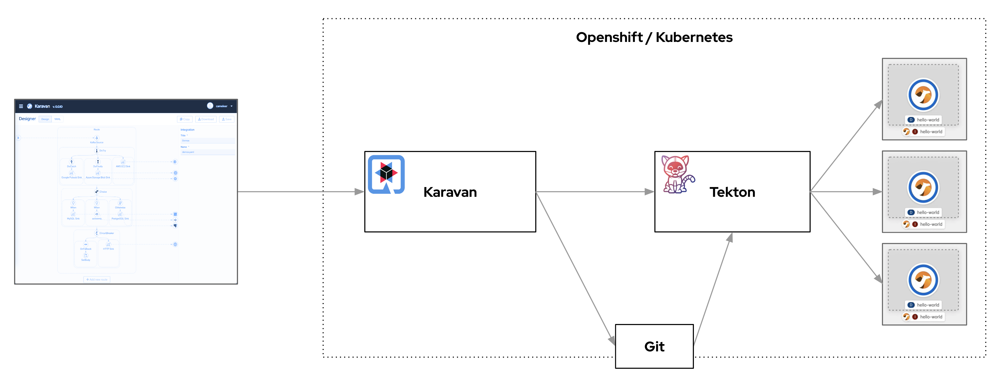
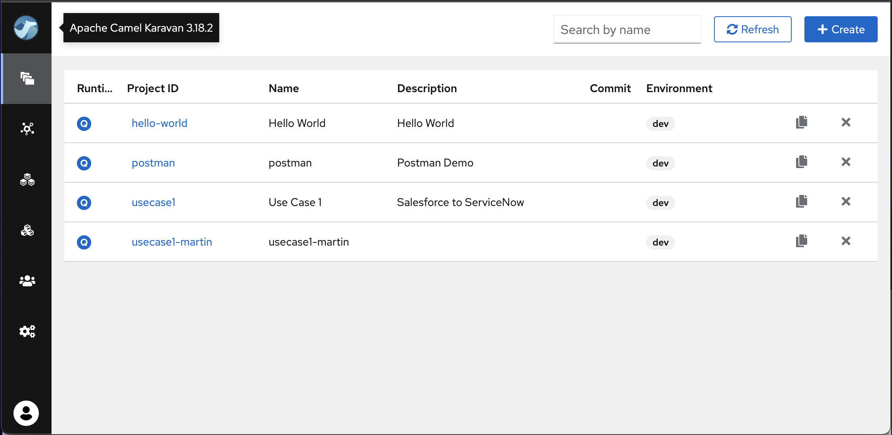
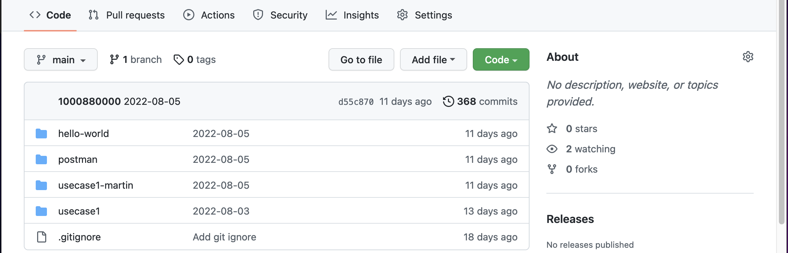

The next significant milestone is Karavan development. Karavan still comes with two main options: VS Code extenson and cloud-native integration toolkit for Kubernetes/OpenShift (FKA cloud/serverless mode). 

Disclamer:

Karavan version is aligned with Camel version.
Karavan 3.18 NOT LTS and still an experimental preview release.
Versions alignment is required to avoid DSL compatibility matrix between Camel and Karavan.

# Cloud-native Itegration Toolkit

Starting from this preview release Karavan could be deployed to OpenShift (Kubernetes version is comming) to design, build, deploy and monitor integrations.

## Architecture
Karavan cloud-native integration toolkit is a user application to manage projects, design and monitor integrations, Tekton pipeline to build and deploy integrations.

## Projects
Karavan manages projects stored in Git repository

## Build and deploy
Karavan uses Tekton Pipelines to build and deploy integrations. Pipeline generates canonical camel-quarkus maven project, then maven package command makes compilation, image build and deployment. No magic!

## Kubernetes integration
KStarting from 3.18 Camel supports placeholders for secrets and configMaps
Karavan supports them as well. In addition Karavan provides selectors for ConfigMaps, Secrets and Services retrieved from Kubernetes.

# VS Code extension 

Karavan VS Code extension for fast local development cycles.

## Create Application

Create new application by adding application.properties

## Export

In additional to local `run` developers can export integration(s) to Camel-Qurkus, Spring-Boot and Camel-Main maven projects

# UI improvements

## Step EIP
User can incapsulate integration logic using Step EIP

or move existing DSL elements into Step DSL

# Feedback is gold

Deploy Karavan as a [cloud-native integration toolkit](https://github.com/apache/camel-karavan/tree/main/karavan-builder) or install [VS Code extension](https://marketplace.visualstudio.com/items?itemName=camel-karavan.karavan) from the Marketplace.

If you have any idea or find a new issue, please [create a new issue report in GitHub](https://github.com/apache/camel-karavan/issues)!
