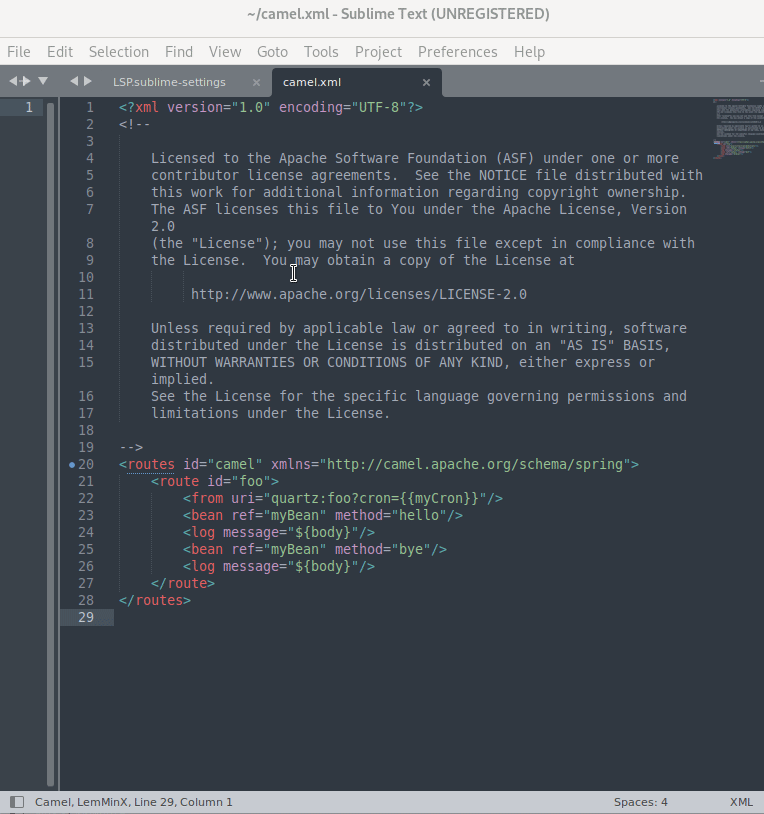
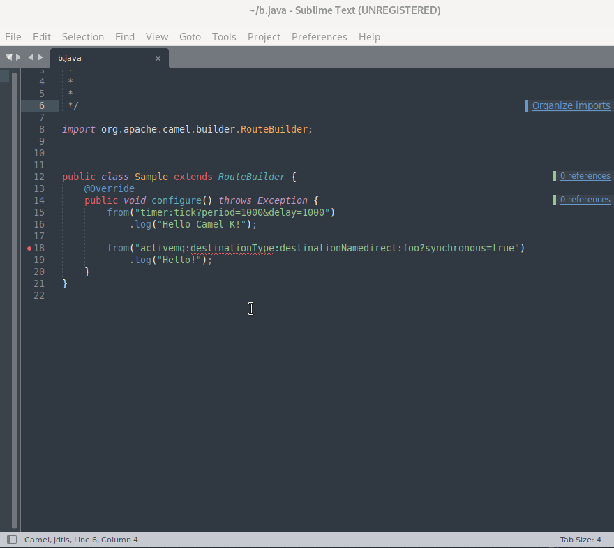

Two weeks before it became easier to provide language support inside coc.nvim -[See this blog post](https://camel.apache.org/blog/page/2/). It is now the case for sublime, thanks to [camells](https://github.com/camel-tooling/camel-lsp-client-sublime).

It is an [extension for camells](https://github.com/sublimelsp) to enable [Apache Camel language server](https://github.com/camel-tooling/camel-language-server) support.

# Camel Language Server Support Demo

For instance, code completion for XML with Camel DSL. The capabilities are based on the [Camel Language Server](https://github.com/camel-tooling/camel-language-server/).




For instance, code completion for JAVA with Camel DSL. The capabilities are based on the [Camel Language Server](https://github.com/camel-tooling/camel-language-server/).



## Install LSP plugin
Tools -> Command palette... -> Package Control: Install Package
Tools -> Command palette... -> Install LSP

## Configure LSP plugin for Camel
Download Camel LSP server jar from (https://jar-download.com/artifacts/com.github.camel-tooling/camel-lsp-server/1.6.0/source-code)

## Preferences: 
Package Setting -> LSP Settings
Fill LSP.sublime-settings with the following configuration and also please update path to the camel-lsp-server jar
```
{

	"clients":
	{
		"Camel":
		{
			"command":
			[
				"java",
				"-jar",
				"PATH/TO/camel-lsp-server-1.6.0.jar"
			],
			"enabled": true,
			"languages": [
				{
					"selector": "text.xml",
					"priority_selector": "text.xml",
				},
				{
					"selector": "source.java",
					"priority_selector": "source.java",
				}
			],
		},
	},
}
```
## Follow these steps to automatically download the latest Apache Camel language server jar and create required LSP configurations.
Run the following command in your terminal. Open a .java or .xml in your sublime text to enable camel language server
- Download and install a recent Java Development Kit
- Java must be added to the system path
- git clone https://github.com/camel-tooling/camel-lsp-client-sublime.git ~/.config/sublime-text/Packages/LSP-camel

Enjoy the Completion of Camel URI in Sublime.