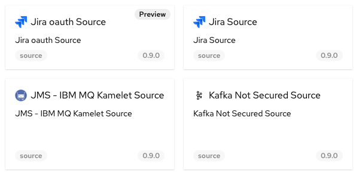

Karavan is an Integration Toolkit for Apache Camel aimed to increase developer performance through the visualization of routes, integration with runtimes and pipelines for package, image build and deploy to kubernetes out-of-the-box.


What's new in Karavan 3.18.3? 

# SSO/Keycloak integration

Karavan cloud-native application comes with three authentication types supported:

## Public
Public API. No authentication requires.

```
kind: Deployment
...
        image: ghcr.io/apache/camel-karavan:3.18.3
```

## Basic
Authentication with build-in `admin` user. Password configured in `karavan` Secrets

```
kind: Secret
apiVersion: v1
metadata:
    name: karavan
type: Opaque
stringData:
    master-password: karavan
...
```

```
kind: Deployment
...
        - name: MASTER_PASSWORD
            valueFrom:
            secretKeyRef:
            key: master-password
            name: karavan
        image: ghcr.io/apache/camel-karavan-basic:3.18.3
```

## OIDC 
OpenID Connect authentication. Demo [Karavan realm](https://github.com/apache/camel-karavan/blob/main/karavan-cloud/karavan-realm.json) is provided.

```
kind: Secret
apiVersion: v1
metadata:
    name: karavan
type: Opaque
stringData:
    oidc-secret: XXXXX
    oidc-server-url: https://server/auth/realms/karavan
    oidc-frontend-url: https://server/auth
....
```

```
kind: Deployment
...
        - name: OIDC_FRONTEND_URL
            valueFrom:
            secretKeyRef:
                key: oidc-frontend-url
                name: karavan
        - name: OIDC_SERVER_URL
            valueFrom:
            secretKeyRef:
                key: oidc-server-url
                name: karavan
        - name: OIDC_SECRET
            valueFrom:
            secretKeyRef:
                key: oidc-secret
                name: karavan
        image: ghcr.io/apache/camel-karavan-oidc:3.18.3
```

# Camel DSL updates

Domain specific language was updated to Camel 3.18.2 including 

* `routeConfigurationId`, `streamCaching`, `autoStartup` for the `route` 
* `description` for the `from` element.


# Kamelets
    
Kamelet catalog was upgaded to Kamelets 0.9.0

Kamelet selector now indicates kamelets with `Preview` support level.

    


# Feedback is gold

Deploy Karavan as a [cloud-native integration toolkit](https://github.com/apache/camel-karavan/tree/main/karavan-cloud) or install [VS Code extension](https://marketplace.visualstudio.com/items?itemName=camel-karavan.karavan) from the Marketplace.

If you have any idea or find a new issue, please [create a new issue report in GitHub](https://github.com/apache/camel-karavan/issues)!
