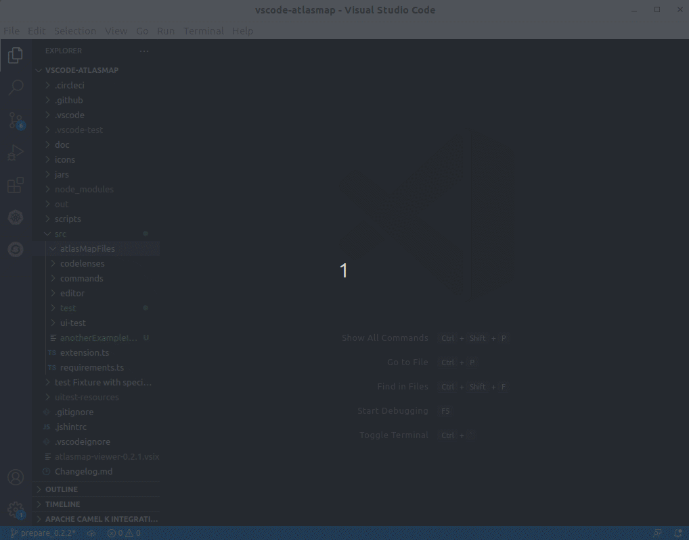

A new version of [VS Code AtlasMap](https://marketplace.visualstudio.com/items?itemName=redhat.atlasmap-viewer) 0.2.1 has been released.

It brings a new feature to allow custom placement of AtlasMap files in any directory inside the workspace.

# New features

## Create a new AtlasMap Data Transformation at a custom location inside workspace

New addition to the Create AtlasMap file action which allows users to place files in their desired location inside the workspace.

# What's next?

Provide your feedback and ideas!
You can create and vote for issues on github [issue](https://github.com/jboss-fuse/vscode-atlasmap).
You can create and vote for issues on the [jira](https://issues.redhat.com/browse/FUSETOOLS2) used by the Red Hat Integration tooling team.
