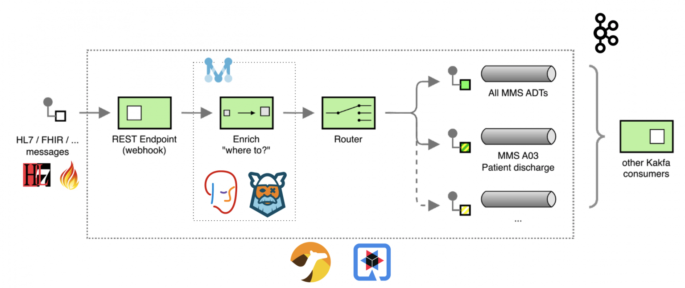
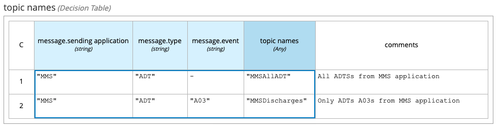
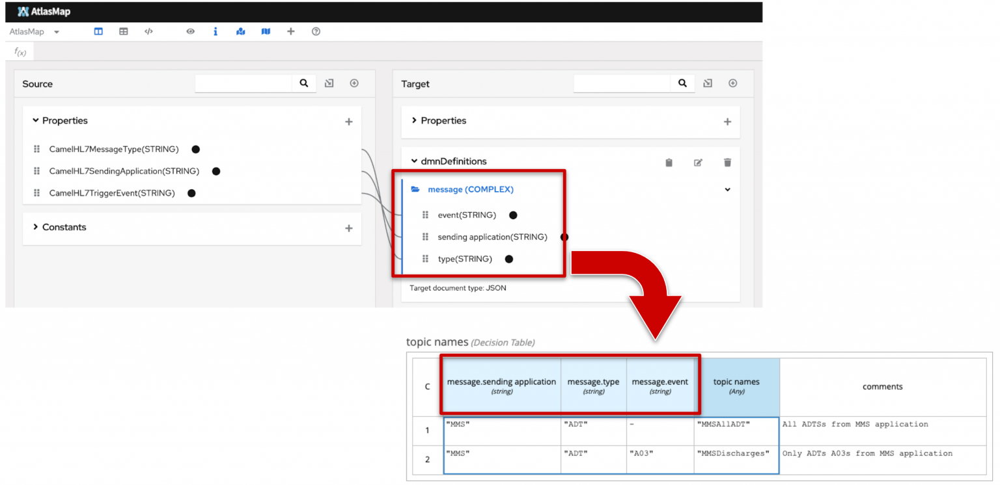
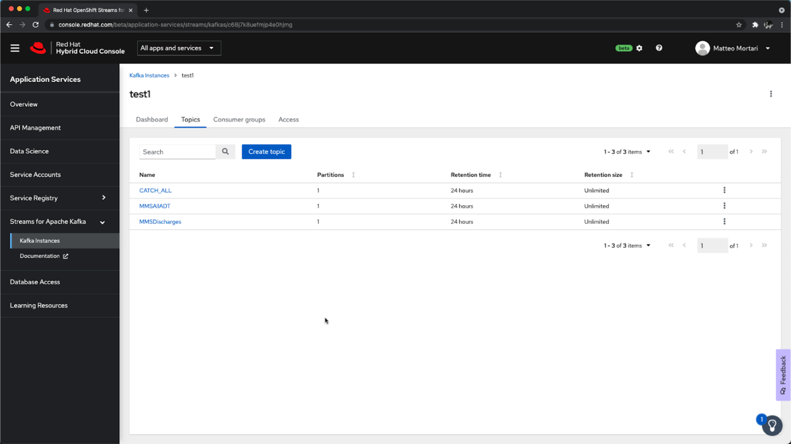
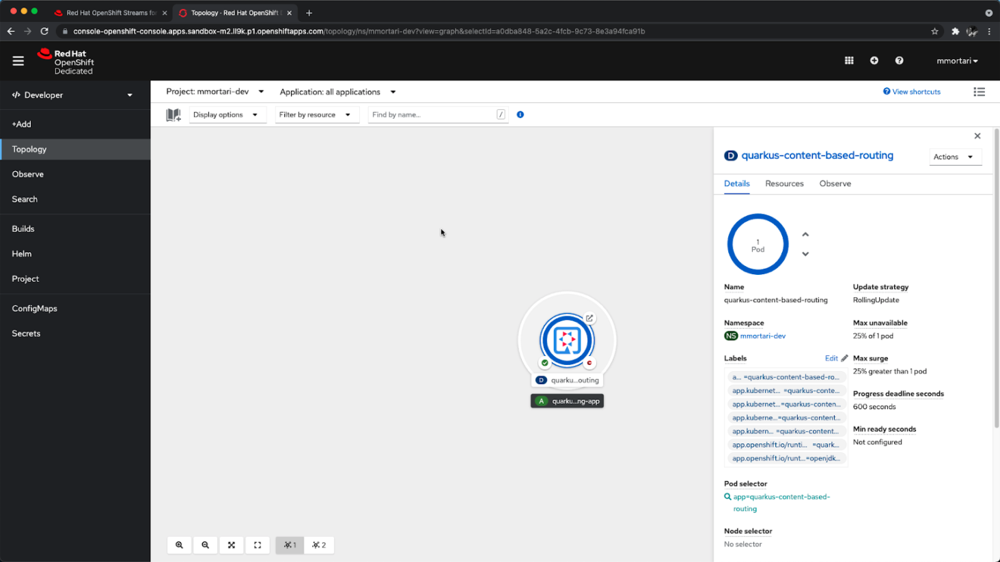
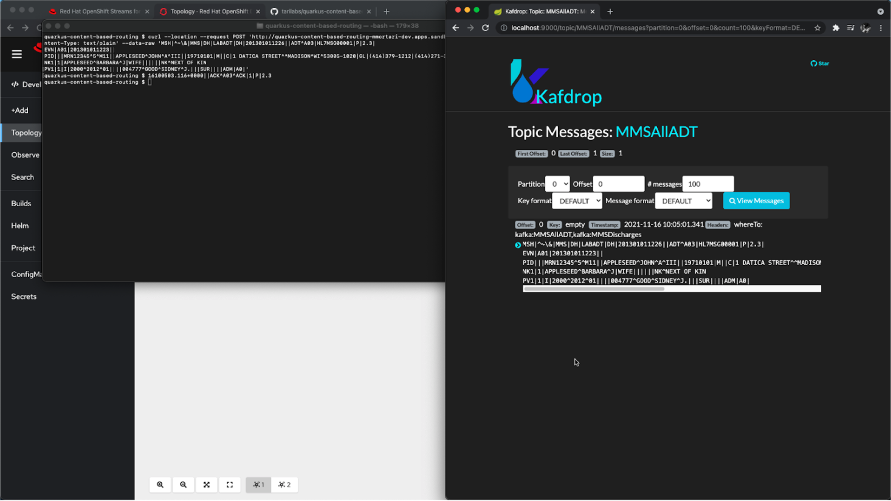


<br/>
In this post I want to share with you how to implement a complete, end-to-end **Content Based Routing** solution using [Apache Camel](/#apache-camel-projects), [AtlasMap](https://www.atlasmap.io/) and [Quarkus](https://quarkus.io/) as a developer platform, including: [Drools DMN Engine](https://www.drools.org/learn/dmn.html), [Kogito](https://kogito.kie.org/). Apache Kafka is used in this solution as a message broker.

## Content based routing overview

Here is the Enterprise Integration Pattern (EIP) diagram of the flow, annotated with some details of the components used:



The focus of this solution is **routing healthcare-related messages**; for this demo example, messages are routed accordingly to the following decision table rules:



The table above describes the rules of message routing in terms of the (business) domain model:

- the sending application
- the type of message
- the type of event

For the purpose of this demo, the examples are provided using HL7v2 as the **technical format** for the message payload. You can read more about HL7v2 on the [HL7 website](http://www.hl7.org/implement/standards/product_brief.cfm?product_id=185) and on this [tutorial page](https://cloud.google.com/healthcare-api/docs/concepts/hl7v2).

In order to properly translate from the specific technical format HL7v2 into the domain model, we can make use of the AtlasMap capabilities of data-mapping. This allows the stakeholder involved in the content based routing application to more easily inspect and describe the rules, for instance. Here is a visual summary of the AltasMap intent combined with the DMN decision table:



In a [separate post](https://blog.kie.org/2022/01/data-enrichment-use-case-with-dmn-and-bpmn.html) about Data Enrichment, I previously hinted at the potentials in combining the capabilities of AltasMap with Drools DMN; I hope this tutorial now provides a very pragmatic example!

## Technical details

In this section, I want to highlight how the [Camel DSL](/manual/dsl.html) allows to implement the EIP pattern very easily:

```java
from("direct:hl7")
    .enrich("direct:label", aggregationStrategy)
    .to("log:org.drools.demo?level=DEBUG&showAll=true&multiline=true")
    .routingSlip(header("whereTo"))
    .transform(HL7.ack())
    ;

from("direct:label")
    .unmarshal().hl7()
    .to("atlasmap:atlasmap-mapping.adm").unmarshal().json()
    .process(kogitoDMNEvaluate) // <== Rules as DMN decisions 
    .setHeader("topicsHeader", simple("${body[topic names]}"))
    ;
```

As you can see, that's all we needed in order to implement the Enterprise Integration Pattern in a Quarkus application, and integrate it with AltasMap and Kogito.

You can access the source code of this demo in this git repository: [https://github.com/tarilabs/quarkus-content-based-routing](https://github.com/tarilabs/quarkus-content-based-routing).

## Deployment

For deployment demonstration purposes:

- I will make use of a Managed Service offering for Kafka, which you can try for free yourself too, by using this link: [https://red.ht/trykafka](https://red.ht/trykafka).
- I will deploy the complete solution on the Red Hat Developer OpenShift Sandbox; you can try for free yourself by using this link: [https://developers.redhat.com/developer-sandbox](https://developers.redhat.com/developer-sandbox).

After setting up the Managed Kafka and OpenShift Sandbox accounts using the links provided above, the deployment is pretty straightforward.

First, we create the intended Kafka topics on the Managed Kafka console.



Second, we deploy the content based routing Quarkus application using the OpenShift console.



Don't forget you can easily recreate the same setup yourself and for free, by using the links above.
For instance, I used the very same links myself in order to make sure the demo worked fine using free resources only.

Finally, the deployment and setup is complete, and we can start to make use of our content based routing solution, by sending REST calls to the ingress endpoint; this can be used as a classic webhook or analogous to a [CDS hook](https://cds-hooks.org/).



## Conclusions

Check out the video at the beginning of this post to see a demonstration of this setup in action!<br/>
For example, the video also shows this application responding live to the incoming messages, in order to route them to the expected Kafka topic.

I hope this article is helpful to you as a pragmatic example on how to implement a complete **content based routing** solution using Apache Camel, Quarkus, Drools DMN engine and Kogito!

If you found this content useful, you might be interested to know this is a second iteration of a [previous post](https://blog.kie.org/2021/06/intelligent-kafka-message-routing-using-drools-dmn-engine-and-apache-camel.html), where I implemented EIP patterns using just Drools and Apache Camel.
You can reference that for additional technical details about the integration of Camel and Drools thanks to Kogito.
In this installment instead I wanted to expand on that, to finally share an end-to-end solution which could be easily deployed on the cloud!

Feedback?  
Questions?  
Don't hesitate to let us know!
