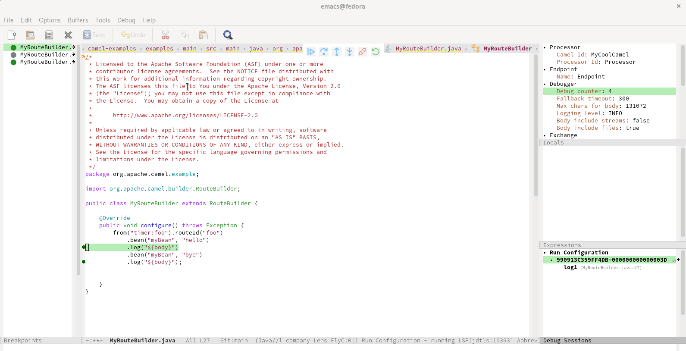

A month before it became easier to provide debug adapter support inside Vim -[See this blog post](/blog/2022/09/vimdap/). It is now time to use Camel Debug Adapter in Emacs[camel-tooling/camel-dap-client-emacs](https://github.com/camel-tooling/camel-dap-client-emacs).

# EMACS Debug Adapter client for Apache Camel



# How to debug Camel with emacs
I just got the debug integration for camel in emacs running using (https://emacs-lsp.github.io/dap-mode/page/adding-debug-server/). In order to not forget the config, I decided to quickly compile this readme.

## Prerequisites
 - Camel version 3.18+
 - camel-debug is available on the classpath
 - have JMX enabled

# How to configure Emacs

In a `~/.emacs.d/dap-camel.el` file:

```lisp
(dap-register-debug-provider
 "camel"
 (lambda (conf)
   (plist-put conf :host "localhost")
   conf))

(dap-register-debug-template "Camel Attach"
                             (list :type "camel"
                                   :request "attach"
                                   :port 1099
                                   :dap-server-path '("java" "-jar" "PATH/TO/camel-dap-server-0.4.0.jar")
                                   :name "Run Configuration"))
```
<kbd>M-x</kbd> `eval-buffer`

# How to get Camel Debug Adapter server.jar file?
- To get a jar file either you can compile the source or download from the Maven Central repository.
- To download from Maven Central repository
```sh
cd /home
curl -LO https://repo1.maven.org/maven2/com/github/camel-tooling/camel-dap-server/0.4.0/camel-dap-server-0.4.0.jar
  ```

# How to attach camel application to emacs for debugging

* To test the camel application debugging need a working example. Lot of good examples are provided in this repo, [camel-examples](https://github.com/apache/camel-examples).

* To enable Camel Textual Route debugging, you need to launch this examples with `mvn camel:debug`.

* I have specifically used [example-main](https://github.com/apache/camel-examples/tree/main/examples/main) in this setup.

## In Terminal
```sh
  cd ~/camel-examples/examples/main
```
- vim src/main/java/org/apache/camel/example/MyBean.java
- Add the following content inside `MyBean.java` file:
```java
package org.apache.camel.example;

public class MyBean {

    private String hi;

    public MyBean(String hi) {
        this.hi = hi;
    }

    public String hello() {
        return hi + " Begin ? ";

    }
     public String bye() {
        return hi + " End ? ";
}
}
```
* Compile the source to reflect the new changes
 ```sh
 mvn compile
 ```
* Launch this example with the profile `camel.debug`
```sh
 mvn camel:run -Pcamel.debug
```

## Make the following changes and run your camel application

- <kbd>M-x</kbd> `load-file`
- Load file: ~/camel-examples/examples/main/src/main/java/org/apache/camel/example/MyRouteBuilder.
             java
- Inside `MyRouteBuilder.java` file:
```java
package org.apache.camel.example;

import org.apache.camel.builder.RouteBuilder;

public class MyRouteBuilder extends RouteBuilder {

    @Override
    public void configure() throws Exception {
        from("timer:foo").routeId("foo")
            .bean("myBean", "hello")
            .log("${body}")
            .bean("myBean", "bye")
            .log("${body}");
    }
}
```
# Debug It

### To set the breakpoints
<kbd>M-x</kbd> `dap-breakpoint-add`

Now everything is in place. Open the main MyRouteBuilder file and start debugging by:

<kbd>M-x</kbd> `dap-debug`

<kbd>Select configuration template: </kbd> `Camel Attach`

### Enjoy the Debug Adapter for Apache Camel in Emacs.
