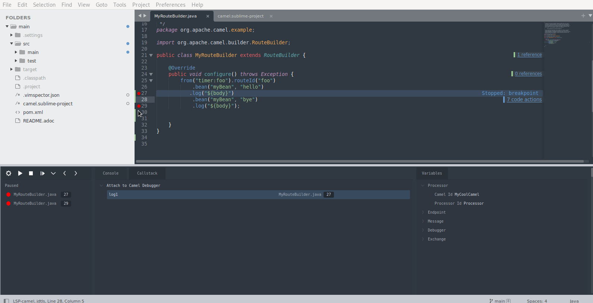

Few days before it became easier to provide debug adapter support inside Emacs -[See this blog post](/blog/2022/10/Emacsdap/). It is now time to use Camel Debug Adapter in Sublime[camel-tooling/camel-dap-client-sublime](https://github.com/camel-tooling/camel-dap-client-sublime).

# Sublime Debug Adapter client for Apache Camel



## Prerequisites
 - Camel version 3.18+
 - camel-debug is available on the classpath
 - have JMX enabled

# How to configure Sublime

In a `~/.config/sublime-text/Packages/Debugger/modules/adapters/camel.py` file:
```py
from __future__ import annotations
from ..typecheck import *

from .import util
from .. import dap
from .. import core

import sublime
import re

class Camel(dap.AdapterConfiguration):

    type = 'camel'
    docs = 'https://github.com/camel-tooling/camel-debug-adapter#debug-adapter-for-apache-camel'

    installer = util.OpenVsxInstaller (
        type='camel',
        repo='redhat/vscode-debug-adapter-apache-camel'
    )

    async def start(self, log: core.Logger, configuration: dap.ConfigurationExpanded):
        install_path = util.vscode.install_path(self.type)
        command = [
            'java',
            '-jar',
            f'{install_path}/extension/jars/camel-dap-server.jar'
        ]
        return dap.StdioTransport(log, command)
```

# How to get Camel Debug Adapter server.jar file?
- To get a jar file either you can compile the source or download from the Maven Central repository.
- To download from Maven Central repository
```sh
cd /home
curl -LO https://repo1.maven.org/maven2/com/github/camel-tooling/camel-dap-server/0.5.0/camel-dap-server-0.5.0.jar
  ```

# How to attach camel application to sublime for debugging

* To test the camel application debugging need a working example. Lot of good examples are provided in this repo, [camel-examples](https://github.com/apache/camel-examples).

* To enable Camel Textual Route debugging, you need to launch this examples with `mvn camel:debug`.

* I have specifically used [example-main](https://github.com/apache/camel-examples/tree/main/examples/main) in this setup.

## In Terminal
```sh
  cd ~/camel-examples/examples/main
```
- vim src/main/java/org/apache/camel/example/MyBean.java
- Add the following content inside `MyBean.java` file:
```java
package org.apache.camel.example;

public class MyBean {

    private String hi;

    public MyBean(String hi) {
        this.hi = hi;
    }

    public String hello() {
        return hi + " Begin ? ";

    }
     public String bye() {
        return hi + " End ? ";
}
}
```
* Compile the source to reflect the new changes
 ```sh
 mvn compile
 ```
* Launch this example with the profile `camel.debug`
```sh
 mvn camel:run -Pcamel.debug
```

## Make the following changes and run your camel application

open file : ~/camel-examples/examples/main/src/main/java/org/apache/camel/example/MyRouteBuilder.
java
- Inside `MyRouteBuilder.java` file:
```java
package org.apache.camel.example;

import org.apache.camel.builder.RouteBuilder;

public class MyRouteBuilder extends RouteBuilder {

    @Override
    public void configure() throws Exception {
        from("timer:foo").routeId("foo")
            .bean("myBean", "hello")
            .log("${body}")
            .bean("myBean", "bye")
            .log("${body}");
    }
}
```
### Setup
`Tools: Command Palette` Using package control run `Package Control: Install Package` and select `Debugger`.
- Open the debug panel
- from the command palette `Debugger: Open`

- Install a debug adapter by running: ```Debugger: Install adapter``` from the command palette.

- Add a configuration ```Debugger: Add Configuration``` from the command palette (or add one manually, see below).
  - Configurations are added to `debugger_configurations` to your sublime-project

  - Your configuration will look something like the following but with some debugger specific fields.
  In  `~/camel-examples/examples/main/camel.sublime-project` file :
```lisp
{
    "folders":
    [
        {
            "path": ".",
        }
    ],
    "debugger_configurations":
    [

        {
            "type": "camel",
            "request": "attach",
            "port": 1099,
            "name": "Attach to Camel Debugger",

        }
    ]
}
```
### Start Debugging
- Click the `gear` icon to select a configuration to use
- Click the` play` icon to start the debugger or run `Debugger: Start` (if no configuration is selected it will ask you to select or create one)
- Click the `settings` icon after starting the debugger select the following configuration `Debugger: Attach to Camel Debugger`.
- After attaching the confiuration set the breakpoints by selecting the particular line on right click select `Toggle Breakpoint`.

### Enjoy the Debug Adapter for Apache Camel in Sublime.
