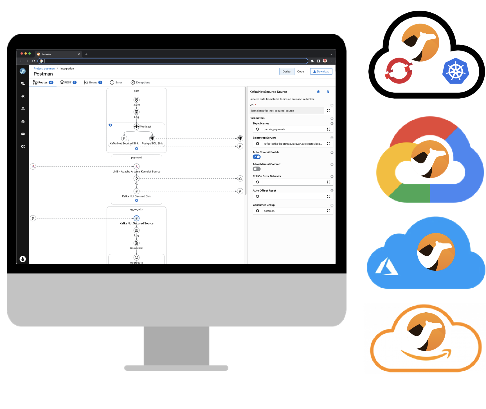

Karavan is an Integration Toolkit for Apache Camel aimed to increase developer performance through the visualization of routes, integration with runtimes and pipelines for package, image build and deploy to kubernetes out-of-the-box.

Apache Camel Karavan is celebrating its first anniversary. October 4, 2021 a new repository was created and the first prototype of Karavan Designer was pushed there.

Today we have the Karavan VS Code extension and Cloud-native application for Kubernetes/OpenShift. Karavan supports Enterprise Integration Patterns, REST DSL (including import of OpenAPI and generation of routes), Camel Components and Kamelets. Cloud application comes with Tekton task and pipeline for package, build and deploy.    

After only one year Karavan has become a toolkit used by thousands developers and integrators. 
However we still have a lot to do to make Apache Camel Karavan the best open-source integration solution.

# Roadmap
By the next anniversary we would like to have the following features implemented.
The plan sounds quite optimistic and ambitious but it will help to keep the pace.
And we welcome and encourage contributors to join the journey.

## Visual debugging and tracing
Karavan users can already  package, build and deploy integrations in one click.
However a real integration development process is iterative and requires debugging.

Visual debugging process will be implemented, so users will be able stopping/stepping running routes and have access to exchange data (body, headers, properties)  

## Monitoring and dashboards
We are planning to create a Dashboard page in the Karavan cloud application.

Dashboard should show all Deployments, Pods, Pipelines and camel-context health-check information associated with Camel projects. 
Camel projects are projects labeled with `app.openshift.io/runtime=camel` or `app.openshift.io/runtime=camel` and not limited to Karavan-created projects.

## Camel Error Handler
ErrorHandler YAML DSL is different from canonical Java/XML DSL.
We need first to synchronize DSLs and then generate visual elements for error handling.

## Propagation between environments
Current version of Karavan deploys integration images (using Tekton pipeline) in the dev environment (same namespace where karavan application deployed).

We are considering implementing integration propagation between dev and test/prod environment as an immutable image that is already in the image repository. Users should be able to select imageId to be propagated. 

## Kubernetes Operator
To simplify Karavan installation in Kubernetes/Openshift we have been working on Karavan Operator.

## Access Control
The following access control are planning to be implemented:

1. Role-Based Access Control (RBAC)
    * Developer creates project, routes, rest api, build and deploy
    * Viewer has view-only access
    * Administrator could change projects templates and default values
2. Group-Based Access Control
    * Each project has a group in Keycloak (with the same name)
    * Only group member could have access to the project

## Web-based IDE 
To support web-based IDEs like Gitpod, DevSpaces, GitHub Codespaces, etc, web-extension specific configuration will be added to Karavan VS Code extension.

Karavan will also be published in the Open VSX marketplace.

## Data mapping
The most requested feature for Karavan is Data Mapping.

We are analyzing existing open-source data mapping solutions like AtlasMap that might be embedded into Karavan Designer. 

Another option is to implement dedicated Camel-specific data mapping functionality that take into consideration Camel Exchange structure and can leverage Camel data transformation functionality and built-in Expression languages.    

# Feedback is gold

Deploy Karavan as a [cloud-native integration toolkit](https://github.com/apache/camel-karavan/tree/main/karavan-cloud) or install [VS Code extension](https://marketplace.visualstudio.com/items?itemName=camel-karavan.karavan) from the Marketplace.

If you have any idea or find a new issue, please [create a new issue report in GitHub](https://github.com/apache/camel-karavan/issues)!
