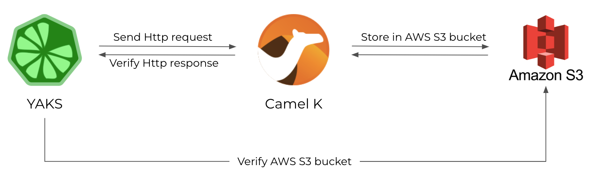

This post describes the steps to test a Camel K integration with YAKS both locally and on the Kubernetes platform.

# What is YAKS?

[YAKS](https://github.com/citrusframework/yaks) is an Open Source test automation platform that leverages Behavior Driven
Development concepts for running tests locally and on Cloud infrastructure (e.g. [Kubernetes](https://kubernetes.io/) or
[OpenShift](https://www.openshift.com/)).
This means that the testing tool is able to run your tests both as local tests and natively on Kubernetes.
The framework is specifically designed to verify Serverless and Microservice applications and aims for integration testing
with the application under test up and running in a production-like environment.
A typical YAKS test uses the very same infrastructure as the application under test and exchanges data/events over different
messaging transports (e.g. Http REST, Knative eventing, Kafka, JMS and many more).

As YAKS itself is written in Java the runtime uses a Java virtual machine with build tools such as Maven and integrates with
well known Java testing frameworks such as [JUnit](https://junit.org/junit5/), [Cucumber](https://cucumber.io/) and
[Citrus](https://citrusframework.org) to run the tests.

# Understanding the Camel K example

First of all here is a small sample Camel K integration that we would like to test in the following.
The integration exposes a Http service to the user.
The service accepts client Http POST requests that add fruit model objects.
The Camel K route applies content based routing to store the fruits in different AWS S3 buckets.



In the test scenario YAKS is going to invoke the Camel K service and verify that the message content has been sent to the right AWS S3 bucket.

Here is a sample fruit model object that is subject to be stored in AWS S3:
```json
{
  "id": 1000,
  "name": "Pineapple",
  "category":{
    "id": "1",
    "name":"tropical"
  },
  "nutrition":{
    "calories": 50,
    "sugar": 9
  },
  "status": "AVAILABLE",
  "price": 1.59,
  "tags": ["sweet"]
}
```

Here is the Camel K integration route:

```groovy
from('platform-http:/fruits')
    .log('received fruit ${body}')
    .unmarshal().json()
    .removeHeaders("*")
    .setHeader("CamelAwsS3Key", constant("fruit.json"))
    .choice()
        .when().simple('${body[nutrition][sugar]} <= 5')
            .setHeader("CamelAwsS3BucketName", constant("low-sugar"))
        .when().simple('${body[nutrition][sugar]} > 5 && ${body[nutrition][sugar]} <= 10')
            .setHeader("CamelAwsS3BucketName", constant("medium-sugar"))
        .otherwise()
            .setHeader("CamelAwsS3BucketName", constant("high-sugar"))
    .end()
    .marshal().json()
    .log('sending ${body}')
    .to("aws2-s3://noop?$parameters")
```

The route uses content based routing EAP based on the nutrition sugar rating of a given fruit in order to send the fruits
to different AWS S3 buckets (low-sugar, medium-sugar, high-sugar).

In the following the test case for this integration needs to invoke the exposed service with different fruits and verify its outcome on AWS S3.

# How to test locally with YAKS

In the beginning let's just write the test and run it locally.
For now, we do not care how to deploy the application under test in the Cloud infrastructure as everything is running on
the local machine using [JBang](https://www.jbang.dev/).

JBang is a fantastic way to just start coding and running Java code and also Camel K integrations (also see this former
blog post about [how JBang integrates with Camel K](/blog/2022/11/camel-k-jbang/)).

YAKS as a framework brings a set of ready-to-use domain specific languages (XML, YAML, Groovy, BDD Cucumber steps) for writing
tests in order to verify your deployed services.

This post uses the Behavior Driven Development integration via Cucumber.
So the YAKS test is a single feature file that uses BDD Gherkin syntax like this:

```gherkin
Feature: Camel K Fruit Store

  Background:
    Given URL: http://localhost:8080

  Scenario: Create infrastructure
    # Start AWS S3 container
    Given Enable service S3
    Given start LocalStack container

    # Create Camel K integration
    Given Camel K integration property file aws-s3-credentials.properties
    When load Camel K integration fruit-service.groovy
    Then Camel K integration fruit-service should print Started route1 (platform-http:///fruits)

  Scenario: Verify fruit service
    # Invoke Camel K service
    Given HTTP request body: yaks:readFile('pineapple.json')
    And HTTP request header Content-Type="application/json"
    When send POST /fruits
    Then receive HTTP 200 OK

    # Verify uploaded S3 file
    Given New global Camel context
    Given load to Camel registry amazonS3Client.groovy
    Given Camel exchange message header CamelAwsS3Key="fruit.json"
    Given receive Camel exchange from("aws2-s3://medium-sugar?amazonS3Client=#amazonS3Client&deleteAfterRead=true") with body: yaks:readFile('pineapple.json')
```

Let’s walk through the test step by step.
First of all the feature file uses the usual Given-When-Then BDD syntax to give context, describe the actions and verify the outcome.
Each step calls a specific YAKS action that is provided out of the box by the framework.
The user is able to choose from a [huge set of steps](https://github.com/citrusframework/yaks/tree/main/java/steps) that
automatically perform actions like sending/receiving Http requests/responses, starting [Testcontainers](https://www.testcontainers.org/),
running Camel routes, connecting to a database, publishing events on Kafka or Knative brokers and many more.

In the first scenario the test automatically prepares some required infrastructure.
The YAKS test starts a Localstack [Testcontainer](https://www.testcontainers.org/) to have an AWS S3 test instance running (`Given start LocalStack container`).
Then the test loads and starts the Camel K integration under test (`When load Camel K integration fruit-service.groovy`) and waits for it to properly start.
In local testing this step starts the Camel K integration using JBang.
Later the post will also run the test in a Kubernetes environment.

Now the infrastructure is up and running and the test is able to load the fruit model object as Http request body
(`Given HTTP request body: yaks:readFile('pineapple.json')`) and invoke the Camel K service (`When send POST /fruits`).
The test waits for the Http response and verifies its 200 OK status.

In the last step the test verifies that the fruit object has been added to the right AWS S3 bucket (medium-sugar).
As YAKS itself is not able to connect to AWS S3 the test uses Apache Camel for this step.
The test creates a Camel context, loads a AWS client and connects to AWS S3 with a temporary Camel route
(`Given receive Camel exchange from("aws2-s3://medium-sugar?amazonS3Client=#amazonS3Client&deleteAfterRead=true")`).
With this Apache Camel integration YAKS is able to use the complete 300+ Camel components for sending and receiving messages
to various messaging transports. The Camel exchange body should be the same fruit model object (`yaks:readFile('pineapple.json'`)
as posted in the initial Http request.

YAKS uses the powerful message payload validation capabilities provided by Citrus for this message content verification.
The validation is able to compare message contents of type XML, Json, plaintext and many more.

This completes the test case. You can now run this test with Cucumber and JUnit for instance.
The easiest way though to directly run tests with YAKS is to use the [YAKS command line client](https://github.com/citrusframework/yaks/releases).
You do not need to set up a whole project with Maven dependencies and so on.
Just write the test file and run with:

```shell script
$ yaks run fruit-service.feature --local
```

You should see some log output like this:

```
INFO |
INFO | ------------------------------------------------------------------------
INFO |        .__  __
INFO |   ____ |__|/  |________ __ __  ______
INFO | _/ ___\|  \   __\_  __ \  |  \/  ___/
INFO | \  \___|  ||  |  |  | \/  |  /\___ \
INFO |  \___  >__||__|  |__|  |____//____  >
INFO |      \/                           \/
INFO |
INFO | C I T R U S  T E S T S  3.4.0
INFO |
INFO | ------------------------------------------------------------------------
INFO |

Scenario: Create infrastructure # fruit-service.feature:6
  Given URL: http://localhost:8080
  Given Enable service S3
  [...]

Scenario: Verify fruit service # fruit-service.feature:20
  Given URL: http://localhost:8080
  Given HTTP request body: yaks:readFile('pineapple.json')
  [...]

Scenario: Remove infrastructure  # fruit-service.feature:31
  Given URL: http://localhost:8080
  Given delete Camel K integration fruit-service
  Given stop LocalStack container

3 Scenarios (3 passed)
18 Steps (18 passed)
0m18,051s


INFO | ------------------------------------------------------------------------
INFO |
INFO | CITRUS TEST RESULTS
INFO |
INFO |  Create infrastructure .......................................... SUCCESS
INFO |  Verify fruit service ........................................... SUCCESS
INFO |  Remove infrastructure .......................................... SUCCESS
INFO |
INFO | TOTAL:	3
INFO | FAILED:	0 (0.0%)
INFO | SUCCESS:	3 (100.0%)
INFO |
INFO | ------------------------------------------------------------------------

3 Scenarios (3 passed)
18 Steps (18 passed)
0m18,051s


Test results: Total: 0, Passed: 1, Failed: 0, Errors: 0, Skipped: 0
    fruit-service (fruit-service.feature): Passed
```

# Running YAKS in the Cloud

YAKS is able to run tests both locally and as part of a Kubernetes cluster.
When running tests on Cloud infrastructure YAKS leverages the Operator SDK and provides a specific operator to manage the
test case resources on the cluster.
Each time you declare a test in the form of a [custom resource](https://kubernetes.io/docs/concepts/extend-kubernetes/api-extension/custom-resources/)
the YAKS operator automatically takes care of preparing the proper runtime in order to execute the test as a Kubernetes Pod.

Why would you want to run tests as Cloud-native resources on the Kubernetes platform? Kubernetes has become a standard target
platform for Serverless and Microservices architectures.
Developing the services is different in many aspects compared to what we have done for decades.

Writing a Serverless or Microservices application for instance with Camel K is very declarative.
As a developer you just write the Camel route and run it as an integration via the Camel K operator directly on the cluster.
The declarative approach as well as the nature of Serverless applications make us rely on a given runtime infrastructure,
and it is essential to verify the applications also on that infrastructure. So it is only natural to also move the verifying
tests into this very same Cloud infrastructure.
This is why YAKS also brings your tests to the Cloud infrastructure for integration and end-to-end testing.

So here is how it works. You are able to run the very same YAKS test that has been run locally also as a Pod in Kubernetes.

YAKS provides a Kubernetes operator and a set of CRDs (custom resources) that we need to install on the cluster.
The best way to install YAKS is to use the [OperatorHub](https://operatorhub.io/operator/yaks) or the yaks CLI tools that
you can download from the [YAKS GitHub release pages](https://github.com/citrusframework/yaks/releases).

With the yaks-client binary simply run this install command:

```shell script
$ yaks install
```

This command prepares your Kubernetes cluster for running tests with YAKS.
It will take care of installing the YAKS custom resource definitions, setting up role permissions and creating the YAKS operator
in a global operator namespace.

**Important:** You need to be a cluster admin to install custom resource definitions.
The operation needs to be done only once for the entire cluster.

Now that the YAKS operator is up and running you can run the very same test from local testing also on the Cloud infrastructure.
The only thing that needs to be done is to adjust the Http endpoint URL of the Camel K integration from `http://localhost:8080` to `http://fruit-service.${YAKS_NAMESPACE`}

```shell script
$ yaks run fruit-service.feature
```

Please notice that we have just skipped the `--local` CLI option.
Instead of using local JBang tooling to run the test locally now the YAKS CLI connects to the Kubernetes cluster in order
to create the test as a custom resource.
From there the YAKS operator takes over preparing the test runtime and running the test as a Pod.

But wait! The test did prepare some infrastructure, in particular the Camel K integration and the AWS S3 Localstack Testcontainer instance.
How does that work inside Kubernetes? YAKS completely takes care of it.
The Camel K integration is run with the Camel K operator running on the same Kubernetes cluster.
And the Testcontainer AWS S3 instance is automatically run as a Pod in Kubernetes.
Even connection settings are handled automatically. It just works!

You will see some similar test log output when running the test remotely and the test performs its actions and its validation
exactly the same as locally.

You can also review the test Pod outcome with:

```shell script
$ yaks ls
```

This is an example output you should get:

```
NAME           PHASE   TOTAL  PASSED  FAILED  SKIPPED  ERRORS
fruit-service  Passed  3      3       0       0        0
```

# Demo

The whole demo code is available on this [GitHub repository](https://github.com/christophd/yaks-demo-camel-k).
It also shows how to integrate the tests in a [GitHub CI actions workflow](https://github.com/christophd/yaks-demo-camel-k/actions),
so you can run the tests automatically with every code change.

# Conclusion

This blog post showed how you can test Camel K integrations locally and in a Cloud infrastructure with YAKS.
YAKS as a framework has many more features to offer (Kafka, Knative, OpenAPI, etc.) so this is just the start of a new testing
platform for BDD testing in Cloud-native environments!

Please give feedback, ideas and of course contributions to this.
Feel free to add your thoughts on the YAKS repository by opening [new issues](https://github.com/citrusframework/yaks/issues) or
even share your appreciation with a [star on GitHub](https://github.com/citrusframework/yaks).
