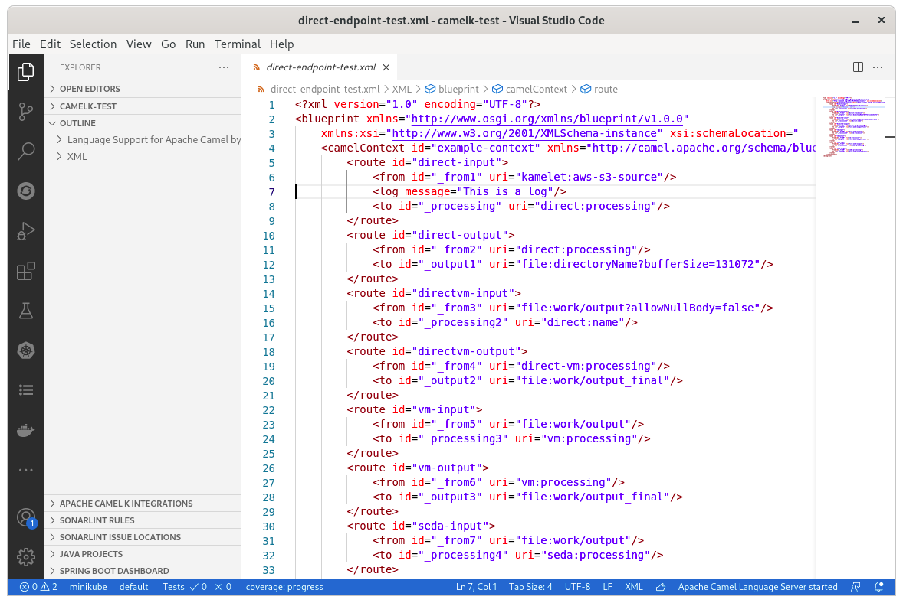
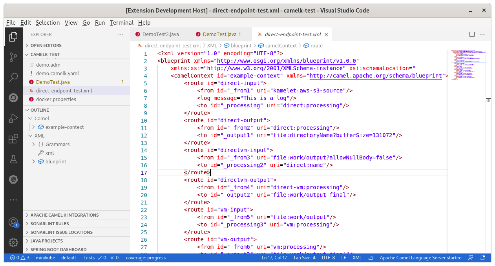

There are new releases of two VS Code extensions:

- VS Code Language support for Apache Camel [0.6.0](https://github.com/camel-tooling/camel-lsp-client-vscode/blob/0.6.0/Changelog.md#060) [Microsoft Marketplace](https://marketplace.visualstudio.com/items?itemName=redhat.vscode-apache-camel) [Open VSX Markeptlace](https://open-vsx.org/extension/redhat/vscode-apache-camel)
- VS Code Tooling for Apache Camel K [0.0.33](https://github.com/camel-tooling/vscode-camelk/blob/0.0.33/CHANGELOG.md#0033) [Microsoft Marketplace](https://marketplace.visualstudio.com/items?itemName=redhat.vscode-camelk) [Open VSX Marketplace](https://open-vsx.org/extension/redhat/vscode-camelk)

# Camel versions upgrades

- Update default Camel Catalog version from 3.18.2 to 3.20.0 (which is an LTS)
- Update Kamelet Catalog from 0.9.0 to 0.10.0
- Update Camel Quarkus Catalog from 2.13.0 to 2.15.0
- Update default Camel K runtime  and kamel CLI version to v1.11.0

# Outline label simplification

The label of the outline has been simplified from `Language Support for Apache Camel by Red Hat` to `Camel`. It allows to see the more meaningful part immediately when several Language Servers are providing support on the same file.

In previous versions:

In new release:

