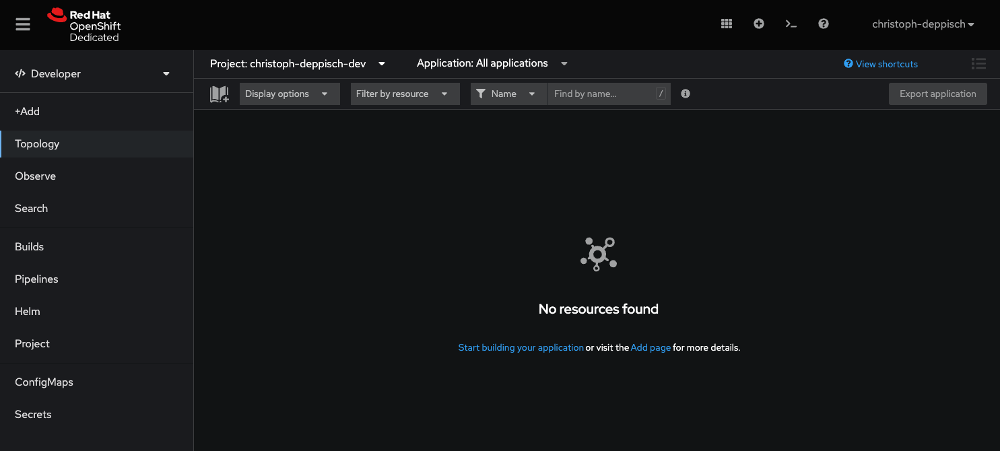
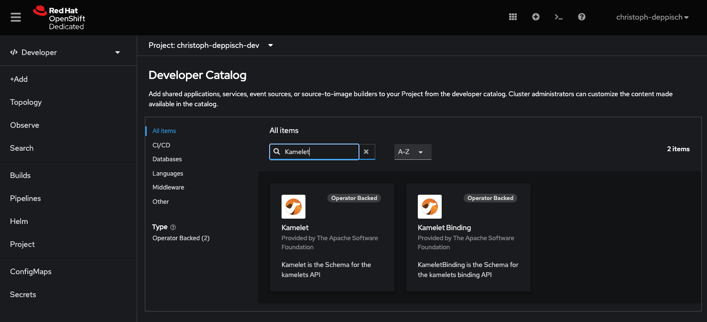

Have you ever asked yourself what it feels like to use Camel K?
Have you ever wanted to just give it a try and have some hands-on experience?
There is some great news for you!
Camel K is now available on [Developer Sandbox](https://developers.redhat.com/developer-sandbox),
so you can just get your own sandbox instance and try out Camel K within minutes.

# What is the OpenShift Developer Sandbox?!

The [OpenShift Developer Sandbox](https://developers.redhat.com/developer-sandbox) gives you 30-days free access to a shared
OpenShift and Kubernetes cluster for development and learning purposes.

The sandbox clusters provide
* [Guided tutorials](https://developers.redhat.com/developer-sandbox/activities) to experience and run sample applications
* [Prebuilt sample applications](https://developers.redhat.com/node/225251) to explore different aspects of developing and running applications in the cloud
* Access the browser-based Red Hat OpenShift Dev Spaces
* (formerly CodeReady Workspaces)
* GitHub integration to your own source code

# Get your own sandbox

To get you started with Developer Sandbox please follow the registration process on [https://developers.redhat.com/developer-sandbox](https://developers.redhat.com/developer-sandbox).


You will be provided with your own sandbox instance within minutes.
Login to your sandbox and get ready to start using Camel K!


# Getting started with Camel K

Camel K is available on your sandbox by default.
There is no need to install the operator or to set up any permissions.
You can just start creating your very first Camel K integration.

## Deploy your first integration

Start by navigating to the **Topology** view.



Click on the **Start building your application** link right in the middle of the **Topology** view canvas.
You will be provided with a filter input field.
Type _"Integration"_ to search for Camel K integration resources.
Select the Camel K **Integration** resource and hit the **Create** button.


This opens the YAML form view to create the Camel K integration.
A sample YAML is already provided.


For now leave everything as suggested and just use a more meaningful integration name (_metadata/name_) such as **timer-to-log** and hit **Create**.

In a few moments you will see the Camel K integration called **timer-to-log** up and running in your personal sandbox.
The more experienced Camel users may notice the Camel domains specific language used in the flows section of the integration.
This is where the Camel route logic is happening.
You can use the well-known Camel language syntax such as `from:uri` or `set-body`.
The sample integration uses a timer component and periodically prints a message (_"Hello from Camel K"_) to the console output.


The **Topology** view shows the integration in a running state and also provides some details such as pod logs when selecting the integration.


Try to view the Pod logs and see how the integration periodically prints _"Hello from Camel K"_ to the console output.
The sample Camel K integration is very simple but it provides a good starting point for exploring more features in Camel and Camel K.
Try to experiment and add more logic to the integration using the YAML Camel domain specific language for instance.

# What about Kamelets?!

Camel K has introduced the concept of Kamelets (**Kamel** route snipp**ets**) which represent ready to use Camel routes written by Camel experts.
Kamelets serve a very specific use case and are designed to simplify its usage.
Usually the user just needs to provide some input properties to have the integration running.

You can choose from a huge set of Kamelets from the [Apache Kamelet catalog](/camel-kamelets/3.20.x/).


The interesting thing about Kamelets is that they are able to bind to different event driven messaging solutions such as
Apache Kafka or Knative in order to act as an event source or sink.

# Using Kamelets & Knative on the sandbox

Here is a small demo on how to use Kamelets in your sandbox in combination with Knative eventing (which is also available in your sandbox out-of-the-box).

## Create a Knative channel

First of all switch back to the Topology view and open the context menu (mouse right-click on the canvas).


In the context menu select **Channel** to create a new Knative eventing channel.


Use the defaults in the following form and just give a reasonable name for the channel (**greetings**).
Click on **Create** and see how the channel icon appears in your **Topology** view.

## Create custom greeting-source Kamelet

The Knative channel needs an event source that publishes events on the channel.
The demo creates a new custom `greeting-source` Kamelet acting as such an event source.
Open the context menu once again in your canvas.
This time select the _"From Catalog"_ option.


This opens the developer catalog with all available application options on the sandbox.
Now filter for _"Kamelet"_ and see the Kamelet options.



Select **Kamelet** and hit **Create**.
This opens the YAML form view for creating a new Kamelet resource in your sandbox.


_Kamelet source_

```yaml
apiVersion: camel.apache.org/v1alpha1
kind: Kamelet
metadata:
  name: greetings-source
  annotations:
    camel.apache.org/kamelet.support.level: Stable
    camel.apache.org/catalog.version: 0.10.0
    camel.apache.org/kamelet.icon: "data:image/svg+xml;base64,PHN2ZyB4bWxucz0iaHR0cDovL3d3dy53My5vcmcvMjAwMC9zdmciIHZpZXdCb3g9Ijk0NCAtNzcxIDI1MDAgMjMzNCI+PHBhdGggZD0iTTIxMTEuNCAyMTAuNWMtMTAzLjYgMTc0LjItMjAyLjkgMzQyLjktMzA0LjIgNTEwLjMtMjYgNDMtMzguOSA3OC0xOC4xIDEzMi42IDU3LjQgMTUwLjktMjMuNiAyOTcuOC0xNzUuOCAzMzcuNi0xNDMuNSAzNy42LTI4My40LTU2LjctMzExLjgtMjEwLjQtMjUuMi0xMzYgODAuMy0yNjkuMyAyMzAuMy0yOTAuNiAxMi42LTEuOCAyNS40LTIgNDYuNS0zLjZsMjI4LjEtMzgyLjVjLTE0My41LTE0Mi43LTIyOC45LTMwOS40LTIxMC01MTYgMTMuNC0xNDYuMSA3MC44LTI3Mi4zIDE3NS44LTM3NS44IDIwMS0xOTguMSA1MDcuOC0yMzAuMiA3NDQuNS03OC4xIDIyNy40IDE0Ni4xIDMzMS41IDQzMC42IDI0Mi44IDY3NC4xLTY2LjktMTguMS0xMzQuMy0zNi40LTIwOC40LTU2LjUgMjcuOS0xMzUuNCA3LjMtMjU3LTg0LjEtMzYxLjEtNjAuMy02OC44LTEzNy44LTEwNC44LTIyNS44LTExOC4xLTE3Ni41LTI2LjctMzQ5LjggODYuNy00MDEuMiAyNTkuOS01OC4zIDE5Ni42IDMwIDM1Ny4yIDI3MS40IDQ3OC4yeiIgZmlsbD0iI2M3M2E2MyIvPjxwYXRoIGQ9Ik0yNDA3LjMgNC41YzczIDEyOC44IDE0Ny4xIDI1OS41IDIyMC42IDM4OSAzNzEuMy0xMTQuOSA2NTEuMiA5MC43IDc1MS43IDMxMC43IDEyMS4zIDI2NS44IDM4LjQgNTgwLjYtMTk5LjkgNzQ0LjYtMjQ0LjUgMTY4LjMtNTUzLjggMTM5LjYtNzcwLjQtNzYuNyA1NS4yLTQ2LjIgMTEwLjctOTIuNiAxNzAtMTQyLjIgMjE0IDEzOC42IDQwMS4xIDEzMi4xIDU0MC4xLTMyLjEgMTE4LjUtMTQwIDExNS45LTM0OC44LTYtNDg1LjgtMTQwLjctMTU4LjItMzI5LjItMTYzLTU1Ny0xMS4yLTk0LjUtMTY3LjctMTkwLjYtMzM0LTI4Mi4yLTUwMi44LTMwLjktNTYuOS02NC45LTg5LjktMTM0LjUtMTAyLTExNi4xLTIwLjEtMTkxLjEtMTE5LjktMTk1LjYtMjMxLjYtNC40LTExMC41IDYwLjctMjEwLjQgMTYyLjQtMjQ5LjMgMTAwLjgtMzguNiAyMTkuMS03LjQgMjg2LjkgNzguMyA1NS40IDcwIDczIDE0OC44IDQzLjkgMjM1LjItOC4xIDI0LjEtMTguNiA0Ny40LTMwIDc1Ljl6IiBmaWxsPSIjNGI0YjRiIi8+PHBhdGggZD0iTTI1ODEuOCAxMDU3LjJoLTQ0N2MtNDIuOCAxNzYuMi0xMzUuNCAzMTguNS0yOTQuOCA0MDguOS0xMjQgNzAuMy0yNTcuNSA5NC4yLTM5OS43IDcxLjItMjYxLjgtNDIuMi00NzUuOS0yNzcuOS00OTQuNy01NDMuMy0yMS4zLTMwMC42IDE4NS4zLTU2Ny44IDQ2MC43LTYyNy45IDE5IDY5LjEgMzguMiAxMzguOCA1Ny4yIDIwNy43LTI1Mi43IDEyOC45LTM0MC4yIDI5MS40LTI2OS40IDQ5NC41IDYyLjMgMTc4LjggMjM5LjEgMjc2LjcgNDMxLjEgMjM4LjggMTk2LjEtMzguNyAyOTUtMjAxLjcgMjgyLjktNDYzLjIgMTg1LjkgMCAzNzItMS45IDU1Ny45LjkgNzIuNiAxLjEgMTI4LjYtNi40IDE4My4zLTcwLjQgOTAtMTA1LjMgMjU1LjgtOTUuOCAzNTIuNyAzLjcgOTkuMSAxMDEuNyA5NC40IDI2NS4yLTEwLjUgMzYyLjYtMTAxLjIgOTMuOS0yNjEgODguOS0zNTUuNy0xMi4zLTE5LjUtMjAuOC0zNC44LTQ1LjUtNTQtNzEuMnoiIGZpbGw9IiM0YTRhNGEiLz48L3N2Zz4="
    camel.apache.org/provider: Apache Software Foundation
    camel.apache.org/kamelet.group: Webhook
    camel.apache.org/version: 1.11.0
  labels:
    camel.apache.org/kamelet.type: source
spec:
  definition:
    description: >-
      Kamelet provides a Http service creating a greeting event for each incoming request.
      The integration accepts requests on the "https://integration-external-url/greetings?name={username}" endpoint.
    title: Greeting Service
    type: object
  dependencies:
    - 'camel:platform-http'
    - 'camel:kamelet'
  template:
    from:
      uri: 'platform-http:///greetings'
      steps:
        - set-body:
            simple: "Hello ${header.name}!"
        - to:
            uri: log:info
        - to: 'kamelet:sink'
```

The new Kamelet source uses a `platform-http` Camel component in order to provide some Http service to the user.
Each client request should publish a new event on the Knative eventing channel.

The Kamelet is able to use the full Camel domain specific language (e.g. `set-body`) and is saved as a reusable eventing source in your namespace.
Each time we reference this Kamelet the given Camel route logic is called.
This is how Camel experts are able to provide ready to use Camel route snippets covering a specific use case.
Hit the **Create** button and continue with the next step to use this new Kamelet source in a so-called KameletBinding.

## Create the greeting-source KameletBinding

As already mentioned the Kamelet itself is vendor agnostic and is able to bind to different messaging solutions (e.g. Kakfa, Knative and more).
In the next step we create such a binding in order to bind the `greeting-source` Kamelet to a Knative channel.

Again use the context menu (mouse right-click) in the **Topology** view to create a new resource _"From Catalog"_.
Once again filter the list of available developer resources for _"Kamelet"_.
But this time select **KameletBinding** as an option from the list.


This brings you to the YAML form for creating a new KameletBinding resource.


_greeting-http-source KameletBinding_

```yaml
apiVersion: camel.apache.org/v1alpha1
kind: KameletBinding
metadata:
  annotations:
    trait.camel.apache.org/knative-service.enabled: 'true'
  name: greeting-http-source
  labels:
    app: camel-k
spec:
  source:
    ref:
      apiVersion: camel.apache.org/v1alpha1
      kind: Kamelet
      name: greetings-source
  sink:
    ref:
      apiVersion: messaging.knative.dev/v1
      kind: Channel
      name: greetings
```

The binding references the new custom `greeting-source` Kamelet as a source and the Knative channel `greetings` as a sink.
Hit the **Create** button and wait for the KameletBinding to appear on the **Topology** view.

You should see the binding connected to the Knative channel named `greetings`.
Also, you should see a new Knative service created for the binding.
This is because we have been using a trait annotation (`trait.camel.apache.org/knative-service.enabled: 'true'`) on the binding.
As we have been using the `platform-http` Camel component in the Kamelet source, the Camel K operator and the Knative serving
operator automatically take care of creating an Http service and a route for you.
Also, the service is capable of auto scaling (including auto-scale to zero) due to Knative serving functionality being applied automatically.

Before we start to open the browser in order to call the Http service we just need to create the event sink,
so we are able to verify that the Knative channel really receives some events.

## Create the greeting-sink KameletBinding

Again we create a KameletBinding this time acting as an event sink.
The sink represents a kind of event display where each event on the Knative `greetings` channel is logged to the console.

As shown many times in this post, open the context menu in **Topology** view and navigate to the KameletBinding YAML form.


_greeting-log-sink KameletBinding_

```yaml
apiVersion: camel.apache.org/v1alpha1
kind: KameletBinding
metadata:
  annotations:
    trait.camel.apache.org/knative-service.enabled: 'true'
  name: greeting-log-sink
  labels:
    app: camel-k
spec:
  source:
    ref:
      apiVersion: messaging.knative.dev/v1
      kind: Channel
      name: greetings
  sink:
    ref:
      apiVersion: camel.apache.org/v1alpha1
      kind: Kamelet
      name: log-sink
    properties:
      showHeaders: true
```

The sink binding looks quite similar to the source binding that has been created in the previous step.
But this time the binding uses the Knative `greeting` channel as a source and the `log-sink` Kamelet as a sink.
Please notice that the `log-sink` Kamelet is provided out-of-the-box as this is part of the [Apache Kamelet catalog](/camel-kamelets/3.20.x/).

You can just reference one of these Kamelets and use it in your sandbox.

Hit the **Create** button one last time and wait for the binding to appear.
You will see how the sink binding also connects to the `greeting` channel.
In addition to that you will also see a new Knative service being created as part of the binding.
Again the KameletBinding is automatically scaled down to zero when there is no traffic on the `greeting` channel.

## Try the example

Now everything is up and running, and you should finally see all components on the **Topology** view.


You can now navigate to the Http greeting service endpoint URL by clicking the little icon on the top right of the Knative
service resource in the **Topology** view.


This takes you to the Http service endpoint in your browser.
You need to use a specific sub-path (_/greetings_) and give the username as a query parameter (_?name=christoph_) when calling the Camel K integration.

Something like:

```
https://greeting-http-source-{user-name}-dev.apps.{sandbox-host}.openshiftapps.com/greetings?name=christoph
```

Once you have sent this Http client GET request you should see all the example components
(Kamelet `greeting-source` => Knative `greeting` channel => Kamelet `greeting-sink`) working together.
As a result you should be able to verify the _"Hello {username}!"_ message body appearing in the `greeting-log-sink` logs (e.g. _"Body: Hello christoph!"_).


This completes the more complex example using Kamelets and Knative in your sandbox.

# Using the kamel CLI

Up to now we have been using the OpenShift UI to create Camel K resources with YAML.
The **kamel** command line interface provides some more user-friendly alternative,
because you just need to write the Camel routes in your favorite domain specific language (e.g. Groovy, Java, XML, YAML).

You can download the kamel CLI from various sources. Please refer to the documentation for more details on [how to install kamel](/camel-k/1.11.x/cli/cli.html).
You will also need the OpenShift command line client or the respective Kubernetes CLI for connecting to your individual Developer Sandbox instance.

Kamel needs to connect to your sandbox environment so please copy the login token provided with your sandbox account.


The **Copy login command** option takes you to a page where you can copy the individual `oc login` command token.
Once your local oc client is connected to the sandbox environment you can also use kamel to connect to your sandbox account.

Now you can use one of the provided Camel K examples and run the integrations via **kamel run** command.

```shell
$ kamel run simple-route.groovy
```

# Summary

The blog post has described the steps to get you started with Camel K on a personal Developer Sandbox instance.
Everything is installed out-of-the-box, so you can just start to write Camel K integrations and Kamelets.
The post also showed a more complex example with Kamelets and Knative event-driven messaging working hand in hand in the sandbox environment.

Please feel free to explore more [Camel K examples](https://github.com/apache/camel-k-examples) on the Developer Sandbox and
do not hesitate to give feedback on the user experience.
