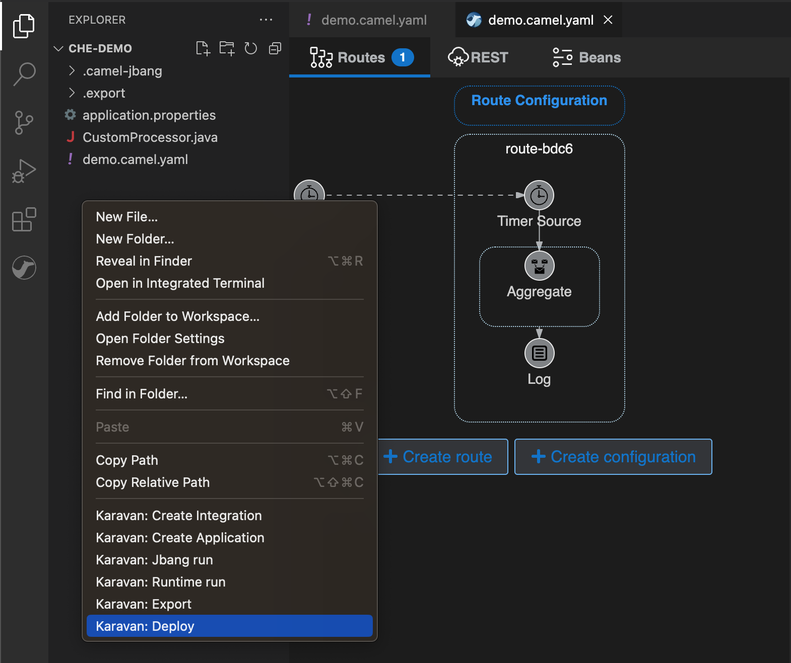

Karavan is an Integration Toolkit for Apache Camel aimed to increase developer performance through the visualization of routes, integration with runtimes and pipelines for package, image build and deploy to kubernetes out-of-the-box.

This is a short [Karavan introduction](https://www.youtube.com/watch?v=RA8sH3AH8Gg) aimed to help to understand if this tool is right for your needs.

Developers can use Karavan in their local development environment by installing Karavan extension in VS Code or Eclipse Che and run their services using JBang powered camel CLI with camel-main or export and run it with canonical Camel Runtimes.

Being installed in a kubernetes environment, Karavan can be used as an application in any modern web browser. In that case Karavan stores integrations as YAML files in a git repository and starts a Tekton pipeline to package an application, build and deploy it to kubernetes.

# New fetures
The long-awaited release brings more flexibility to developers. Runtime selection: Quarkus or Spring Boot. Configurable default values for  application.properties. Deployment to kubernetes from a local environment with configurable Maven commands. Simplified code creation for custom Processors and AggregationStrategy.

## Code snippets 

This release introduces Code Snippets that simplify custom Processor and AggregationStrategy creation again for both Quarkus and Spring Boot runtimes.

## Spring Boot Runtime
In addition to the already supported Quarkus Runtime, starting from version 3.20 Karavan supports Spring Boot Runtime both for local and cloud mode.
Users can choose target runtime while creating new projects.

## Camel 3.20.1
The latest YAML DSL changes to Camel 3.20.x. The most significant one is routeConfiguration with interceptors and errorHandlers:

## Deploy to Kubernetes and Openshift from VS Code
New deployment menu in VS Code extension uses configurable Maven commands for deployment to Kubernetes or OpenShift for both runtimes: Quarkus and Spring Boot with JKube.

## Framework and runtimes upgrades:
1. Camel 3.20.1
2. Kamelets 3.20.1.1
3. Route Configuration DSL
4. Quarkus 2.16.0.Final
5. Spring Boot 2.7.7

# Feedback is gold

Deploy Karavan as a [cloud-native integration toolkit](https://github.com/apache/camel-karavan/tree/main/karavan-cloud) or install [VS Code extension](https://marketplace.visualstudio.com/items?itemName=camel-karavan.karavan) from the Marketplace.

If you have any idea or find a new issue, please [create a new issue report in GitHub](https://github.com/apache/camel-karavan/issues)!
